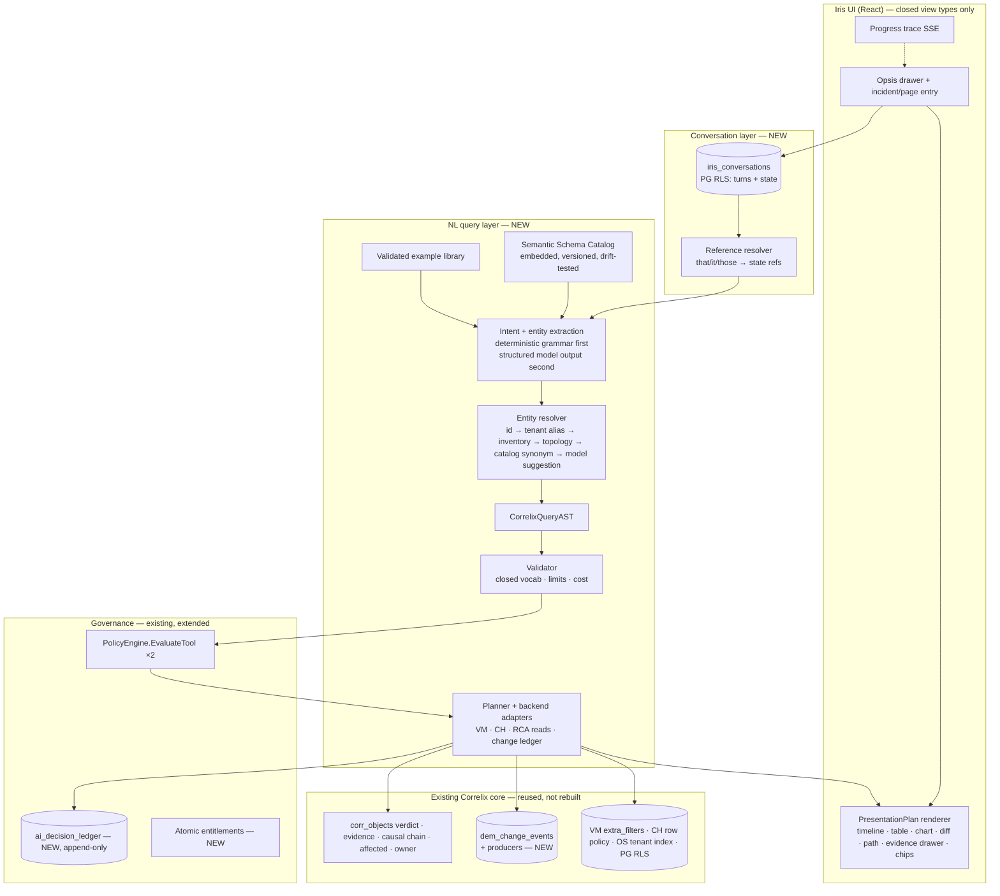
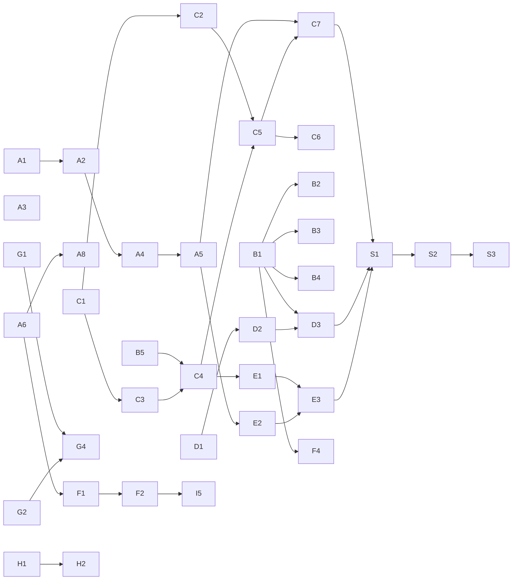

<!-- SPDX-License-Identifier: Apache-2.0 -->
<!-- Copyright 2026 Correlix -->

# Iris — natural-language platform: gap analysis and the one merged implementation plan

**Date:** 2026-09-26 · **Status:** implementation plan of record for Iris AI (tracker row 337)
**Inputs (both owner prompts, merged into ONE project):**
- **Part 1** — `Correlix-Ai-Iris-Part1.md` (62 sections): the AI-native platform — read-only investigator,
  evidence/RCA contract, Environment Context, runbooks + tests, tool gateway, model gateway/router,
  decision ledger, policy/approval, evaluation, incident replay, MCP.
- **Part 2** — `Iris-Ai-Enhancements.md` (71 parts): natural-language operations — typed Query AST,
  semantic schema catalog, schema/example RAG, entity resolution, conversation state and follow-ups,
  Change Intelligence, presentation plans (chart/timeline/table/diff), streaming progress.
- **Owner goal (2026-09-26):** *"this will be AI chatbot answering all the questions and goal is
  question can be answered any way related to the product."* → a third track, **product knowledge**
  (§G), sits beside the operational one.

**Relationship to the design of record.** `docs/design/IRIS_AI_DESIGN.md` (2026-09-21) remains the
**architecture** of record; this document is the **implementation plan** of record. Part 1 is ~70 %
the same material as `/var/tmp/AiStratgey.md`, which that design already absorbed — so Part 1 is not
re-designed here: every Part 1 section is *mapped* to the code and to the design's 20-item plan, and
only its genuinely unaddressed asks become new items. Part 2 is new — no prior code, branch or
document covers it (verified 2026-09-26: no `QueryAST`, schema catalog, conversation state or change
ledger exists anywhere in the tree or in git history). Part 1 §59 asks for `docs/architecture/ai-platform.md`;
that content already exists as `IRIS_AI_DESIGN.md` and is **not duplicated** — this file is the one
new architecture document.

**Binding constraints (restated, not reopened — `IRIS_AI_DESIGN.md` §10):** device writes are
structurally impossible (owner 2026-09-05); no model-callable `execute_runbook`; no fine-tuning or
proprietary model; stdlib-first Go with the CLAUDE.md §6 allowlist; §3a isolation + an isolation test
for every new store; §15 OWASP-LLM; network-first, not a SIEM/APM.

---

## 1. Method and what was found

Audit on HEAD `fc1f96eb` (three bounded research passes — AI runtime, data substrate, frontend +
product corpus — each claim spot-checked against the code before it entered this document).

**Status vocabulary:** **SHIPPED** · **PARTIAL** (exists, needs extension) · **IN-FLIGHT** (code written
2026-09-21, never committed — recovered onto `iris/nl-platform`) · **DESIGNED** (design of record only)
· **MISSING** · **DECLINED** (owner decision on record; overridable only by the owner).

**Uncommitted work recovered, not rebuilt.** Two abandoned worktrees held design items 9, 10 and 19:
- item 9 (model tiers wired to `RouteFor`) — complete + tested; landed first (N-A1).
- item 10 (`get_recent_changes`/`get_config_diff`, `ai/config_changes.go`, 449 lines) — **inert**: the
  server never populated the `RecentChanges`/`ConfigDiff` seams, so the tools never registered; no
  tests, no §3a isolation test (N-A2 finishes it).
- item 19 (`internal/aiscore`, ~1,100 lines) — zero tests and no `ScoreSink` wired (N-A3 finishes it).

### 1.1 The eight findings that shape the plan

1. **There is no server-side conversation.** `/api/ai/ask` takes `{question, context}` only
   (`ai_handlers.go:101-104`); copilot history is client-supplied **including assistant turns**
   (`ai/llm_transport.go:41-66`) — a forgeable-history injection path; the UI keeps history in
   component state and loses it when the drawer closes (`Opsis.tsx:165`, `OpsisDrawer.tsx:85`).
   Follow-ups ("who changed it?") are therefore impossible today.
2. **Two brains with disjoint tools.** The model-driven copilot loop sees `Tools()+search_docs` only
   (`copilot.go:249-250`); the grounded engine sees the Phase-A tools but not `search_docs`
   (`ai_handlers.go:185-190`). By default the copilot path is off (`FEATURE_COPILOT`, `copilot.go:107`).
3. **Intent is a regex cascade** (`ai/orchestrator.go:202-338`) ending in a capability clarification —
   "any question" dead-ends. No structured (JSON-schema) model output exists anywhere.
4. **Answers are strings** (`Timeline []string`, `ai/schemas.go:186`) — the UI cannot chart, table or
   diff anything. `ContradictingEvidence`/`ItsmNote` are declared and never populated (`schemas.go:188,191`).
5. **No query layer for Iris.** Stores are tenant-scoped at the database (VM `extra_filters` via
   `metricsScopeFiltersFor` `metrics_query.go:115`; CH row policies via `chTenantScopeFor`
   `clickhouse_client.go:384`; OS `oslog.TenantFilter`; PG RLS) — a solid foundation — but queries are
   hand-written strings; there is no typed builder, no semantic catalog, no alias table.
6. **A normalized change ledger exists and nothing feeds it.** `dem_change_events`
   (`migrations/0044_dem_experience.sql:59`, `experience.ChangeEvent` with actor/before/after) has one
   writer, a manual POST. Syslog `CONFIG_I` is shadowed (`correlation/parser_rules.py:524`); config
   versions carry no actor; no ticket reference exists anywhere.
7. **No decision ledger, no cost truth, no retry.** One log line per question, provider name but no
   model id, no args/result hashes, answer not persisted; tokens estimated (chars/4) and metered only
   in the agent loop (`copilot_agent.go:115`); provider errors fall through with no backoff (CLAUDE.md §9).
8. **Product knowledge is BM25 over 147 embedded pages** with no stemming (`ai/kb.go:302-315`);
   hit@3 = 0.91 vs a 0.90 floor (tracker 335); ~15 nav areas have no or thin coverage; `ProductKB` is
   dead code (tracker 336). Iris cannot yet answer "any product question" reliably.

---

## 2. Part 1 — section-by-section compliance matrix

Evidence paths are relative to `src/backend/` unless prefixed. "Closes in" names the plan item (§5).

| § | Requirement | Status | Evidence / note | Closes in |
|---|---|---|---|---|
| 1 | Competitive target (Kentik/Dynatrace strengths; seam differentiators) | PARTIAL | Seam model, grounded verdict gate shipped (`IRIS_AI_DESIGN.md` §4, §6). NL analytics, change correlation, visible progress missing | whole plan |
| 2 | Don't build the AI layer first — substrate check | PARTIAL | Substrate strong but under-populated on lab: 98 % undirected edges (tracker 334); circuit/probe series likely invisible to scoped tenants (no `device/hostname/source` label, `collectors/echo.go:160`, filter `metrics_query.go:128-147`) | N-B5, 334 |
| 3 | Canonical entity model, stable ids | SHIPPED | 16 `EntityType`s enum-pinned Python↔ClickHouse (`correlation/signals.py:199`, `internal/chschema/corr_schema.go:80`) | — |
| 4 | Deterministic entity resolution + provenance | PARTIAL | IP/ifIndex→device only (`correlation/entity_resolver.py:44`); no name/alias resolution | N-C2 |
| 5 | Ingest-time enrichment (site, role, provider, criticality…) | PARTIAL | Pipeline honest, population empty on lab (334); no criticality/business-service tags | N-F1 (criticality kind), 334 |
| 6 | Telemetry contract (tenant/entity/source/ts/type/measure/unit/quality/provenance) | PARTIAL | `corr_signals` carries most; unit/quality are not uniform across VM series | N-C1 (catalog records unit/quality per metric) |
| 7 | Detection classes, not the LLM | PARTIAL | CUSUM change-point shipped; seasonality/robust-z missing | design item 18 → N-H6 |
| 8 | Preserve existing correlation | SHIPPED | Grounded edges, seams, 103 signatures; nothing in this plan touches the engine's decision path | — |
| 9 | EvidenceItem / EvidenceBundle | PARTIAL | `ai.EvidenceItem{citation_id,kind,text,href}` (`ai/tools.go:89-111`); lacks tenant, source, window, query, provenance, quality, integrity hash | N-B1 |
| 10 | Evidence correlation across dimensions; compact structures | SHIPPED | Engine cross-modality reinforcement; compact evidence already sent, not raw dumps | — |
| 11 | Deterministic RCA; model never manufactures the score | SHIPPED | `confidence = coverage × graph_support × direction` gate; verdict-honesty post-check (`ai/verify.go`) | — |
| 12 | Contradictory evidence surfaced | PARTIAL | Engine computes `contradictions` (`correlation/scoring.py:177-245`); reaches the model as text; typed `ContradictingEvidence` never filled | N-B1 |
| 13 | Hypothesis model PROPOSED/TESTING/SUPPORTED/REJECTED/INCONCLUSIVE | PARTIAL | Engine ranked hypotheses parsed (`ai/evidence_language.go:45-67`); no Iris investigation-hypothesis state | N-B3 |
| 14 | Causal chain with OBSERVED/INFERRED/DERIVED/USER_DEFINED | PARTIAL | `causal_chain` in hypothesis blob + `buildCausalChainView` (`rca_postmortem.go:110`); no relationship-provenance label | N-B1 |
| 15 | Environment Context (tenant, versioned, audited, rollback, authorship) | DESIGNED | Org Context Store, design item 6 (`IRIS_FINAL_DESIGN_2026-09-21.md` §1); 5 closed kinds do not cover Part 1's criticality, carriers, address/routing conventions, terminology | N-F1 |
| 16 | Three context scopes (always-on / retrieved / live) | PARTIAL | Live evidence = turn evidence (shipped); always-on = Org Context (designed); retrieved = docs/KB only | N-F1, N-F3 |
| 17 | Investigative runbooks (versioned, audit, rollback, ownership, tenant, search, associations) | PARTIAL | 13 compiled skills are investigative runbooks (`ai/skills/`); tenant authoring = design item 7; associations (alert/signature/entity/incident) + search missing | N-F2 |
| 18 | Runbook tests (tools, evidence, prohibited tools, hypotheses, outcome) | PARTIAL | 66 skill cases, loader-required (`ai/skill_cases.go`); no prohibited-tool / expected-hypothesis assertions; not re-run on model/prompt change | N-F2, N-H2 |
| 19 | Controlled learning loop (no self-learning) | PARTIAL | Thumbs rating promotes investigation memory (`ai_handlers.go:372-390`); no review→version→test path for context/runbook updates | N-F5 |
| 20 | Historical incident intelligence, hybrid search | MISSING | Only recurrence ranking (`timeintel_reliability.go:339`) and investigation memory recall | N-F4 |
| 21 | Read-only Iris Investigator workflow | PARTIAL | Skill chain + grounded engine shipped; no entity binding from NL, no plan/hypothesis loop, no Environment Context, no runbook retrieval | N-I1 |
| 22 | Typed tool registry with in/out schema, tenant, perms, risk, timeout, rate limit, audit | PARTIAL | 27 tools, input JSON-Schema (`ai/toolspec.go:252`); one generic output shape; no per-tool timeout/rate limit; audit = log line. Absent tools: get_service_dependencies, query_sdwan, get_configuration, compare_time_windows, compare_paths, get_environment_context, get_blast_radius, get_causal_chain, run_* | N-A8, N-B2, N-C5, N-I3 |
| 23 | Never generic execution | SHIPPED | No shell/cli/ssh/http tool; policy hard-denies write/execute (`ai/policy.go:86-97`) | — |
| 24 | NL → intent → structured query → validation → authz → engine | MISSING | Nothing; see Part 2 §3–18 | N-C1…C6 |
| 25 | Tool Gateway validates tenant/user/role/cap/perm/schema/scope/risk/rate/timeout/audit | PARTIAL | `PolicyEngine.EvaluateTool` at manifest + execution (`copilot_agent.go:196`); rate/timeout/target-scope/audit-record missing | N-A8, N-A6 |
| 26 | Tool risk tiers 1–5 | PARTIAL | `CapRead` only in use; tier 2 = `CapProbe` (design 14) missing; tier 3 = ApprovalGate (design 15); tiers 4–5 **DECLINED** (device writes prohibited) | N-I3, N-I4 |
| 27 | Modes OBSERVE/INVESTIGATE/RECOMMEND/ACT | PARTIAL | Answer modes cover observe/investigate; recommend = next-actions only; ACT = none (by design until N-I4) | N-I1, N-I7, N-I4 |
| 28 | Model Gateway (provider, model, region, creds, retry, timeout, structured output, tokens, cost, prompt version, redaction) | PARTIAL | Provider chain + BYO keys + redaction shipped; retry/backoff, structured output, real token/cost accounting, prompt versioning missing | N-A4 |
| 29 | Model Router by task | DONE | `TieredLLMClient`, per-tenant `model_fast`/`model_strong`, settings UI (N-A1) | — |
| 30 | Operational investigation trace, no chain-of-thought | PARTIAL | "Investigated N sources" after the fact, free-form path only (`Opsis.tsx:775`); no plan/queries/hypotheses view, no streaming | N-E2, N-E3 |
| 31 | Standard Iris RCA result contract | PARTIAL | Data exists across `corr_objects` + rca-report; no single typed contract for Iris | N-B1 |
| 32 | Ownership from deterministic metadata | SHIPPED | Hypothesis `owner` + seam owners (`internal/tenant/governance.go:64`); exposed as a tool in N-B2 | N-B2 |
| 33 | Change correlation (temporal ≠ causal) | PARTIAL | Engine rule: a change can corroborate, never confirm (INVARIANTS 402-403); cloud onset-anchored change read (`cloud_investigation_changes.go:160`); network ledger now fed by config capture + Correlix audit (N-D2, 2026-09-27); device-syslog/trap/Versa/cloud producers still open | N-D2 (rest), N-D3 |
| 34 | Deterministic blast radius | PARTIAL | `affected` JSON + `app_impact` on `corr_objects`; no tool, no user counts | N-B2 |
| 35 | Append-only decision ledger (events, model/tool version, arg/result hashes) | MISSING | Log lines only (`ai_handlers.go:172-176`) | N-A6 |
| 36 | Prompt-injection channel separation | SHIPPED | Non-overridable data fence at 5 rendering boundaries (commercial item 4); extended to new channels in N-C5/N-F3 | — |
| 37 | TenantContext/ActorContext everywhere; tenant-bound evidence ids, caches | PARTIAL | Principal carries tenant; evidence ids not tenant-bound; no retrieval caches yet | N-B1, N-C7 |
| 38 | Runbook execution safety chain | DESIGNED | ApprovalGate[T] five gates (design 15); device path DECLINED | N-I4 |
| 39 | No free-text execution; typed runbook params | SHIPPED | Skill args from closed vocabularies; no free-text execution path | — |
| 40 | Policy decisions ALLOW/DENY/REQUIRE_APPROVAL/DRY_RUN_ONLY | PARTIAL | allow/deny today | N-I4 |
| 41 | Atomic entitlements (ai.chat, ai.investigate, …), pricing external | MISSING | Coarse env flags (`FEATURE_AI`, `FEATURE_COPILOT`, `FEATURE_AI_TOOLS`) | N-A7 |
| 42 | MCP as an adapter over the gateway, read-only first | DESIGNED | Design item 17 | N-I5 |
| 43 | Evaluation corpus from resolved incidents, lab, synthetic, signatures | PARTIAL | 62 golden QA, 116 correlation fixtures, 66 skill cases; no NL-query or end-to-end answer corpus | N-C6, N-H1 |
| 44 | Per-layer scorecard | IN-FLIGHT | Item 19 recovered (`internal/aiscore`), unwired | N-A3 |
| 45 | Primary KPI: time to evidence-backed diagnosis | MISSING | Not measured | N-A3 |
| 46 | Incident Replay | MISSING | Engine replay-determinism exists for correlation; no Iris replay | N-H2 |
| 47 | Golden incident corpus incl. adversarial cases | PARTIAL | Correlation fixtures cover many classes; no Iris-level corpus with coincident-change / cross-tenant-alias / log-injection cases | N-H1 |
| 48 | Release gates before Investigator | MISSING (as gates) | Encoded as CI checks in N-H5 | N-H5 |
| 49 | Release gates before ACT | DESIGNED | ApprovalGate gates + kill switch | N-I4 |
| 50 | Milestone 1: read-only investigator | PARTIAL | See §21 | Phases A–E |
| 51 | Milestone 2: organizational intelligence | PARTIAL | See §15–19 | Phase F |
| 52 | Milestone 3: domain intelligence | PARTIAL | Seasonal detection, blast radius, ownership tool | N-B2, N-H6 |
| 53 | Milestone 4: low-risk product automation | DESIGNED | Two product/ticket write tools | N-I4 |
| 54 | Milestone 5: operational runbooks, limited autonomy, MCP writes | DECLINED (device) / DEFERRED (MCP writes) | Owner 2026-09-05; `IRIS_AI_DESIGN.md` §5.4–5.5 | — |
| 55 | Differentiators (seams, inspectable RCA, contradictions, runbook tests, replay, verified remediation, model neutrality) | PARTIAL | Seams/inspectable RCA/model neutrality shipped; contradictions (N-B1), replay (N-H2) | as listed |
| 56 | Reference UX ("Why is Salesforce slow in Dallas?") | MISSING | Needs alias resolution, NL query, RCA contract, presentation | Phases B–E |
| 57 | Reuse existing infra; no new services | COMPLIANT | Plan adds no service; Postgres/CH/VM/OS reused; no vector DB | — |
| 58 | Logical components (not microservices) | PARTIAL | Mapping in §4 | — |
| 59 | `docs/architecture/ai-platform.md` | SATISFIED BY | `docs/design/IRIS_AI_DESIGN.md` (not duplicated) + this file | — |
| 60 | Phase sequence 0–20 | ADOPTED | Folded into §5 ordering | — |
| 61 | Never-do list | COMPLIANT | Enforced by §0 constraints and tests in each item | — |
| 62 | Report before coding | THIS DOCUMENT | — | — |

## 3. Part 2 (Enhancements) — part-by-part compliance matrix

| Part | Requirement | Status | Evidence / note | Closes in |
|---|---|---|---|---|
| 1 | Iris consumes Correlix results; never a second RCA engine | SHIPPED (principle) | Verdict gate + honesty post-check | — |
| 2 | Repository audit doc | THIS DOCUMENT | — | — |
| 3 | First-class NL operations layer | MISSING | — | N-C5 |
| 4 | No unrestricted SQL; AST pipeline | MISSING | — | N-C3, N-C4 |
| 5 | Backend-neutral `CorrelixQueryAST` + planner → MetricsQL / CH SQL / OS DSL / PG | MISSING | Scoped executors exist to compile into: `vmInstantScoped` (`path_health_api.go:63`), `vmRange` (`metrics_forecast.go:159`), `chSelect` (`clickhouse_client.go:315`), `oslog.TenantFilter`, `WithTenant` | N-C3, N-C4 |
| 6 | `QueryIntent` taxonomy (23 intents), structured model output | MISSING | Regex `Classify` only | N-C5, N-A4 |
| 7 | Entity recognition + `ResolvedEntityRef` + 6-rung priority; ambiguity blocks actions | MISSING | No alias table; `/api/search` covers device/app/case, not site/interface/circuit (`search_unified.go:44`) | N-C2 |
| 8 | `SemanticSchemaCatalog` | MISSING | Real metric names enumerated in the audit (e.g. `circuit_loss_pct`, `device_if_in_octets`, `device_bgp_peer_state`, `probe_rtt_ms`) | N-C1 |
| 9 | Schema RAG (relevant fragments only) | MISSING | — | N-C5 |
| 10 | Multi-layer RAG A–G (schema, environment, runbook, incident, docs, structured change, never-vector telemetry) | PARTIAL | Docs BM25 (E) shipped; others missing | N-C5, N-F3, N-F4, N-D3 |
| 11 | Hybrid retrieval (filters + lexical + semantic + recency + authority + rerank) | PARTIAL | Lexical BM25 + tier tie-break only | N-F3 |
| 12 | RAG security: tenant pre-filter, provenance fields, retrieved content is data | PARTIAL | Docs corpus is platform-global (no tenant data); investigation memory is tenant-scoped | N-F3 |
| 13 | `IrisConversationState` | DONE | `internal/irisconvo` + migration 0053 (2026-09-27); design §9 of `iris-nl-query-design.md` | — |
| 14 | Reference resolution (that/it/there/those) from structured state | DONE | `compile/refer.go` — bound from server state or Unparsed (2026-09-27) | — |
| 15 | `NLQueryCompiler` pipeline + compile/execute/get/explain APIs + `compile_query` tool | MISSING | — | N-C5 |
| 16 | Query validation + hard limits; reject unknown/cross-tenant/forbidden | MISSING | — | N-C3 |
| 17 | Query repair loop with structured errors, bounded retries | MISSING | — | N-C5 |
| 18 | Versioned validated NL↔Intent↔AST example library | MISSING | — | N-C6 |
| 19 | No fine-tuning first; frontier model + structure | COMPLIANT | Owner decision: no training a proprietary model | — |
| 20 | Golden NL query corpus `tests/iris/nlquery/golden/` | MISSING | — | N-C6 |
| 21 | Controlled synthetic paraphrases validated against same AST | MISSING | — | N-C6 |
| 22 | Capture query telemetry + operator corrections, no auto-retrain | PARTIAL | Thumbs only, `Mode` never stored (`ai_handlers.go:332-335`) | N-C8 |
| 23 | Optional future fine-tuning to AST | DEFERRED | Owner decision stands; revisit only with a measured corpus | — |
| 24 | Normalized `ChangeEvent` + actor normalization | PARTIAL | Provenance columns + 180-day retention (migration 0052, N-D1); producers `config_capture` and `correlix_audit` + `changeledger.NormalizeActor` (N-D2 part, N-D4) shipped 2026-09-27; syslog `CONFIG_I`/`UI_COMMIT`, trap, Versa and cloud producers open — evidence each needs is in N-D2 below | N-D2 (rest) |
| 25 | Change questions (who/what/when/ticket/same person/other sites/before-after/rollback) | MISSING | — | N-D3, N-C5 |
| 26 | Temporal correlation ≠ causality in wording | PARTIAL | Engine rule shipped; Iris wording + label in N-B4 | N-B4, N-D3 |
| 27 | Change timeline with restrained accents | MISSING | `EventTimeline` private (`components/rca/RcaWorkspace.tsx:130`) | N-E3 |
| 28 | Clickable change drill-down table + drawer | MISSING | `DataTable` reusable (`components/DataTable.tsx:92`) | N-E3 |
| 29 | Config diff view incl. side-by-side JSON | PARTIAL | `ConfigDiffView` unified text (`pages/config/DeviceConfigPanel.tsx:90`); no JSON diff | N-E3 |
| 30 | `PresentationPlan`, closed view types, UI validates, no model frontend code | MISSING | — | N-E1, N-E3 |
| 31 | Visualization chosen by question semantics; charts drill to rows | MISSING | `EChart` supports `onEvents` (`components/EChart.tsx:64`) | N-E1, N-E3 |
| 32 | Result provenance on every row + "Why am I seeing this?" | MISSING | — | N-E1, N-E3 |
| 33 | "Interpreted Query" explain; physical query for privileged users | MISSING | — | N-C5, N-E3 |
| 34 | Editable filter chips regenerate AST deterministically | MISSING | Chips display-only today | N-C7, N-E3 |
| 35 | Synthesis from typed result objects, never raw rows | PARTIAL | Engine path compact; NL results N/A yet | N-C5 |
| 36 | Statement classes OBSERVED/CORRELIX_RCA/DERIVED/HISTORICAL/DOCUMENTATION/RECOMMENDATION | MISSING | — | N-B4 |
| 37 | Experienced-engineer voice | PARTIAL | NOC-English quality layer shipped (`ai/quality.go`) | N-B4 |
| 38 | Existing Correlix evidence first when incident context exists | PARTIAL | Case-bound asks use correlation_id; free-form drawer asks carry no page context (`Opsis.tsx:310`) | N-B2, N-E4 |
| 39 | Investigation without incident: query → existing anomaly/RCA → tools | PARTIAL | Skill chain; no NL query step | N-I1 |
| 40 | Model routing fast/advanced | DONE | Item 9 (N-A1) | — |
| 41 | Environment Context feeds NLP/entity resolution; never overrides telemetry | DESIGNED | — | N-F1, N-C2 |
| 42 | Configurable source authority order | MISSING | — | N-F6 |
| 43 | "Have we seen this before?" | MISSING | — | N-F4 |
| 44 | Investigative vs executable runbooks separated | DESIGNED | `Executable` flag, one object (design 7) | N-F2 |
| 45 | ChatOps with identity mapping, never superuser | MISSING | — | N-I6 |
| 46 | Streamed operational progress | MISSING | No SSE/Flusher anywhere | N-E2 |
| 47 | Performance targets per class; tenant-keyed caches | MISSING | — | N-C5, N-H4 |
| 48 | Query eval metrics + targets (entity ≥99 %, exec ≥98 %, semantic ≥95 %) | MISSING | — | N-C6, N-H5 |
| 49 | RAG evaluation per layer | PARTIAL | Docs hit@1/hit@3 floors 0.75/0.95 (N-G2 shipped); other layers not built | N-F3 |
| 50 | Multi-turn naturalness tests | PARTIAL | Unit + HTTP follow-up tests (`refer_test.go`, `nlquery_convo_isolation_test.go`); no scored multi-turn corpus yet | N-C7 |
| 51 | Flagship test 1: change incident conversation | MISSING | — | N-S1 |
| 52 | Flagship test 2: Comcast circuits → only Dallas → BGP flaps | MISSING | — | N-S2 |
| 53 | Flagship test 3: changes 30 min before every SD-WAN incident this week | MISSING | — | N-S3 |
| 54 | API contracts | MISSING | Adapted to existing `/api/ai/*` prefix (§4.3) | N-C5, N-C7, N-D3 |
| 55 | New data models (only if absent) | MISSING | `ChangeEvent` reused from DEM; Incident/Evidence/RCA/Path wrapped not recreated | per item |
| 56 | Dynamic prompt assembly, relevant-only | PARTIAL | Persona + app knowledge + fence; no schema/example/context slots | N-C5 |
| 57 | RAG for knowledge, query APIs for data | COMPLIANT (enforced) | Planner never reads telemetry via retrieval | N-C4 |
| 58 | Trusted planner injects tenant; model cannot | PARTIAL | Stores enforce; planner will only call scoped executors (chokepoint test) | N-C4 |
| 59 | Change descriptions/tickets/docs are untrusted data | PARTIAL | Fence exists; extend to change and retrieved-doc channels | N-D3, N-F3 |
| 60 | Action architecture preserved | DESIGNED | — | N-I4 |
| 61 | Implementation order | ADOPTED | §5 | — |
| 62 | Vertical slice 1 (incident → what happened → changes → actor → diff → follow-ups) | MISSING | — | N-S1 |
| 63 | Vertical slice 2 (NL analytics refinement) | MISSING | — | N-S2 |
| 64 | Operations-product UI, restrained accents | PARTIAL | Iris CSS 12.5–13 px violates the ≥14 px standard (`styles.css:2008-2336`) | N-E3 |
| 65 | No dead-end answers; every result drills down | MISSING | Opsis citations bypass `safeCiteHref` (`Opsis.tsx:1062`) | N-E3 |
| 66 | Investigation UX trace | MISSING | — | N-E2, N-E3 |
| 67 | Release gates | MISSING (as gates) | — | N-H5 |
| 68 | What-not-to-build | COMPLIANT | — | — |
| 69 | Success criteria (14 routine questions) | MISSING | Encoded as the multi-turn corpus in N-C7/N-S1–S3 | — |
| 70 | Strategic principle | ADOPTED | — | — |
| 71 | Report before code, then slice 1 | THIS DOCUMENT → N-S1 | — | — |

### 3.1 Product knowledge — the owner's third track

| Requirement | Status | Evidence | Closes in |
|---|---|---|---|
| Answer any "how do I / what is / what does this page mean" question | PARTIAL | BM25 over 147 pages + 354 `(i)` explain answers (`ai/explain.go`) | N-G1…G3 |
| Coverage of every nav area | PARTIAL | None/thin: Operations→Cloud (6 pages), Application Map, Business Services, DEM Journeys/Service Paths/Changes/Data Health, Access Explorer, Sessions, Search Dashboards, GraphQL Explorer, Stack Health, Self-Monitoring, Data Protection, Sensors, Action Queue, Recovery Scorecard, Findings | N-G1 |
| Retrieval quality ≥ floor with headroom | DONE | hit@3 floor raised to 0.95 with folding/stemming, release-note down-weighting and the docs-031 fix (N-G2, 2026-09-26) | — |
| Page-aware help ("what am I looking at?") | PARTIAL | `(i)` sends a topic; the drawer does not send the route | N-G3 |
| One product-KB path (no dead code) | PARTIAL | `ProductKB` unreachable (`ai/orchestrator.go:1504-1523`); unique `productRoutes` deep-link map must move first | N-G2 |

---

## 4. Target architecture (what is added, and where it plugs in)



### 4.1 Design decisions taken here (engineering calls, not owner calls)

1. **Deterministic compiler first, model second.** A closed grammar handles the high-frequency
   shapes (metric over entity over window, changes by actor/site/window, incident explain, compare
   windows, follow-up refinements). Only when it cannot produce a valid AST does the compiler ask the
   model — via **structured output against the AST JSON schema**, with schema-RAG fragments and
   retrieved examples, then the same validator and at most 2 repair rounds. The system therefore
   works key-free for the common questions (`IRIS_AI_DESIGN.md` §3.4 — "survives the model being
   unavailable") and the model is measured against the grammar on the golden corpus.
2. **The AST is a closed Go type, not free JSON.** Unknown fields reject at decode
   (`DisallowUnknownFields`); every field name, metric, entity type, operator and dimension is a
   catalog lookup; tenant is never an AST field — the planner takes it from claims.
3. **One conversation store, server-held.** Client-supplied assistant turns are dropped (closes an
   injection path). State is structured refs (entity ids, window, filters, last AST id, last result
   id, last change id), never prose; reference resolution reads refs, not the transcript.
4. **Change ledger = `dem_change_events`**, extended additively; producers are idempotent
   (`ON CONFLICT DO NOTHING` on a deterministic id). No second change store.
5. **No vector database** (standing decision, LLM08). Hybrid retrieval = metadata/tenant/time
   pre-filter + BM25 with stemming + authority/recency rerank. Re-opened only if the N-G2/N-F3
   evaluation shows lexical recall is the bottleneck.
6. **Environment Context kinds:** the design's 5 closed kinds are extended by **4** to cover Part 1
   §15 — `criticality` (critical sites/apps/business priority), `carrier_relationship`,
   `address_convention` (IP/routing conventions), `terminology` (operational vocabulary). Human
   aliases ("DFW" → site) are **not** a context kind: they go to the structured `entity_aliases` table
   so resolution is exact, auditable and testable.
7. **Presentation is server-planned and client-validated.** The server returns a `PresentationPlan`
   with a closed `view` enum and typed payloads; the model may only *suggest* a view from that enum;
   the client renders unknown views as escaped text.
8. **Streaming = SSE** from the Go handler (`http.Flusher`, stdlib), events are the operational trace
   (`resolved`, `querying`, `found`, `rca_loaded`, `rendering`) — never model reasoning text.

### 4.2 Security invariants every item carries (§3a/§15)

- Every new store (`iris_conversations`, `entity_aliases`, `ai_decision_ledger`, `org_context`,
  tenant runbooks, change-ledger columns) ships the `tenant_iso` FORCE-RLS migration, `withTenant`
  access, a cross-org isolation test (own-only list, cross-tenant id → 404, `as_tenant` into another
  org ignored) and the `pgintegration` leg.
- The planner calls only scoped executors (`metricsScopeFiltersFor`, `chTenantScopeFor`,
  `oslog.TenantFilter`, `WithTenant`); a guard test fails the build if an Iris path calls an
  unscoped one or the raw `/api/metrics/query` proxy or OS `query_string` with model-shaped text.
- Retrieved text, change descriptions, ticket text, aliases and context bodies render inside the
  data fence; none can become instructions.
- Bounded everything: request bytes, turns per conversation, AST limits (window, rows, cardinality,
  joins), repair rounds, SSE duration, output tokens.

### 4.3 API surface (adapted to the existing `/api/ai/*` prefix, no parallel `/iris` tree)

```
POST /api/ai/conversations                      create (tenant/user from claims)
GET  /api/ai/conversations/{id}                 own-tenant only; foreign → 404
POST /api/ai/conversations/{id}/messages        ask in context → Answer + PresentationPlan (SSE when Accept: text/event-stream)
POST /api/ai/query/compile                      NL (+conversation id) → intent, resolved entities, AST, validation
POST /api/ai/query/execute                      AST (validated again) → ResultSet + PresentationPlan
GET  /api/ai/query/{id}  ·  /{id}/explain       interpreted query; physical query for platform/tenant admins
POST /api/ai/entities/resolve                   text → []ResolvedEntityRef
GET/PUT/DELETE /api/ai/aliases                  tenant alias CRUD (requirePerm + tenant filter)
GET  /api/ai/schema/search                      catalog fragments (read-only)
GET  /api/changes · /api/changes/{id} · /{id}/diff   the change ledger (reused by UI and tools)
```

---

## 5. The merged implementation plan

One ordered programme. **N-** ids are this plan's; design-of-record items are cross-referenced as
"D#". Every item ships with: unit tests, failure-path tests, §3a isolation test when it stores or
returns data, `pgintegration` when it touches PG, and the CI gate (§12). Effort in engineer-weeks
(ew) for one engineer.

### Phase A — Land the in-flight work and harden the runtime (foundation)

| # | Item | Depends | ew |
|---|---|---|---:|
| N-A3 | **Scorecard remainder** (sink, sampler, `/metrics` KPI set, and the `iris-ai-quality` vmalert group — unsupported-claim rate, invisible provider usage, scorecard not sampling — with promtool tests + runbook SHIPPED): a Grafana dashboard over `netops_ai_*` | — | 0.25 |
| N-A5 | **One brain, one registry**: copilot loop and grounded engine share one tool registry (Phase-A tools + `search_docs`) behind the same double `EvaluateTool`; drop client assistant turns | A4 | 1.5 |
| N-A6 | **Decision ledger**: `ai_decision_ledger` (PG, append-only, RLS) — Part 1 §35 event types, model/tool versions, SHA-256 of args/results, persisted answer id; `/api/ai/ask` enters the platform audit trail | — | 2 |
| N-A7 | **Atomic AI entitlements** (`ai.chat`, `ai.investigate`, `ai.nlquery`, `ai.context.author`, `ai.runbook.author`, `ai.mcp`) mapped from existing flags/tiering — no plan names in code | — | 1 |
| N-A8 | **Tool contract v2**: per-tool timeout, per-tool rate limit, typed output schema, risk tier, ledger record per call | A6 | 1.5 |

### Phase B — Expose the evidence/RCA contract cleanly (Part 1 §9–14, 31–34; Part 2 §38)

| # | Item | Depends | ew |
|---|---|---|---:|
| N-B2 | **RCA tools remainder** (`get_causal_chain`, `get_blast_radius`, `get_owner`, `get_confidence_breakdown` SHIPPED): `get_affected_entities`; blast-radius user counts where DEM has them | — | 0.5 |
| N-B3 | **Investigation hypotheses** (PROPOSED→TESTING→SUPPORTED/REJECTED/INCONCLUSIVE) held per investigation, driven by tool outcomes; never overrides the engine verdict; shown in the trace | B1 | 2 |
| N-B4 | **Statement classes** (OBSERVED/CORRELIX_RCA/DERIVED/HISTORICAL/DOCUMENTATION/RECOMMENDATION) on answer sentences, checked by `VerifyGrounding`; "temporally correlated, not established as cause" wording enforced when a change is not in the engine's chain | B1 | 1.5 |
| N-B5 | **Substrate fix — circuit/probe series visible to scoped tenants** (verify on lab first; add the scope label at emit or map `local_device`); isolation test | — | 1 |

### Phase C — Natural-language query platform (Part 2 §3–23; Part 1 §24)

| # | Item | Depends | ew |
|---|---|---|---:|
| N-C2 | **Resolver remainder** (ladder canonical id → tenant alias → inventory name → partial-needs-confirm, alias store + CRUD API + UI SHIPPED): topology rung, catalog-synonym rung, model-suggestion-needs-confirm rung; provider/application seeding (providers resolve to nothing until aliased) | — | 1 |
| N-C4 | **Planner remainder** (metrics, changes, incidents, explain, site/device/provider grouping SHIPPED): `flow_top` over CH allowlisted templates and `log_search` over OS structured filters (both reserved today — the validator refuses them precisely); depends on N-B5 for circuit/probe series | B5 | 1.5 |
| N-C5 | **Compiler remainder** (deterministic grammar, compile/execute APIs SHIPPED): model fallback via structured output + schema-RAG + example-RAG; repair loop ≤2; `GET /api/ai/query/{id}` + `/explain`; `compile_query` tool | A4 | 2.5 |
| N-C6 | **Corpus remainder** (212-case golden corpus + paraphrases + accuracy ratchet + 0-violation safety SHIPPED): per-metric CI numbers (entity precision, executable rate, semantic correctness) with floors; coverage of Part 2 §20's 21 categories; offline harness for the model path | C5 | 1 |
| N-C7 | **Conversation remainder** (store, state, reference binding, follow-up rewriting and the conversation API SHIPPED 2026-09-27): editable-chip → AST regeneration; a scored multi-turn corpus (Part 2 §50) with a ratchet like the golden corpus; Part 2 §69's 14 routine questions end to end | C5, E3 | 1 |
| N-C8 | **Query capture + operator corrections**: per-query record (Part 2 §22 fields) and chip edits stored for offline evaluation; no automatic retraining | C7, A6 | 1 |

### Phase D — Change Intelligence (Part 2 §24–29; Part 1 §33; D12)

| # | Item | Depends | ew |
|---|---|---|---:|
| N-D2 | **Remaining producers** (config capture + Correlix audit SHIPPED 2026-09-27, `internal/changeledger`). Open: (a) syslog `CONFIG_I`/`UI_COMMIT` — un-shadow only after real-traffic hit rate (`corr_parser_shadow_hits_total{rule_id="syslog.config.change"}`), per-vendor lab fixtures proving user/source/line extraction, and a false-positive check; then bridge into the ledger with a deterministic id, device user kept verbatim; (b) trap `trap.config.change` feeds only corr_signals — same bridge; (c) Versa `controller_policy_change` — needs an exact event-type allowlist (today a substring match on "policy" also catches violations) and real Concerto samples; (d) cloud — producer keyed on the provider event id, or a decision to keep cloud changes read-time only | — | 2 |
| N-D3 | **Change APIs + tools**: `/api/changes[/{id}[/diff]]`; incident-anchored change read (cloud pattern); causal vs temporal label taken from the engine's chain only; structured before/after + redacted diff | D1, B1 | 2 |

### Phase E — Presentation and the operator experience (Part 2 §27–37, 46, 64–66; Part 1 §30)

| # | Item | Depends | ew |
|---|---|---|---:|
| N-E1 | **`PresentationPlan` + `ResultSet` contract**: closed view enum (SUMMARY, TABLE, TIME_SERIES, TIMELINE, BAR, TOPOLOGY, PATH, DIFF, EVIDENCE_LIST, INCIDENT_CARD, CHANGE_CARD, RECOMMENDATION_CARD); semantic view selection; every row/point carries query id + provenance | C4 | 1.5 |
| N-E2 | **SSE progress stream**: operational trace events; bounded; falls back to one JSON response | A5 | 1.5 |
| N-E3 | **Frontend components**: plan renderer; shared `IrisTimeline` (cause/start/recovery accents); change table + drawer; unified + side-by-side JSON diff; evidence drawer ("why am I seeing this?"); editable chip bar; progress trace; incident/change/recommendation cards; ≥14 px; `safeCiteHref` everywhere | E1, E2 | 4 |
| N-E4 | **Conversation + page context in the UI**: history survives drawer close (server conversation id); route/entity/incident bound into the ask and validated server-side; incident-detail Iris entry; merge the two RCA Iris asks into one | C7 | 2 |
| N-E5 | **Playwright e2e** for the drawer and the three flagship slices | S1–S3 | 1.5 |

### Phase S — The flagship vertical slices (acceptance tests of A–E)

| # | Slice | Depends |
|---|---|---|
| N-S1 | Incident page → "What happened?" → existing RCA → relevant changes → actor → before/after → timeline → table → click-to-diff → "Who changed it?" → "What else did they change?" → "Only WAN changes" → "Show the last 7 days" (Part 2 §51, §62) | B1, C7, D3, E3 |
| N-S2 | "Show Dallas WAN packet loss for the last two hours" → "Compare it with yesterday" → "Only Comcast" → "Which interfaces changed most?"; and "Which Comcast circuits had unusual loss in the last hour?" → "Only Dallas" → "Were there BGP flaps on those circuits?" (§52, §63) | C7, E3, B5 |
| N-S3 | "Show me what changed 30 minutes before every SD-WAN incident this week" — correlated vs causal kept distinct, each row linked to its RCA (§53) | D3, C5 |

Each slice runs as a fixture-backed integration test (deterministic compiler path, no model) in CI,
plus a recorded-model run in the offline harness.

### Phase F — Organizational knowledge (Part 1 §15–20; Part 2 §41–44; D6, D7)

| # | Item | Depends | ew |
|---|---|---|---:|
| N-F1 | **Environment Context = Org Context Store (D6)** with 9 closed kinds (§4.1.6), tenant/site scope, versioned, second-person approval, rollback, audit, 2 KB/doc; renders before the fence; also feeds the entity resolver and planner (criticality, carriers); delete `CopilotConfig.System` content once empty everywhere | A6 | 3 |
| N-F2 | **Tenant runbooks/MOPs (D7)** through the same skill loader; case harness per submission incl. prohibited-tool and expected-hypothesis assertions; associations (alert/signature/entity/incident); search; re-run all cases on model/prompt/tool-schema change | F1, A8 | 7 |
| N-F3 | **Tenant-scoped hybrid retrieval** for Environment/Runbook/Incident layers: pre-filtered by tenant, retrieval objects carry tenant/source/authority/timestamps/type/scope; stemming BM25 + authority/recency rerank; fenced; retrieval evaluation (recall/precision/wrong-source/stale) | F1, G2 | 2 |
| N-F4 | **Historical incident intelligence**: incident fingerprint (signature, seam, entities, provider, path, causal chain, symptoms, resolution); "have we seen this before?" = exact-key recall over `incident_time_metrics` + investigation memory, reranked by same-domain/signature/topology/provider/path; similar-incident card | B1 | 3 |
| N-F5 | **Controlled learning loop**: resolved incident → operator validation → proposed context/runbook/alias update → review → version → test → activate; nothing retrains production | F1, F2 | 2 |
| N-F6 | **Configurable source authority** (controller observed > discovered > declared > manual note > model inference), shown on conflicts | C2 | 1 |

### Phase G — Product knowledge: answer any product question (owner goal)

| # | Item | Depends | ew |
|---|---|---|---:|
| N-G1 | **Corpus coverage**: write the missing pages (§3.1 list); one golden item per nav leaf (≈90, today 32) | — | 3 |
| N-G3 | **Page-aware help**: current route boosts that page's docs; "what am I looking at?" answers from the page's doc + `(i)` answers | E4 | 1 |
| N-G4 | **Router remainder** (deterministic data arm SHIPPED 2026-09-27: `/api/ai/ask` answers a question the NL compiler fully understands from its query — key-free summary + result rendered by the presentation renderer; diagnostic cues stay with skills; product questions never compile): model tie-break for questions two arms could claim; data arm inside a conversation (follow-ups in the Iris box, with N-E4); a routing scoreboard over the golden corpus | C5, E4 | 0.5 |

### Phase H — Evaluation, replay and release gates (Part 1 §43–48; Part 2 §48–50, 67; D13, D18)

| # | Item | Depends | ew |
|---|---|---|---:|
| N-H1 | **Golden incident corpus** (Part 1 §47 incl. coincident non-causal change, missing telemetry, contradictions, dual failure, log injection, cross-tenant alias collision) | B1 | 2 |
| N-H2 | **Incident Replay**: freeze telemetry slice, topology as-of, config state, context version, allowed tools; run Iris blind; compare RCA/evidence/tools/cost/latency/unsupported claims; re-run on model/prompt/tool/runbook/RCA change | H1, A6 | 4 |
| N-H3 | **Held-out field eval split (D13)** | H1 | 3 |
| N-H4 | **Performance classes + tenant-keyed caches** (schema, aliases, context, examples) with p50/p95 targets per class | C5 | 1 |
| N-H5 | **Release gates as CI checks**: entity ≥99 %, executable ≥98 %, semantic ≥95 %, cross-tenant = 0, unauthorized = 0, citation coverage, injection suite, audit completeness | C6, H1 | 1 |
| N-H6 | **Seasonal baselines + robust z (D18)** — detection depth | H3 | 12–18 |

### Phase I — Investigator, active diagnostics, governed writes, external surfaces

| # | Item | Depends | ew |
|---|---|---|---:|
| N-I1 | **Read-only Investigator** (Part 1 §21): NL → entities → context → runbook retrieval → existing RCA first → plan → tools → hypotheses → bounded repeat → diagnosis; reuses the skill chain | B3, C5, F1 | 2 |
| N-I2 | **Alert-triggered / scheduled investigations (D16)** | I1 | 3 |
| N-I3 | **`CapProbe` tier (D14)** + `run_ping`/`run_traceroute`/`run_dns_test`/`run_http_test` over existing collectors, target validation, rate limits | A8 | 3 |
| N-I4 | **ApprovalGate[T] + two write tools (D15)**, policy decisions ALLOW/DENY/REQUIRE_APPROVAL/DRY_RUN_ONLY, kill switch; device paths remain structurally impossible | I3, A6 | 5 |
| N-I5 | **Read-only MCP gateway (D17)** | F2, I3 | 5 |
| N-I6 | **ChatOps** (Slack/Teams) over the same conversation engine, identity-mapped, never a superuser | C7 | 3 |
| N-I7 | **Recommendation cards** (Part 1 §27 RECOMMEND), grounded, "no action has been executed" | B4 | 1 |

Carried unchanged from the design of record: **D11 entity-bridge population** (tracker 334) and
**D20 doc corrections** (tracker 336).

### 5.1 Critical path and order of work



Work order: **A1 → A2 → (A3, A6, B1, C1, D1, G2 in parallel) → C2–C5 + B2–B4 + D2–D3 → C7 + E1–E3
→ S1 → S2/S3 → F → H → I**. Phases A–E + S are milestone 1 (Part 1 §50 "read-only investigator" +
Part 2's first slices); F + G milestone 2; H–I milestones 3–4.

**Totals:** A 12 · B 8 · C 21 · D 7 · E 10.5 · F 18 · G 6.5 · H 23–29 · I 22 ≈ **128–134 ew**
including D18 (12–18); ≈ **110 ew** without it. This supersedes the 58–85 ew of `IRIS_AI_DESIGN.md`
§7, because Part 2 (NL query, conversation, change intelligence, presentation) and the product-
knowledge track are new scope that document did not contain.

---

## 6. Explicitly NOT built (declined or deferred on the record)

| Item | Why | Authority |
|---|---|---|
| Device configuration writes, tier 4–5 actions, operational runbooks with device reach | Structurally prohibited | Owner 2026-09-05; `IRIS_AI_DESIGN.md` §10 |
| Model-callable `execute_runbook` | Reintroduces open action space the skill chain removed | `IRIS_AI_DESIGN.md` §8.8 |
| Fine-tuning / proprietary model; training on tenant names | No training, BYO frontier models only | `IRIS_AI_DESIGN.md` §10; Part 2 §23 |
| Vector database / embeddings | LLM08 surface; lexical + structure first; revisit on measured recall | §4.1.5; tracker 335 |
| Arbitrary SQL / MetricsQL / Lucene from the model | Typed AST only | Part 2 §4 |
| `query_traces`, hosts/pods entities, L7 inferred edges | Network-first, not APM | `IRIS_AI_DESIGN.md` §6 |
| Automatic retraining from thumbs up/down | Controlled loop only | Part 1 §19 |
| MCP write/request interfaces | Deferred until read MCP proves out | `IRIS_AI_DESIGN.md` §5.5 |
| Slack posting / owner reassignment / TAC auto-case-open as writes | Deferred `ApprovalGate` consumers | `IRIS_AI_DESIGN.md` §5.4 |

## 7. Owner decisions still open (money, legal, brand — unchanged from the design)

1. Tier placement of the AI capabilities (N-A7 makes it an entitlement mapping, not code).
2. Contractual terms for tenant-authored executable runbooks (N-F2).
3. MCP marketed as an ecosystem story or shipped as a checkbox (N-I5).
