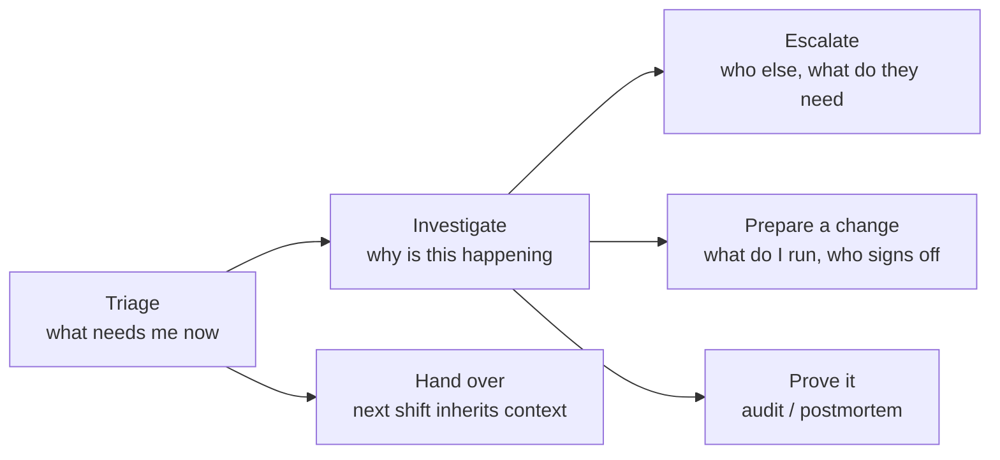
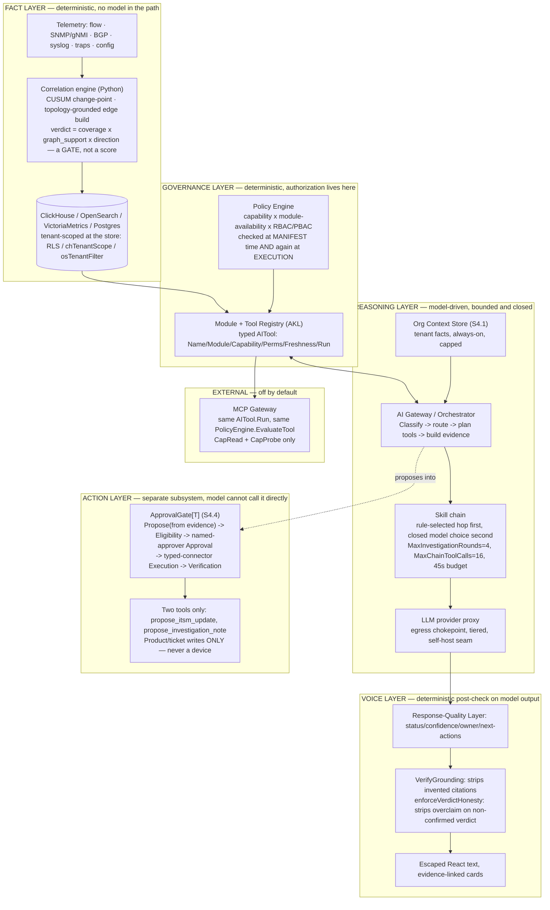
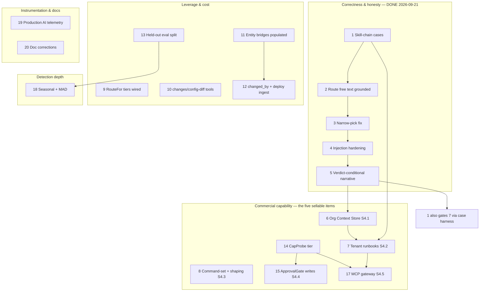

<!-- SPDX-License-Identifier: Apache-2.0 -->
<!-- Copyright 2026 Correlix -->

# Iris AI — the design of record

**Date:** 2026-09-21 · **Status:** design of record, whole-system
**Owner's mandate (verbatim, 2026-09-21):** *"Goal is to compete Kentik and dynatrace Ai... After
reviewing our current design, add items from research that will enhance our iris ai to make it
close to competitors... own the entire iris ai design rather than treating it as fragments... Have
the design structure well framed, ensure features are making sense from NOC admin perspective,
entire structure has to complement and also should be a stepping foundation for building future ai
features."*
**Owner's five commercial items (verbatim, 2026-09-20):** *"noc admin should be able to retrieve
outputs from the devices, able to modify the output of show commands like noc admin wants and more
operational tasks and also automations, also should be able to teach the customer specific
networks, able to give runbooks, mops, may able to write with approval in the loop, MCP should be
supported."*

---

## 0. What this document is, and the document map

This is **the** Iris design — one structure, jobs-to-be-done down to the storage row, so that a
NOC admin, a buyer, and an engineer can each read the same document and find their question
answered. It **supersedes** three prior documents as the place to look for current design; it
**absorbs** their decisions rather than deleting the record of how those decisions were reached:

| Document | Disposition |
|---|---|
| `docs/design/correlix-ai-hld.md` (2026-06-29) | **Superseded as design-of-record.** §2–§8 (orchestrator pipeline, Application Knowledge Layer, Module Tool Registry, guardrails, model strategy) are **shipped and correct** — kept as implementation detail, not restated in full here. §9 (MCP) and §10 (P5–P7 phase plan) are superseded by §4.4 and §6 below. |
| `docs/design/IRIS_COMMERCIAL_REVIEW_2026-09-20.md` (2026-09-20) | **Superseded as design-of-record; kept as the measurement record.** Its maturity baseline and defect list are **facts, not re-derived here** — this document treats them as ground truth throughout. Its 20-item plan is folded into §6. |
| `docs/design/IRIS_FINAL_DESIGN_2026-09-21.md` (2026-09-21) | **Superseded as design-of-record; its four decisions stand and are restated, not reopened, in §4.** One open question it left (§1.5, the fate of `CopilotConfig.System`) is **closed here** (§4.1) — it was a product-surface call, not an owner-level one. |

Documents that **remain valid as detail** — this design references them by name rather than
restating their content, and a reader who wants the mechanism, not the shape, goes there:
`docs/design/IRIS_TROUBLESHOOTING_MODEL_2026-09-02.md` (the skill-chain, show-first battery, and
investigation-memory mechanics — the NetClaw-derived in-house model), `docs/design/ai-response-quality.md`
(the answer-mode/quality-layer contract), `docs/design/UI_WORDS_IRIS_EXPLAINS_2026-09-06.md` (the
"screens don't teach, Iris does" copy doctrine — the direct ancestor of commercial item #4's
`AskIris` surface), `docs/ai/guardrails.md`, `docs/ai/architecture.md`, `docs/ai/provider-routing.md`,
`docs/ai/tool-registry.md` (code-level contracts). `docs/design/ai-strategy-and-guardrails-2026-06-29.md`
is historical — the HLD already reconciled it once; its OWASP-2025-vs-2023 numbering note and
self-host cost analysis remain accurate and are cited where relevant.

**Inputs to this document:** the shipped code as of commit `263fd080` (tracker rows 330–333); the
three superseded documents above; `/var/tmp/AiStratgey.md` (the owner's commissioned Kentik study,
Dynatrace as its named adjacent benchmark); `docs/TRACKER.md` row 329; `CLAUDE.md` in full,
particularly §3a, §6, §15.

---

## 1. Executive summary

Iris is a **governed evidence engine with a language interface**, not a chatbot with database
access — and that ordering is the entire competitive thesis. A deterministic correlation engine
(46,647 lines of Python, zero model imports) decides what happened; a typed tool registry decides
what the model is allowed to look at; a policy engine decides who is allowed to ask; a closed,
compiled, case-tested skill graph decides how an investigation proceeds; and the LLM's only job is
to read what all of that produced and say it in NOC English, citing every sentence back to a piece
of evidence it did not choose. Measured against the owner's own commissioned research, Correlix is
already at or past Kentik's **Months 0–3 and 3–6** milestones — canonical entities, enrichment,
change-point detection, a topology-grounded correlation engine, and an evidence-scored RCA verdict
that *refuses* a structurally impossible cause rather than merely down-weighting it, which an
additive score (Kentik's own published formula) cannot do. What is missing is not architecture; it
is **customer-facing surface** on an architecture that already earns it: a NOC admin cannot yet
teach Iris their network, cannot author a runbook, cannot let Iris touch a ticket even with
explicit approval, and cannot point an external agent at Iris's own tools. This document designs
that surface as five sellable capabilities, places the whole system honestly on the industry's own
capability ladder, and reconciles every place the platform's existing invariants and the owner's
new asks would otherwise have collided — finding, in every case, that the codebase's existing
"author → validate → closed vocabulary → re-check at use" pattern already generalizes to the ask
without inventing new trust machinery.

---

## 2. Iris from the NOC admin's chair

A feature earns a place in this design by serving a job a NOC admin actually has. Six jobs, in the
order a shift runs them:

| Job | What the admin does today | Iris capability that serves it | Where it lives |
|---|---|---|---|
| **Triage** — what needs me now | Scans dashboards, guesses priority from noise | `/status`, ranked by actionability not recency (confirmed>suspected>undetermined, classified>unclassified, blast radius); proactive heartbeat checks (persistent BGP down, sustained CPU) flag without being asked | `ai/quality.go` `PriorityScore`; `src/correlation/proactive.py` |
| **Investigate** — why is this happening | Pastes context into a generic chat, or drives the device by hand | Grounded engine (`/api/ai/ask`), the skill chain (show-first, bounded rounds, deterministic-then-model routing), `get_device_state`, protocol diagnostics, and — new in this design — the customer's own declared facts (§4.1) and what a past investigation of this same peer concluded | `ai/skill_chain.go`, `internal/protocoldiag`, `ai/investigation_memory.go`, §4.1 |
| **Escalate** — who else, what do they need | Hand-writes a TAC case or a ticket note from memory | TAC catalogue (85 issue classes, 1,662 command bindings) drafts the escalation note from cited evidence; Escalate→Prepare→Confirm; new in this design, Iris can *propose* the ticket update for one-click approval (§4.4) | `internal/tac/*`; §4.4 |
| **Prepare a change** — what do I run, who signs off | Writes a MOP from scratch or from memory of "how we always do it" | New in this design: tenant-authored runbooks/MOPs, the *same* compiled-and-case-tested object Correlix's own 13 skills are (§4.2); per-tenant command-set authoring with output shaping (§4.3) | §4.2, §4.3 |
| **Hand over a shift** | Types a summary from memory | `shift_handoff` answer mode, evidence-linked | `ai/schemas.go` |
| **Prove what happened** | Screenshots a dashboard, reconstructs a timeline by hand | Every answer carries citation ids back into RCA/Logs/Topology; the audit trail records every tool call, every skill hop, every approval | `ai/verify.go` `VerifyGrounding`; `AuditEvent` |

A feature that does not map to a row above does not belong in Iris. This is the filter §4 and §6
were built against.

---

## 3. One architecture

### 3.1 Layers and what runs where

**The one sentence that matters:** the correlation engine decides *what happened* before any model
runs; the policy engine decides *what the model may look at* before any tool runs; the skill graph
decides *how an investigation proceeds*, preferring a machine-derived rule over a model choice and
only ever letting the model pick among names the skill itself declared; and the quality/verify layer
decides *what the model is allowed to have said* after it has said it. The model is grounded at
every boundary, never trusted at any of them.

### 3.2 Deterministic vs. model-driven, stated as a rule

Everything that can be computed is computed; the model narrates and, only where a rule cannot
decide, closes a choice from a menu the rule-writer defined. Four places this shows up in the built
system, each a template for anything new:

| Deterministic (the platform decides) | Model-driven (the model narrates or, bounded, chooses) |
|---|---|
| The RCA verdict — `confidence = coverage × graph_support × direction_agreement`; a structurally impossible signature is refused, not down-weighted | The narrative sentence explaining a *confirmed* verdict in NOC English |
| The next skill hop, when a `next=` rule's condition fires (server-derived facts only — tool outcome, evidence kind, verdict tier/phrase, `state:` facet) | The next skill hop **only** when no rule fires, and only by naming one of that skill's own declared `next=` targets |
| Which tools exist, what they return, what tenant they're scoped to | Which of the *already-authorized* tools to call, for a given question |
| Whether a write is eligible, who must approve it, whether it verified | The wording of the proposed ticket note, drawn only from evidence already in the turn |

This is not a stylistic preference — it is why a config edit that reworded one operator phrase from
"link" to "circuit" was catchable at all (tracker 330's skill-chain behavioural cases found four
routing rules that could never fire), and why Kentik's own published RCA formula — one additive
score — cannot express what this system's verdict gate does structurally.

### 3.3 Authorization, restated once, enforced everywhere

Every data-returning surface — tool, chat proxy, MCP call, org-context fetch, runbook execution —
answers to the same claim: `principalTenant(claims)` → tenant filter, default-closed, cross-tenant
id → `ErrNotFound`, never a leaking 403 (CLAUDE.md §3a). The tool boundary is where this is
enforced for Iris specifically: `PolicyEngine.EvaluateTool` runs **twice** — once filtering the
manifest a skill or the model can even see, once re-authorizing at the instant a tool actually runs
— so a model can never *talk* its way to a capability it wasn't granted, because the second gate
does not read anything the model said. This is the single mechanism §4.4's `ApprovalGate` and §4.5's
MCP gateway both build on rather than re-invent.

### 3.4 What survives the model being unavailable

Everything upstream of the LLM box in §3.1's diagram. The correlation engine, the verdict, the
evidence, `/status`, RCA explanation, and every deterministic answer mode (`investigation_plan`,
`product_navigation_help`, `shift_handoff`, `time_range_outage_summary`) work with **zero** model
calls — most answer modes are deterministic today, which is why the product works key-free
(`docs/ai/provider-routing.md`). When a provider is absent or errors, the Response-Quality Layer
produces a polished evidence-only operational summary, not a raw error and not a degraded chatbot —
provider state is a metadata badge, never the headline. This is the load-bearing reason Iris is not
"the product" — it is one client of a platform that is the product, which is also §6's answer to why
none of the five commercial items may ever become the only path to something the platform can do
without a model.

---

## 4. The capability ladder — where Iris stands, honestly

The owner's research names the industry's own maturity ladder. Placing Correlix on it, rung by
rung, with each rung stated as the foundation the next one stands on:

| Rung | Correlix state | What it makes possible next |
|---|---:|---|
| 1 Telemetry fidelity | **Shipped, deep.** 17 typed entities, enum-pinned across Python and ClickHouse; 578 read-only command renderings across 8 vendor dialects | A rung-2 enrichment pass has stable identifiers to enrich *against* |
| 2 Enrichment | **Shipped, thin coverage.** The pipeline is honest (an unreadable source emits zero rows and logs it, never fabricates) but the estate is unpopulated on the lab — 98% of edges are undirected for a **population**, not architecture, reason (tracker 334) | Direction-aware edges are what makes rung-5 correlation's "who caused whom" reliable instead of "who co-occurred" |
| 3 Entity/topology graph | **Shipped.** Frozen Service Path Graph contract, 7-rank resolution ladder, seam-level ownership (a differentiator the research's own scorecard has no row for) | Topology grounding is the hard precondition rung-5's edge build refuses to skip |
| 4 Anomaly intelligence | **Shipped, narrower than the target.** Two-sided CUSUM change-point; missing seasonal baselines and robust z-scores (plan item 18) | More detection classes feed more evidence into the same correlation object, not a new pipeline |
| 5 Evidence correlation | **Shipped, deep.** Deterministic edge build, cross-modality reinforcement, a hard invariant: no topology grounding ⇒ no edge, ever | The correlation object rung-6 scores is already evidence-complete and tenant-scoped |
| 6 RCA | **Shipped, stricter than the benchmark.** Verdict is a gate (refuse), not a score (down-weight) — the property that turned a false positive at confidence 1.0 into zero rows with accuracy unchanged | A verdict object with citations is exactly what rung-7's tools expose and rung-8's narrative explains |
| 7 Typed tools | **Shipped.** 26+ tools, JSON-Schema args, no free-form SQL/shell, capability-tiered (§4.4) | The closed, authorized surface rung-8's chain and §4.5's MCP gateway both reuse unmodified |
| 8 Agentic investigation | **Built, dark by default** (`FEATURE_AI_TOOLS=false`) but hardening fast: the skill chain is bounded, case-tested (66 behavioural cases as of 2026-09-21), rule-first/model-second | A proven investigation chain is the substrate a tenant's own runbook (rung 9) plugs into without weakening any guarantee |
| 9 Organizational runbooks | **Half.** Correlix's own 13 skills are stricter than Kentik's prose runbooks (compile-verified, case-tested, refuse to boot on a dangling hop) — but only Correlix authors them today. §4.2 closes this for tenants | A validated method graph is the one thing worth putting a human-approved executor behind — you don't automate a method you haven't proven |
| 10 Governed automation | **Nascent, deliberately.** The five-gate pattern exists (wireless actions, TAC escalation) but nothing is agent-reachable yet. §4.4 makes exactly two product/ticket writes agent-reachable through it | This is the rung the owner's fifth commercial item lives on, and it is why rungs 1–9 had to be true first |

Rungs 1, 2, 3, 5, 6, 7 are ahead of what the research assumed Correlix had (it assumed nothing was
supplied and prescribed 15–18 months from zero). Rungs 4, 8, 9, 10 are exactly where this design's
work goes.

---

## 5. The five commercial items, as selling points

Each is designed against the same question: what does the NOC admin *do*, what do they *get*, why
does a buyer pay for it, what already-built mechanism does it stand on, what must it never break,
and what does it deliberately not do. All five decisions restate — not reopen — `IRIS_FINAL_DESIGN_2026-09-21.md`;
one question it left open is closed here.

### 5.1 "Teach Iris the customer's specific network" — the Org Context Store

**What the admin does.** Writes short, typed facts about their own network — a naming convention,
who owns a seam, "core-02 is the DR site, alerts there are lower urgency before 06:00," a known
false positive with a reason — through a versioned, approved store, never a chat message that
silently edits Iris's whole personality.

**What they get.** Every answer about their network reads like it was written by someone who has
worked there for a year, not someone reading a generic runbook. A fact that's wrong gets diffed,
rolled back, and audited like a config change — not silently overwritten by whoever typed into a
box last.

**Why a buyer pays for it.** This is the direct answer to "the AI doesn't know how we do things
here," which is the single most common objection to any NOC copilot. Kentik's Custom Network
Context is the closest competitor feature; ours is stricter — Kentik's own study describes CNC as
free text up to 100,000 characters. Ours is a **closed 5-kind enum, 2,000 bytes a fact, approved by
a second named person before it ever reaches a prompt** — the "runbook poisoning" risk the research
names as a mitigation-by-audit problem is, here, refused at write time, not merely logged after.

**Built on.** `internal/tac/templatestore.go`'s version-stamping (unchanged), `wirelessAction`'s
named-approver split (unchanged), the existing `EvidenceItem` citation-id shape (a context fact is
citable exactly like a tool result). Renders **before** the fence, never after: `persona +
appKnowledge + ORG_CONTEXT_BLOCK + BREVITY + FENCE` — a customer's declared fact can never be the
last word the model reads before its own evidence discipline.

**Invariant it must not break.** The LLM01 data-vs-instruction fence is the last word before
evidence, for every persona, unconditionally.

**What it deliberately does not do.** It is not a knowledge base and not a vector index — no
customer prose competes with the persona, only typed facts from a closed vocabulary. It is not
platform-wide: there is no scope above "tenant" or "site." Adding a 6th kind is a code change with
a migration, never a customer action.

**The open question this design closes.** `IRIS_FINAL_DESIGN_2026-09-21.md` §1.5 left the fate of
`CopilotConfig.System` (today's single platform-wide free-text override) as an explicit owner
choice. It is not one — it is a product-surface call with a clearly better option on the table.
**Decision: Option A. Delete `CopilotConfig.System` for content once every deployment has zero
non-empty values.** Its entire legitimate use (teach Iris about the network) is fully replaced by
this section with strictly better guarantees; keeping "for branding" is exactly the convenience
CLAUDE.md §6's dependency-gate reasoning would reject if it were a library. If platform branding is
ever needed it is a new, narrow field — not a persona override.

### 5.2 "Runbooks and MOPs the customer can give" — tenant-authored runbooks, one object

**What the admin does.** Authors a method the same way Correlix's own engineers do — when to use
it, what to gather, what a bad reading looks like, what to do next — in the same `SKILL.md` dialect,
submitted through an API that runs it through the **same loader** compiled-in skills use.

**What they get.** A MOP a human follows (`Executable: false`) or a runbook Iris runs
(`Executable: true`) — the same object, one flag apart, because who acts on a method doesn't change
its shape. Either way, a mistake — a tool that doesn't exist, a dangling hop, an argument outside
the closed vocabulary — is refused at submission with the same error message a Correlix engineer
would see, not discovered live against a customer's network.

**Why a buyer pays for it.** This is the operationalization of "tribal knowledge," and it is the
single feature the research names as the strategic core of Kentik's product (Runbooks + CNC). The
honest differentiator: Kentik's runbooks are Markdown prose the agent interprets at investigation
time. A tenant's Correlix runbook, to be dispatchable, must **pass its own test cases against a
mocked tool harness before it can run against a real device** — a bar stricter than this platform's
own CI gate for its compiled-in skills, deliberately, because a customer we do not employ is a
lower-trust author than our own engineers.

**Built on.** `ai/skill.go` + `ai/skill_chain.go`, unmodified in what they check — only the input
source changes (an API submission instead of `//go:embed`). `skillToolAllowlist` and
`skillEntities` are platform-owned closed sets a tenant skill can select from and never extend;
`next=` into a compiled-in skill is allowed one-directionally (a tenant symptom can hand off to
Correlix's own deeper method); a compiled-in skill can never hand off into a tenant's.

**Invariant it must not break.** No skill, tenant-authored or not, can name a tool outside the
allowlist, bind an entity outside the closed set, or author a condition outside the closed fact
vocabulary — enforced by the same parse functions, not a parallel looser path.

**What it deliberately does not do.** It does not let one tenant's runbook `next=` into another
tenant's. It does not relax the "zero cases is a load error" rule from tracker 331 for tenant
content — if anything it is stricter. It does not become a place a tenant widens what Iris can
touch; it is a place a tenant narrows how Iris behaves within what it could already touch.

### 5.3 "Retrieve and modify the output of show commands" — capture, then shape

**What the admin does.** Two separate things the owner's one sentence names together, designed
separately because they carry different risk. *Retrieval* — a per-tenant authored command set,
versioned, diffed, validated against the output-only policy — already ships. New here: *shaping* —
once a capture has run, the admin defines field extraction (pull just the operational-state column
for a dashboard tile), a redaction overlay on top of the platform's own, and cosmetic relabeling.

**What they get.** A show-command output that reads the way their own team already reads it,
without waiting for Correlix to add a parser for their exact preference.

**Why a buyer pays for it.** Every NOC has an opinion about what a `show interfaces` dump should
look like on their dashboard. Letting them express that opinion without touching how the command
reaches the device is a small feature with an outsized "feels tailored" effect.

**Built on.** `internal/tac/templates.go`'s four-check validation pipeline, applied conceptually to
shaping rules: shape, no code/eval, bounded pattern complexity (no ReDoS surface), re-applied at
render time only — **never baked into stored bytes.**

**Invariant it must not break.** The raw capture is always retained and is always what a TAC bundle
attaches to a case — a shaping rule is a view, never the record of truth. Nothing here has a path to
a device; it is Go's `regexp` engine against text TAC already collected under the output-only gate.

**What it deliberately does not do.** It does not rewrite device output before storage. It does not
change which commands run. It cannot express a transform expensive enough to matter as a DoS
surface — bounded pattern complexity is enforced, not requested.

### 5.4 "Write with approval in the loop" — two tools, one generalized gate, never a device

**What the admin does.** Asks Iris a question; if the investigation's own evidence supports it,
Iris offers — in the same turn, one click — to attach a note to the ticket the admin is already
looking at, or to write its own conclusion back into that entity's memory for the next person who
asks. The admin approves or doesn't. Nothing executes without that click.

**What they get.** The single highest-friction step in "AI helped me triage this" — copying the
finding into the ticket by hand — removed, without removing the human decision.

**Why a buyer pays for it.** This is the feature every buyer will ask about first, because it is
the one place "AI" and "risk" meet in the sentence "can it touch my network." The honest answer is
the sale: **it cannot, structurally** — device writes are not a policy today that could be loosened
tomorrow, they are unknown to the product, enforced at three independent moments (ingestion, load,
and on the rendered string immediately before it would reach a wire). What Iris can write is
narrower than most competitors' "human-in-the-loop actions" language implies — a ticket note, its
own memory — and that narrowness is the pitch, not a limitation to apologize for. The research's own
citation is blunt: humans catch a bad agent action only 9–26% of the time when approval is a rubber
stamp. This design does not rely on the human catching it — it relies on the write being too narrow
to need catching.

**The two tools, both `CapWrite`, both through one `ApprovalGate[T]`:**
- `propose_itsm_update` — a ticket note drafted from the investigation's own cited evidence, never
  auto-applied; the approver is the operator who asked, surfaced as a one-click confirm in the same
  turn (low friction, on purpose), unless the tenant has configured a separate ticket-approver role.
- `propose_investigation_note` — Iris writes its own finding back into that entity's investigation
  memory, but never into the *same* chain's later rounds — a note lands after the turn ends, so an
  investigation can never read back its own not-yet-verified conclusion as settled fact.

**Built on.** The five-gate wireless pattern and TAC's Escalate→Prepare→Confirm are **the pattern,
generalized**, not a third implementation: Gate 1 (Proposal — must come from evidence already
gathered this turn, never invented), Gate 2 (Eligibility — per-tenant type allowlist, default
empty), Gate 3 (Approval — named human, never the proposer), Gate 4 (Execution — idempotent,
typed-connector only), Gate 5 (Verification — re-measured in a settle window).

**Invariant it must not break.** A device write remains structurally impossible — no code path this
section adds touches `forbidden.yaml`'s three families; `CapExecute` stays permanently unimplemented
for any device-reachable tool.

**What it deliberately does not do, and the decision this design closes.** `IRIS_FINAL_DESIGN_2026-09-21.md`
§3.3 left Slack posting and owner reassignment as "not blocked structurally, just not decided" — no
evidence-participation test as clean as a ticket note's citation trail existed for either.
**Decision: defer both, and add TAC auto-case-opening to the same deferred list** (the enhancement
roadmap's Phase C had proposed it as a controlled action; this design does not build it now — a TAC
case-open has a bigger blast radius than a ticket note and deserves its own Gate-1 evidence rule,
not a force-fit onto this section's effort). All three are future `ApprovalGate` consumers, each
needing its own review — not a capability gap, a sequencing choice.

### 5.5 "MCP should be supported" — a read-only export of the tools that already exist

**What the admin does.** Nothing new inside the product — this is for the admin's *own* tooling. A
tenant admin issues a scoped credential; whatever external agent framework the customer already
runs (their own Claude/GPT-based ops agent, an internal tool) can call Iris's read tools directly.

**What they get.** Iris's evidence becomes callable from wherever the customer already does agentic
work, instead of being a walled garden they have to `paste` out of.

**Why a buyer pays for it.** Enterprise buyers increasingly ask "does this integrate with our own
agent stack" the way they used to ask "do you have an API." Dynatrace already ships an MCP server;
this is table stakes to not lose a deal on, not a novel feature to lead with — and the honest
positioning is that Correlix's MCP surface is safer by construction than most, because it is a thin
JSON-RPC skin over the *identical* `AITool.Run()` and `PolicyEngine.EvaluateTool()` the in-process
path uses. An external caller reaches no more than the in-process caller with the same claims would
— not a promise kept later, a fact of the code path.

**Built on.** `AITool`'s existing shape (`Name/Module/Capability/RequiredPerms/Freshness/Run`)
already matches what an MCP tool definition needs. `tenant_config.go`'s sealed BYO-credential
custody pattern, extended to an MCP token instead of a provider key.

**Invariant it must not break.** No `CapWrite`/`CapExecute` tool is ever exposed in this release; no
raw org-context or runbook authoring endpoint; no exposure of `skill_chain.go`'s orchestration layer
itself (an external agent gets the flat tool list, never our bounded investigation loop — the
chain's guarantees are specific to *our* loop, not exportable as someone else's).

**What it deliberately does not do.** It is not a general-purpose agent platform and not a
partner-ecosystem play in this release — `CapRead` + `CapProbe` only, rate-limited at the gateway
separately from the in-process per-question budget (an external caller isn't bounded by
`MaxChainToolCalls` the way an internal chain is).

---

## 6. Competitive posture

| Where | Kentik | Dynatrace | Correlix / Iris |
|---|---|---|---|
| RCA scoring | Documented additive formula: `R(c) = w_t·T + w_g·G + w_Δ·C + w_a·A + w_h·H − w_u·U` | Deterministic causal graph (Davis) — strongest public causal claim in the market | **Stricter than both on the specific failure mode measured:** verdict is coverage × graph_support × direction_agreement **gated** by hard topology grounding — a structurally impossible cause is *refused*, not out-weighed. A false positive at confidence 1.0 went to zero rows with accuracy flat; an additive score cannot express that |
| Runbooks | Editable Markdown prose, agent-interpreted | Troubleshooting guides/workflows | **Compile-verified.** A skill with zero test cases is a load error; a dangling `next=` hop refuses to boot the API. Tenant runbooks (§4.2) inherit the same bar, stricter for lower-trust authors |
| Ownership model | Not scored in the research's own competitive table | Not scored | **Seam-level ownership** — the research has no row for this at all. It is a genuine differentiator, not an omission worth apologizing for |
| Works with no model | Not addressed | Not addressed | **Explicit design property.** Everything upstream of the LLM box works with zero provider configured; the product is not the chatbot, the chatbot is a client of the product (§3.4) |
| Network data depth | Deepest in the market (flow/BGP/peering/paths) | Broader full-stack, thinner network semantics | Comparable enrichment *design*, thinner **population** today (tracker 334) — an operational gap, not an architectural one |
| Agentic investigation breadth | Very mature, open action space across ~1,000 MCP operations | Mature, MCP-exposed | **Deliberately narrower and closed** — a bounded chain choosing among a skill's own declared next-hops, never an open tool search. This is a designed constraint, not an immaturity |
| Autonomous writes | Early, Site-object writes with HITL; device config read-only | Broader workflow ecosystem, still permission-gated | **Narrower on purpose** — two product/ticket tools, evidence-gated at proposal time, device writes structurally unknown to the product (not merely denied) |
| Evaluation discipline | Not publicly disclosed (the research's own stated gap) | Not publicly disclosed | **CI-blocking today**: 61 golden fixtures (hit@1≥0.75/hit@3≥0.90), 116 correlation fixtures, 345/345 rig-measured RCA accuracy across 11 legs — ahead of both on *published* rigor, behind on *held-out field* rigor (plan item 13 closes this) |
| NL→query semantic grounding | Structured queries + selected metadata | Environment-aware semantic index over customer schema | Not yet built as a semantic index — but **the Org Context Store's `naming_convention`/`topology_note` kinds (§4.1) serve the same purpose with typed facts instead of embeddings**, consistent with the standing decision to defer a vector DB (LLM08 surface) until unstructured knowledge search is actually justified |

**Where we will not compete — declined, on the record, not to be re-proposed:** OTLP traces and
trace-critical-path (network-first, not an APM; DEM RUM already covers the user side); hosts/pods as
entities and Kubernetes inventory; an L7 `calls` edge inferred from L4 flows (would violate this
codebase's own honesty rules about inferring what wasn't observed); a materialized feature store (it
breaks the replay-determinism contract, which is load-bearing); tier 4–5 device writes (prohibited
by owner decision, structurally enforced).

**What must be added to stay credible.** Seasonal/robust-z detection (plan item 18) closes the
single detection-depth gap the research correctly identifies. Held-out field evaluation (item 13)
converts "100% on self-authored synthetics" into a number an external buyer should trust. Entity
bridge population (item 11) fixes the 98%-undirected-edge problem that is the platform's least
defensible current number.

---

## 7. The reconciled plan

One ordered sequence, dependencies and unlocks stated, merging the review's 20 items with the final
design's scope refinements (items 6, 7, 8, 14, 15, 17 changed; nothing deleted, nothing added at the
top level) and this document's two closed decisions (§4.1, §4.4). No re-derivation of effort
numbers — they are the review's and final design's, carried forward.

| # | Item | Depends on | Unlocks | Eng-weeks |
|---|---|---|---|---:|
| 1 | Skill-chain behavioural cases | — | Proves rung 8; is the prerequisite harness §4.2 reuses per-submission | **shipped** |
| 2 | Route free text to grounded engine | — | The product's central "cited" claim becomes true | **shipped** |
| 3 | `ListProblemsInWindow` narrow-pick fix | — | Platform-owner reads stop 502ing | **shipped** |
| 4 | Injection hardening at rendering boundaries | — | Syslog stops being a forgeable evidence channel | **shipped** |
| 5 | Verdict-conditional narrative + certainty post-check | — | Honesty invariant closes the loop §3.2 depends on | **shipped** |
| 6 | Org Context Store (§4.1) | 5 | Commercial item #4; closes the runbook-poisoning risk before #7 needs it | 2–3 |
| 7 | Tenant runbooks/MOPs (§4.2) | 1, 6 | Commercial item #5; rung 9 | 6–8 |
| 8 | Command-set authoring + output shaping (§4.3) | — | Commercial item #2 | 4–5 |
| 9 | `RouteFor` tiers wired to real models | — | Cost, not correctness — policy already exists and is tested | 1–2 |
| 10 | `get_recent_changes` + `get_config_diff` tools | — | Cheapest item in the plan; two of the research's named tools over a store that already exists | 1–2 |
| 11 | Populate entity-resolution bridges | — | Fixes the 98%-undirected-edge problem; feeds #12 | 4–6 |
| 12 | `changed_by` actor + deploy ingest | 11 | Highest-value missing RCA *feature* per the research; the "prepare a change" job (§2) gets change-awareness | 4–6 |
| 13 | Held-out field eval split | — | Converts the weakest published number into a defensible one; gates #18's grading | 3–4 |
| 14 | `CapProbe` capability tier | — | Correct audit trail for device-touching reads; prerequisite for #15 and #17 | 2 |
| 15 | Agent-reachable HITL writes (§4.4) | 14 | Commercial item #6 | 4–6 (low end, per §4.4's narrowed scope) |
| 16 | Alert-triggered / scheduled investigations | — | Commercial item #3 ("more operational tasks and automations") | 3–4 |
| 17 | MCP gateway (§4.5) | 7, 14 | Commercial item #7 | 4–6 (low end, per §4.5's narrowed scope) |
| 18 | Seasonal baselines + robust z | 13 | The only gap limiting what Iris can *detect*, not merely prove | 12–18 |
| 19 | Production AI telemetry (expanded per §8 below) | — | The launch gates §9 needs numbers for | 3–4 |
| 20 | Doc corrections (`ARCHITECTURE.md`, `COPILOT.md`, `evals.md`, OWASP 2025 numbering) | — | Stops the next external reviewer writing this document again from a stale baseline | 1 |

**Totals, unchanged from the review's arithmetic:** correctness (shipped) + commercial capability
23–34 ew + leverage/cost 13–18 ew + detection depth 12–18 ew + instrumentation 4–5 ew ≈ **58–85
engineer-weeks**, one to two engineers, roughly two to three quarters — against the external
research's 15–18 months / 24–30 people, because two of its first three milestones were already
shipped before this plan started.

### Item 19, expanded — the KPI set this design commits to

The research's own scorecard is more complete than the review's item 19 states in one line. This
design adopts it explicitly rather than re-deriving a Correlix-specific one: detection precision/
recall/false-alerts-per-entity-per-day; correlation compression ratio and incident purity; RCA top-1/
top-3 accuracy and evidence recall; NL-query executable-rate and result correctness; agent
tool-selection accuracy and task-completion rate; grounding citation coverage and unsupported-claim
rate (the last already enforced structurally by `VerifyGrounding`, so this is instrumentation of an
existing invariant, not a new one); safety — cross-tenant incidents (must be zero, always), blocked
injection attempts; p50/p95 investigation latency; tokens and cost per investigation; time-to-
evidence-backed-diagnosis (not raw chat latency — a fast unsupported answer is worse than a slow
cited one); Runbook completion/approval/rollback rates once §4.2 and §4.4 ship.

---

## 8. Where old and new would have conflicted, and how this document resolves it

Every reconciliation point found while building one structure out of five design documents plus new
research, stated explicitly so none of it is silently re-litigated later.

1. **HLD §10's P6 write-action list ("create/update ITSM ticket · post Slack · assign owner · gated
   device change") vs. the final design's two-tool scope (§4.4).** The HLD's language is broader
   than what actually ships first. **Resolved:** §4.4 is the design of record; Slack and owner-
   reassignment are explicitly deferred (§5.4), not silently dropped, and TAC auto-case-opening is
   added to that same deferred list by this document rather than built per the enhancement roadmap's
   original Phase C ordering.
2. **The enhancement roadmap's Phase C sequencing (non-device product actions, THEN auto vendor-case
   opening, THEN gated device change) vs. this design's actual order.** The roadmap assumed device
   change would eventually be reachable with enough gates. **Resolved:** device writes are not a
   "last, highest bar" step on a ladder — they are structurally prohibited by the 2026-09-05 owner
   decision, restated in §5.4 and §7's binding constraints, not a rung this ladder ever reaches.
3. **The HLD's P5 "Runbook Advisor — advisory text only, no executor" vs. §4.2's `Executable=true`
   runbooks that the skill chain actually dispatches.** These look contradictory. **Resolved:** they
   describe different eras of the same object. P5 was correct for a runbook the model *proposes*;
   §4.2's tenant runbook is dispatched only after it clears a stricter bar (case-execution harness
   pass, §4.2) than the platform's own compiled-in skills need at CI time — "advisory only" is
   superseded by "provably safe to dispatch," which is a stronger guarantee, not a weaker one.
4. **The 2026-06-29 research proposal's MCP verdict ("NO now, conditional YES later," §6 of that
   doc) vs. the owner's flat 2026-09-20 "MCP should be supported."** **Resolved:** not a conflict —
   the HLD already set the condition ("a thin, optional, off-by-default adapter over the same
   tenant-scoped tools"), and §4.5 is exactly that adapter, built now because the owner's ask makes
   the condition true today rather than hypothetically later.
5. **Research's recommended "permission-aware semantic index of the customer's schema/vocabulary"
   (borrowed from Dynatrace) vs. the standing 2026-06-29 decision to defer a vector DB.** These
   would conflict if a semantic index meant embeddings. **Resolved (§6):** the Org Context Store's
   `naming_convention`/`topology_note` kinds serve the same purpose with typed, closed-vocabulary
   facts — no vector DB, no LLM08 surface, no reopening of the deferral.
6. **Research's tool-tier table (five tiers: read / active-diagnostic / low-risk product write /
   operational change / high-impact network change) vs. Correlix's four-tier `Capability` enum.**
   **Resolved:** the top two research tiers collapse into one Correlix state — *prohibited*, not
   *later* — because owner decision already removed "operational change" and "high-impact network
   change" from the roadmap entirely (§7's binding constraints). `CapExecute` exists in the enum as
   a statement of the ceiling, permanently unimplemented for any device path, not a future tier.
7. **`IRIS_FINAL_DESIGN_2026-09-21.md` §1.5's open question (delete vs. re-scope
   `CopilotConfig.System`).** **Resolved, not reopened** — §5.1 decides Option A (delete for
   content) because it is a product-surface call, not an owner-level one.
8. **Research's `execute_runbook` as a model-callable tool (its own named tool list) vs. this
   codebase's skill-chain design.** The commercial review already flagged this as a regression, not
   an upgrade — restated and upheld here: a model-callable `execute_runbook` would hand back exactly
   the open action-space agency the skill chain's rule-first/model-second design removed. Not built,
   not reconsidered.

---

## 9. In-flight work — what to keep, what to stop

Three items were in flight at the time this document was written: **model-tier routing wired to
`RouteFor`** (plan item 9), **`get_recent_changes`/`get_config_diff` tools over the existing
`configdrift` store** (plan item 10), and **the production scorecard** (plan item 19, now expanded
by §7's KPI set above). **None conflict with this design — keep all three moving.** They sit at
rung 4/7 of the capability ladder, are prerequisites this design's §4 items reference (item 10
directly feeds the "prepare a change" job in §2; item 19's scorecard is how §6's competitive claims
stay honest over time), and nothing in §4–§8 changes their shape. The one instruction that follows
from this review: when item 19's scorecard lands, wire it to the KPI set in §7 exactly as listed
there, not to a narrower ad hoc metric set — the expansion is a decision of this document, not a
suggestion.

---

## 10. Binding constraints (restated, not reopened)

Owner decisions already made, that every item in §7 and every capability in §4 was checked against:
config/restart/daemon device commands are unknown to the product, enforced at three layers, not
merely denied at one; network-first, not a SIEM; single-appliance deployments; stdlib-only Go with
the CLAUDE.md §6 allowlist; tenant isolation per §3a on every new store this design adds (Org
Context Store, tenant runbooks, MCP token issuance all ship with the isolation test §3a.5 requires);
OWASP-LLM per §15 (the Org Context Store's rendering order in §4.1 is the concrete new instance);
no fine-tuning, no training a proprietary model — every tier in §9's model-tier table is an existing
external or self-hosted provider, never a Correlix-trained one.

---

## 11. What is left as a genuine owner decision, and why

Everything decidable on engineering or product-design judgment was decided above, per the owner's
own instruction not to hand back what can be resolved. Three questions remain because they are
money, legal, or brand — the categories the owner reserved:

1. **Pricing/tier placement of the five commercial items.** Which of Community/Team/Business/
   Enterprise (per `docs/design/TIERING_PLAN_2026-09-03.md`) each of §4.1–§4.5 sits in is a
   packaging and revenue decision this document does not make. The technical design is tier-agnostic
   — every item is gated by tenant entitlement the same way BYO provider keys already are, so
   whatever tiering is chosen is an entitlement-flag change, not a design change.
2. **Contractual terms for tenant-authored executable content (§4.2).** This is a genuinely new
   liability surface: until now, only Correlix engineers author anything the skill chain dispatches.
   Once a tenant's own runbook can be `Executable=true` and reach a device read, the support and
   liability boundary when a *customer's own* authored method gives bad guidance is a legal question,
   not an engineering one, and this document does not answer it.
3. **Whether the MCP surface (§4.5) is marketed as a partner-ecosystem/"AgenticOps" story** — the
   way Infoblox positions the combined Kentik acquisition — **or shipped quietly as a compliance
   checkbox** ("MCP supported," nothing more said). Both are technically identical; the choice is
   go-to-market, not architecture.
