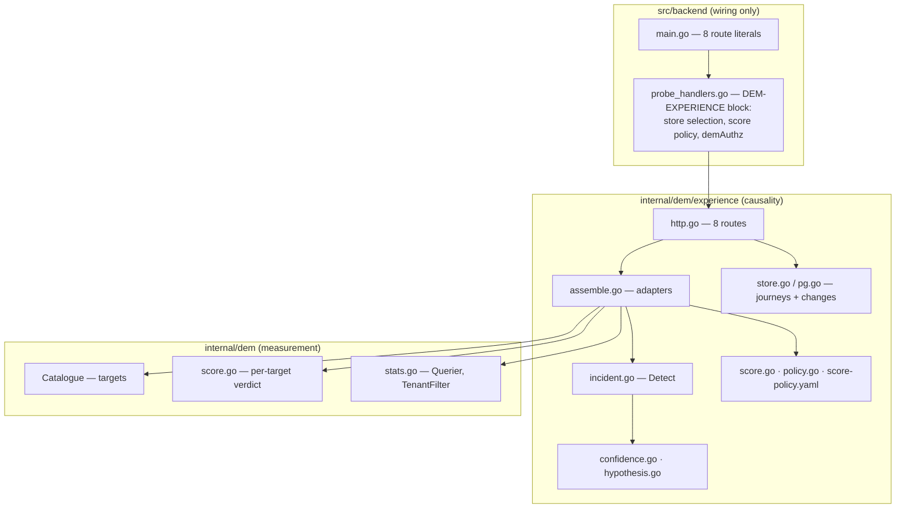
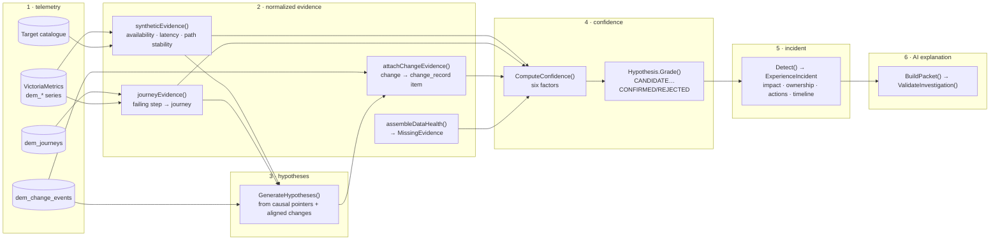

# DEM architecture — the Digital Experience causality layer

Status: **as-built, 2026-09-05.** This document records what the code in
`src/backend/internal/dem/experience` actually does, not what the design
anticipated. Where the two differ the code is documented and the difference is
called out under [§9 Divergences](#9-divergences-from-the-design-of-record).

Authorities, in order: `docs/design/DEM_2026-09-05.md` **§M** (design of
record), `docs/design/dem-repository-assessment.md` (the Phase A assessment,
whose §3, §5 and §6 this document defers to),
`docs/design/research/DEM_OWNER_DESIGN_2026-09-05.md` (the owner's document).
The layer beneath is recorded in `docs/design/DEM_PLUMBING_2026-09-05.md` and
`docs/design/DEM_DATA_MODEL_2026-09-05.md`. The path contract this layer
references and never copies is `docs/design/service-path-graph-contract.md`.

Companions: [`dem-domain-model.md`](dem-domain-model.md) ·
[`dem-evidence-confidence.md`](dem-evidence-confidence.md) ·
[`dem-privacy.md`](dem-privacy.md) · [`dem-api.md`](dem-api.md) ·
[`dem-ui.md`](dem-ui.md) · [`dem-roadmap.md`](dem-roadmap.md).

---

## 1. Two packages, one direction of dependency

Digital Experience Monitoring is two Go packages, stacked, and the stacking is
the architecture.

| Package | Question it answers | What it owns |
|---|---|---|
| `internal/dem` | *Was this subject reachable, how fast, and did its path move?* | The per-tenant target catalogue, the `Identity` every measurement is stamped with, the `dem_*` series, the three-component per-target verdict (`Score`), the window parser and the VictoriaMetrics `Querier`. |
| `internal/dem/experience` | *Was the EXPERIENCE good, and which seam owns the fix?* | Provenance, evidence, hypotheses, the confidence maths, journeys, changes, the published six-dimension score, derived incidents, source health, the AI briefing contract, and the eight aggregation routes. |

`experience` imports `dem`. `dem` does not import `experience` and must not:
the lower layer has to keep working when nobody has declared a journey, and a
measurement package that depended on a causality package would be impossible to
test without one.

The wiring lives in `src/backend/probe_handlers.go`, inside the
`DEM-EXPERIENCE-BEGIN` / `DEM-EXPERIENCE-END` block, and the route literals in
`src/backend/main.go`. No domain logic lives in either: the root package is at
its file-count ratchet (`TestFlatPackageMainDoesNotGrow`), and CLAUDE.md §2
forbids business logic in the entry point regardless.

### 1.1 Purity, and why it is load-bearing

Everything in `evidence.go`, `confidence.go`, `hypothesis.go`, `journey.go`,
`change.go`, `score.go`, `incident.go`, `synthetic.go` and `datahealth.go` is
pure: no clock, no network, no store. `now` is always an argument and every
input is a value.

That is not stylistic. It is what makes the owner's Phase T acceptance scenario
a table test (`acceptance_test.go`) rather than a lab booking, and it is why
`TestIncidentDerivationIsDeterministic` can assert that the same bundle yields
the same incident id and the same confidence on a second call.
`assemble.go` is the only file that knows where evidence comes from, and
`http.go` is the only file that touches a request.

---

## 2. Stored versus derived, and the reason for the line

Exactly **two** objects are persisted. Everything else is recomputed from
immutable facts on every read.

| Object | Persisted? | Where | Why |
|---|---|---|---|
| `JourneyDefinition` | **Yes** | PG `dem_journeys` (migration `0044`, FORCE-RLS `tenant_iso`) or the file store | An operator declared it. Nothing can recompute a human's description of a workflow. |
| `ChangeEvent` | **Yes** | PG `dem_change_events` (same migration and policy) | A producer reported a fact about the past. It is append-only and immutable: the insert is `ON CONFLICT (tenant_id, change_id) DO NOTHING`, so a replayed producer cannot rewrite history. |
| `EvidenceItem` | No — derived | `assemble.go` from `dem.Result` + the change feed | Recomputable from the measurements and the path observations that produced it. |
| `Hypothesis` | No — derived | `GenerateHypotheses` + `RankHypotheses` | A conclusion. Storing it creates a window in which the conclusion and the evidence beneath it disagree. |
| `ExperienceIncident` | No — derived | `Detect(Bundle)` | Same reason, at the level the product is judged on. |
| `ExperienceScore` | No — derived | `ComputeScore` over `ScorePolicy` | The policy version travels with the number, so a score is reconstructible from the window and the policy. |
| `DataHealth` | No — derived | `assembleDataHealth` | It is a statement about right now. |
| `CoverageReport` | No — derived | `BuildCoverage` | Composed from journeys, targets and reliability grades. |

Deriving the incident buys three properties that a persistence layer at this
stage would not:

1. **The same bundle always yields the same incident.** `IncidentID` is
   `sha256(tenant | kind | subject | window_start)` truncated to 10 bytes and
   prefixed `exp-`, so a link an operator shares keeps working and two API calls
   never disagree about which incident is which.
2. **No background writer can drift from what the API returns.** There is no
   detector loop; `Detect` runs inside the request that renders it.
3. **There is no window in which a stored conclusion contradicts the evidence
   under it.** A rollback of migration `0044` loses no analysis, only the
   declared journeys and the recorded change feed.

The cost is recomputation per request. It is bounded by the same ceiling the
catalogue already has: 500 targets per tenant (`dem.MaxTargetsPerTenant`), 100
journeys per tenant (`MaxJourneysPerTenant`), 2000 retained change events per
tenant in the file backend (`changeRetention`), and `DefaultChangePageLimit`
(100) changes read per assembly.

---

## 3. The assembly pipeline

The direction is fixed and never reversed:

> telemetry → normalized evidence → hypotheses → confidence → incident → AI explanation

An AI answer is the *last* step and reads an already-graded incident. There is
no path in which a guess is made first and evidence is then sought to support
it. `investigator.go` enforces the boundary: the model receives a closed packet
built from a graded incident, and any evidence id in its answer that was not in
the packet rejects the whole answer.

### 3.1 Step by step

**Telemetry.** `API.assemble` reads the tenant's targets from `dem.Catalogue`,
one window of statistics from `dem.FetchWindow` (VictoriaMetrics, scoped by
`dem.TenantFilter`), the tenant's journeys from `Store.ListJourneys`, and the
change feed over `window + DefaultChangeLookback` from `Store.ListChanges`. A
metrics query that fails is recorded (`Counters.QueryErrors`), logged and turned
into `ReasonQueryFailed` on every surface. It is never treated as zero.

**Normalized evidence.** `syntheticEvidence` turns each measured target into
zero or more `EvidenceItem`s. A target that missed its availability budget
produces a *supporting* item; a target that met it produces a *contradicting*
one naming the causes a healthy check rules out (`contradictedByHealthyCheck`).
Negative evidence is produced mechanically here rather than curated later.
`journeyEvidence` stamps the failing step of a failing journey onto the
journey itself, which is what lets an incident be scoped to a workflow rather
than only to a check.

**Hypotheses.** `GenerateHypotheses` has exactly two producers and no third:
every distinct `(cause_class, cause_entity)` a supporting item points at, and
every change inside the lookback that touches the scope. There is deliberately
no default hypothesis — an incident whose evidence implicates nothing has none,
and the UI says so. A manufactured "unknown cause at 40 %" is the failure mode
this layer exists to remove.

**Confidence.** `ComputeConfidence` multiplies six factors; `Hypothesis.Grade`
turns the number plus the independence assessment plus the missing-evidence
record into one of five states. The rule is the same one
`src/correlation/verdicts.py` applies, written once in Go. The whole of it is
documented in [`dem-evidence-confidence.md`](dem-evidence-confidence.md).

**Incident.** `Detect` builds one incident per failing journey, plus one per
application that has failing evidence but no declared journey. A healthy
journey gets no incident; an *unmeasured* journey also gets none, because
alarming on absence is not the same as reporting it — the Journeys surface
reports the absence with its reason.

**AI explanation.** `BuildPacket` projects a graded incident into a reduced,
bounded briefing. `ValidateInvestigation` enforces the evidence whitelist, caps
the answer, downgrades any model-claimed `CONFIRMED` to `SUSPECTED` and stamps
the attribution line. No provider call lives in this package.

---

## 4. Where each surface's data comes from

| Surface | Route | Composed from |
|---|---|---|
| Experience overview | `GET /api/dem/overview` | `Assembly.Score` (tenant, six dimensions), `Assembly.JourneyHealth`, `Summarize` over `Assembly.Incidents`, `Bundle.Changes`, `Assembly.DataHealth`, `hotspots(asm)`, and `RollUpBusinessImpact` over the incidents' declared values. |
| Incident list | `GET /api/dem/incidents` | `Summarize` over `Detect`'s output, filtered on `severity`/`app`/`journey`, paged by `internal/httppage`. |
| One incident | `GET /api/dem/incidents/{id}` | The matching `ExperienceIncident` from the same assembly, plus `AIAvailability` and whether a briefing could be built at all. |
| Evidence tab | `…/{id}/evidence` | `Evidence`, `MissingEvidence`, `Hypotheses` of that incident. |
| Timeline tab | `…/{id}/timeline` | `Timeline` (impact + evidence + changes + detection, sorted, capped at `MaxListLen`) and `Changes` (`ChangeRelevance`). |
| Path tab | `…/{id}/path` | **A reference only**: `path_observation_id` plus a `measured` flag. The ordered spine is fetched from the service path graph API, which stays the single source of hop order. |
| Journeys | `GET /api/dem/journeys` | `Store.ListJourneys` + `ComputeJourneyHealth` over per-step `dem.Result`/`dem.WindowStats`. |
| Synthetic coverage | `GET /api/dem/synthetics/coverage` | `BuildCoverage` over the journeys and the catalogue targets their steps bind to. Every check's reliability is `unknown` — see §6. |
| Changes | `GET /api/dem/changes` | `Store.ListChanges` directly, paged. |
| Data health | `GET /api/dem/data-health` | `assembleDataHealth` over `SourceLadder`. |

Every one of the eight routes is authorized by `s.demAuthz`, which maps
`GateRead`/`GateWrite` onto `requirePerm("infrastructure", LevelRead|LevelWrite)`
and then resolves one concrete tenant. The reasoning for that gate, and the
isolation posture behind it, is in [`dem-privacy.md`](dem-privacy.md) §6.

---

## 5. Storage decisions

### 5.1 What was added

**PostgreSQL, migration `0044_dem_experience.sql`.** Two tables,
`dem_journeys` and `dem_change_events`, each with `ENABLE` + `FORCE ROW LEVEL
SECURITY` and the `tenant_iso` policy that migrations `0011` and `0043`
established. Identity plus the columns a query orders or filters on are typed;
the object itself lives in a `data` JSONB column holding byte-for-byte the
API's JSON, so the Postgres and file backends answer identically from one
serialization. The migration is additive and idempotent, touches no existing
table, and its rollback drops only those two tables.

`pg.go` runs every statement inside `WithTenant`, and the scoped reads carry
**no** `WHERE tenant_id = …` predicate. That is deliberate and follows
`internal/dem/pg.go`: enforcement is RLS's job, and a redundant Go-side
predicate would let a future edit remove the real enforcement while keeping the
tests green.

**The file backend** (`store.go`, `DEM_EXPERIENCE_FILE`, default
`/data/dem_experience.json`) is the non-Postgres twin. Rows are a
tenant-keyed map, so a lookup for tenant A cannot walk tenant B's bucket, and
there is no "list every tenant's journeys" method on the `Store` interface at
all. A corrupt file starts empty **and records the error**, which
`probe_handlers.go` logs at error level: an empty table that is really a read
failure is the worst of both outcomes.

### 5.2 What was deliberately not added

**VictoriaMetrics** is unchanged. The experience series are the `dem_*` series
already documented in `DEM_DATA_MODEL_2026-09-05.md` §3, read through
`dem.FetchWindow` with `dem.TenantFilter` supplying `extra_filters[]` so a
crafted expression cannot evade tenant scoping. This layer adds no series of its
own; its only metrics are the self-observability counters in §7.

**ClickHouse and Kafka WERE eventually touched — by tracker 254, once a producer
existed.** In this slice `ExperienceEvent`, `ExperienceSession` and
`BusinessEvent` landed as contracts with validation and an `EventSink` seam and
nothing else, because Phase P is explicit that infrastructure is added when
there is a requirement, not before. The requirement arrived with the first-party
RUM snippet.

### 5.3 The `netops.experience` lane, as built (tracker 254)

It was the five changes predicted below, and — the point of having written the
shapes first — **not one shape changed** to get there. Full walk-through:
[`dem-rum-snippet.md`](dem-rum-snippet.md).

| # | Change | Where | As built |
|---|---|---|---|
| 1 | Declare the topic | `netops.experience` in the bus topic list and the Kafka ACL bootstrap | Added to kafka-init in all three compose files and to `vector-router`'s consume grant in `apply-acls.sh`. correlation is deliberately NOT granted it: nothing in the engine subscribes, and granting a topic nothing consumes implies a consumer that does not exist. |
| 2 | Route it | `vector-router/vector.yaml` — a source on the new topic and `clickhouse` sinks | `kafka_experience` → `experience_split` (a `route` on `record_type`) → two normalising remaps → two sinks. Nested `provenance`/`cohort`/`vitals` are flattened to columns; the dotted-key rule is respected by construction (no `.label`-shaped map reaches a sink). A record with no tenant or no event time is ABORTED to the dead letter. |
| 3 | Create the table **twice** | `deployment/docker/clickhouse/init.sql` **and** `internal/chschema/experience_schema.go` + `ConvergeStmts()` | `netops.experience_events` (30 d) and `netops.business_events` (400 d) in both places, with retention knobs in `ch_retention.go` — the guard test fails the build if the two ever disagree. |
| 4 | Add a **STRICT row policy** | Alongside each table | `StrictRowPolicyDDL` on both. An untagged row is platform-only; the api stamps `tenant_id` from the caller's credential before publishing and the router never derives or defaults it. |
| 5 | Implement `EventSink` | `internal/dem/expbus` | Its own leaf package, so `internal/dem/experience` still never learns about Kafka and the root package holds no queueing logic. Bounded in batches AND in events, backpressure as `503 + Retry-After`, retry with full jitter, and a loud counted drop when the envelope is exhausted. |

Two things the prediction did not say, and that turned out to matter more than
any of the five:

- **The credential.** The producer is a snippet in a page served to the public,
  so its key must be assumed public. `ingest:experience` is write-only and
  tenant-bound, and a key whose scopes are exclusively `ingest:*` now derives
  the zero-permission `rbac.RoleIngest` — before that, an ingest-only key
  derived `read-only` and could have read the tenant's entire operational
  surface from any browser that viewed source.
- **Refusal beats repair.** `user_ref` must be pseudonymous, and the API
  REFUSES a direct identifier with the instruction that fixes it rather than
  hashing it quietly. Silently repairing a caller's mistake teaches the caller
  that sending real identifiers is fine.

---

## 6. Honest limits that are structural, not accidental

Three limits follow from the pipeline above and are reported rather than hidden.

**Two anchor-capable modality classes are live; the second is thin.** The
synthetic prober and the path measurement both carry `active_probe`. Tracker 252
added `passive_flow` (`flow.go`, §8.1), observed by the flow exporter rather than
by our prober, so `CanConfirm` can now be true and a live tenant can reach
`CONFIRMED`. It is thin for two reasons stated on the surface itself: the flow
lane carries **no timing column**, so it contributes availability-shaped evidence
only and never responsiveness; and it needs an exporter that populates
`tcpControlBits`, without which the subject reports `not_supported` rather than a
healthy-looking zero. RUM, SD-WAN SLA and wireless client feeds still have no
producer. `DataHealth.CanConfirm` states the tenant's real position in one field
with a sentence — including "only one kind of instrument is reporting" where that
is still the truth, which is the correct answer, not a limitation to work around.

**A source that went quiet blocks confirmation; one that never reported does
not.** `DataHealth.MissingFrom()` marks a missing source `Required` only when it
is `AnchorCapable && Configured && LastSeen != nil`. The `LastSeen` clause is
the load-bearing one: a source that has **never** produced anything is a
capability the deployment does not have, and treating that as a blocking gap
would make every incident in every such deployment permanently unconfirmable —
which is not caution, it is a broken product. A source that reported and then
stopped is a real gap and still blocks, and the gate reason names it so the
operator is told which instrument fell silent.

With today's adapters no source ever reaches all three conditions: every
anchor-capable source is either `flowing` (and therefore not missing at all) or
has never reported in the window (and therefore is not `Required`). So **no
missing source blocks confirmation on any deployment today.** Missing telemetry
still lowers confidence through the completeness factor, and the confirmation
ceiling comes from the independence rule alone.

**Per-check reliability is `unknown`, everywhere, today.** `GradeReliability`
needs per-run records (`SyntheticRun`), and the prober publishes aggregate
series. `Assemble` therefore passes `Reliability: map[string]SyntheticReliability{}`
into every bundle, and the coverage response carries an explicit
`reliability_note` saying so. A check nobody has graded is not a check that
passed. The consequence inside `severityFor` is deliberate and is tracker 253:
with no grade recorded, an ungraded check is treated as **trustworthy** rather
than as suspect, so the flaky-check severity cap is wired and tested but cannot
fire in production. Inventing a grade for an ungraded check would be worse than
not having one.

---

## 7. Self-observability

`metrics.go` declares nine monotonic counters, exposed on the platform's
`/metrics` endpoint through the same `Write` hook `internal/dem`'s counters use,
so a DEM lane that stops serving is visible where every other engine's liveness
is.

| Counter | Incremented when |
|---|---|
| `dem_experience_views_served_total` | An assembly is built and served. |
| `dem_experience_query_errors_total` | The metrics store did not answer, so the view reports not-measured instead of a zero. |
| `dem_experience_journeys_created_total` | A journey definition is created. |
| `dem_experience_journeys_updated_total` | A journey definition is replaced. |
| `dem_experience_journeys_deleted_total` | A journey definition is removed. |
| `dem_experience_changes_recorded_total` | A change event is accepted. |
| `dem_experience_incidents_derived_total` | Incidents are derived, incremented by the count per assembly. |
| `dem_experience_ai_packets_built_total` | An evidence briefing is built for a model. |
| `dem_experience_ai_packets_rejected_total` | A model answer cited evidence that was not supplied to it. |

The pair worth watching together is `views_served` against `query_errors`: a
rising error ratio means the surfaces are still rendering, honestly, with no
score. The pair `packets_built` against `packets_rejected` is the AI
overreach signal.

Nothing here resets, so a scrape gap is a gap in the rate rather than a reset.
No alert rule fires on these counters yet; the four `noc-experience` rules in
`src/config/rules.yaml` remain the alerting surface and are unchanged by this
slice.

---

## 8. Extension points left for Track T0 producers

A new evidence source is a new function in `assemble.go` and nothing else. The
contract it must satisfy:

1. **Emit `EvidenceItem`s, not measurements.** Each carries a `Provenance`
   (source, `event_at`, `observed_at`, observation mode, data class), a stance,
   an `IndependenceGroup` (its modality class), an `Observer`, a `Reliability`
   and, where the source knows one, a `CauseClass`/`CauseEntity`/`Seam`.
2. **Add the source to `SourceLadder`.** A source absent from the ladder is a
   source nobody notices is missing. Give it a case in `assembleDataHealth` that
   reports its real state; the default case is `off` with "no producer for this
   source is deployed yet".
3. **Register its modality in `sourceModality`** (`datahealth.go`) and its
   operator-facing name in `sourceLabels`. `ModalityForSource` fails closed to
   `management_plane` — corroborating, never confirming — for anything
   unregistered.
4. **Give it a reliability default** in `sourceReliability` (`evidence.go`).
   `DefaultReliability` returns a deliberately modest `0.5` for an ungraded
   source.
5. **If the class is anchor-capable, add it to `anchorModalities` here AND to
   `ModalityClass` in `src/correlation/signals.py`.** `real_user`,
   `change_record` and `business` exist only on the Go side today. Only
   `real_user` is anchor-capable, and the day the RUM producer ships, the Python
   engine must learn the same class or the two graders will disagree about what
   "independent" means.

The producers Track T0 will use these points for, in build order, are: **flow
(shipped — §8.1)**, SD-WAN IPFIX per-tunnel SLA, the wireless onboarding funnel,
Microsoft Graph `callRecords`, and RIPEstat/CrUX. The ordering and the reasoning
are in [`dem-roadmap.md`](dem-roadmap.md) §3.

### 8.1 The passive-flow producer (shipped, tracker 252)

The first extension point actually used, and the worked example of the contract
above. `internal/dem/experience/flow.go` is the whole producer; `assemble.go`
gained one call and one `SourceHealth` case, and nothing else in the package
changed shape.

| Piece | Where |
|---|---|
| subject mapping `<app>@<site>` folded from the catalogue | `FlowSubjectsFor` (`flow.go`) |
| the store seam | `FlowQuerier` (`flow.go`) — nil is legal and reports `off` |
| the ClickHouse implementation | `demFlowQuerier` (`probe_handlers.go`) — aggregate counters only, triple-scoped |
| the adapter | `flowEvidence` (`flow.go`), called from `Assemble` |
| source state | `flowSourceHealth` (`flow.go`), the `SourceFlow` case in `assembleDataHealth` |
| modality, label, reliability | already declared (`ModalityPassiveFlow`, "Flow records", `0.85`) |
| the isolation pin | `dem_flow_isolation_test.go` |

The reasoning — why flow may anchor, why `0.85`, why responsiveness is not
measured, why the healthy item is neutral — is in
[`dem-evidence-confidence.md`](dem-evidence-confidence.md) §4.5 and is not
repeated here.

Two things the producer deliberately does **not** do, both of which a later
change may revisit with a schema change rather than a code change:

- **It does not resolve hostnames.** A DEM target declared by name contributes
  no flow endpoint. Resolving it in the API would measure whatever that name
  resolves to on the API host, which is not what the user reached.
- **It does not infer a site from an address.** There is no subnet→site map in
  this repository; the site comes from the target declaration or the subject has
  none.

Two further seams are already declared and unimplemented: `EventSink`
(`event.go`) for the RUM/agent ingest lane, and the AI orchestrator's use of
`BuildPacket`/`ValidateInvestigation` (`investigator.go`), which needs only a
provider call added in `ai/*`.

---

## 9. Divergences from the design of record

Recorded so a reader of §M is not surprised by the code. None of these is a
defect; each is either a decision the assessment took or a place the code went
further than the design.

| # | §M said | The code does | Why |
|---|---|---|---|
| D1 | §M.2: the DEM evidence packet is "persisted alongside" the incident (PG, RLS). | Nothing derived is persisted; incidents are computed at read time. | Assessment §6.3. Same bundle ⇒ same incident, no drift window, no background writer. |
| D2 | §M.3: `ChangeEvent` lives in a new `internal/dem/change` package. | It lives in `internal/dem/experience/change.go`. | One bounded context. A separate package would have split the change type from the ranker that scores it. |
| D3 | §M.3: `ExperienceEvent`/`ExperienceSession` reach ClickHouse over the `netops.experience` lane. | **BUILT (tracker 254).** Topic, router lane, two STRICT-policy ClickHouse tables, `POST /api/dem/events` + `/business-events`, and the first-party RUM snippet. | `ExperienceSession` remains a contract: the snippet emits events with a session id, and a session ROLL-UP has no producer yet. See §5.3 and `dem-rum-snippet.md`. |
| D4 | §M.9: `FeatureDEM` semantic entitlement. | Not added. Gating stays the `FEATURE_DEM` environment flag, plus `FEATURE_COPILOT` + `FEATURE_DEM_AI_INVESTIGATOR` for the investigator. | Assessment §6.1: `internal/entitlement`'s vocabulary is owner-locked, and §M.11 lists DEM packaging as an open owner decision. **Owner decision required.** |
| D5 | §M.4: worst-of for triage and p95-of for reporting, with the UI stating which. | A third mode, `worst_weighted`, is what the tenant score reports. `WorstWeightedMean` folds each dimension's per-subject points giving the **worst** subject `WorstShare` (0.4) of the weight, and `aggregation` reads `worst_weighted`. `AggWorstOf` and `AggP95Of` remain declared as the **per-observer** modes. | The per-observer toggle needs more than one vantage per subject, and there is one prober, so there is no second observer to take a worst or a percentile of. What the tenant score actually folds is per-*subject* points, and folding them with a plain mean is how one dead target disappears into a green tile: nine perfect subjects and one dead one is 54, not 90. The label now names the arithmetic. |
| D6 | §M.4: a score per journey, app, site and tenant. | `ComputeScore` accepts all four `subject_kind`s; `Assemble` builds only the tenant score. | Per-journey and per-site scores need per-subject dimension inputs, which need a per-site prober. `hotspots()` reports the site and application breakdowns it can and marks ISP, device, browser, version and network as not measured. |
| D7 | Owner Phase C.10: `EvidenceItem` carries a `freshness` field. | Freshness is **derived** (`EvidenceItem.Freshness(now)`) from `ExpectedIntervalSec` and the provenance age; it is not a stored field. | A stored freshness is stale by definition. The stored input is the source's declared cadence. |
| D8 | Owner Phase D: every list endpoint filters on environment, geography, browser/device, ISP/network, release/version and feature flag. | `RejectUnknownQuery` refuses every parameter not implemented. Incidents accept `window`, `severity`, `app`, `journey`; changes accept `window`, `type`, `app`, `site`. | A filter over a dimension nothing produces is a filter that always returns nothing. A misspelt parameter must fail loudly rather than be swallowed (`internal/httppage`). |
| D9 | Owner Phase C.12: `recovery timestamp`, `executed actions`, `verification results`. | `RecoveredAt` is modelled and never set; `Status` is always `open`; `Verification.Attempted` is always false and `Checks` is a **plan**, not a result. Only `RecommendedActions` exist; execution belongs to the platform's Action Queue. | Nothing in this slice executes or verifies a remediation. Claiming recovery from an action completing is precisely what `Verification.Detail` refuses to do. |
| D10 | §M.2: hypotheses carry their own missing evidence. | `Hypothesis.MissingEvidence` is set to the whole incident's missing-evidence list. | The gaps are a property of the tenant's telemetry in that window, not of one explanation. A per-hypothesis view would need a producer→cause map that does not exist. |

---

## Related

- [`dem-domain-model.md`](dem-domain-model.md) — every object, field and invariant.
- [`dem-evidence-confidence.md`](dem-evidence-confidence.md) — the maths, to the decimal.
- [`dem-api.md`](dem-api.md) — the eight routes and their honest shapes.
- [`dem-privacy.md`](dem-privacy.md) — data classes, redaction, retention, authorization.
- [`dem-ui.md`](dem-ui.md) — the IA and the honesty rules the screens must enforce.
- [`dem-roadmap.md`](dem-roadmap.md) — what ships next, and the open owner decisions.
- [`service-path-graph-contract.md`](service-path-graph-contract.md) — the frozen path contract this layer references by id.
