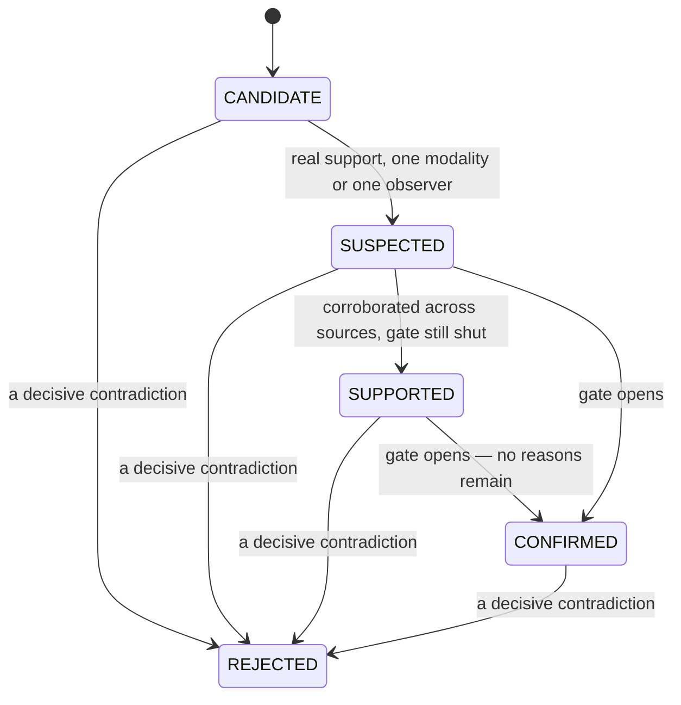

# DEM evidence and confidence — the maths, to the decimal

Status: **as-built, 2026-09-05.** Source: `confidence.go`, `evidence.go`,
`hypothesis.go` and `change.go` in `src/backend/internal/dem/experience`,
verified against `confidence_test.go` and `acceptance_test.go`.

A confidence in Correlix is a claim about **evidence**, not a feeling about a
conclusion. Every number on this page is decomposable into named factors with
operator-readable reasons, and every constant is exported so the API can publish
it beside a score: a number whose constants are secret is not explainable.

Nothing here reads a clock. `now` is always an argument, which is why every
branch below is a table test rather than a lab booking.

---

## 1. The formula

```
confidence = support × independence × alignment × specificity
             × contradiction × completeness
```

Six factors, each in 0..1, each carrying a sentence. The product is clamped to
0..1 and rounded to two decimals.

| Factor | Answers |
|---|---|
| `support` | How much fresh, reliable observation is there? |
| `independence` | How many **different kinds** of instrument, from how many different vantages, agree? |
| `alignment` | How much of the supporting evidence falls inside the incident window — and, for a change, does it precede first impact? |
| `specificity` | Does the hypothesis name a concrete cause and the seam that owns it, or wave at a region? |
| `contradiction` | How much of what remains is removed by observations that point the other way? |
| `completeness` | How much did we expect to hear from, and did not? |

A multiplicative composition is chosen over a weighted sum because each factor
is a **veto with a floor**: no amount of support should rescue a hypothesis
that names no cause, and no amount of specificity should rescue one nothing
observes.

---

## 2. The constants

Every one of these is an exported constant in `confidence.go`.

| Constant | Value | What it does | Why this value |
|---|---|---|---|
| `SupportSaturation` | `3.0` | The summed evidence weight at which `support` reaches 1.0. | Three fully-reliable, perfectly fresh observations saturate it. Linear-then-capped rather than exponential precisely so it can be explained on a tooltip: a third strong observation adds nothing a fourth would not. |
| `IndependenceSingleClass` | `0.60` | One modality class. | Five copies of one source stay here. That is the point of the factor. |
| `IndependenceTwoClasses` | `0.85` | Two anchor classes across two observers — the independence rule satisfied. | The step from 0.60 to 0.85 is the largest single move any factor makes, because a genuine second opinion is the largest single thing that can be learned. |
| `IndependenceThreeOrMore` | `1.00` | Three or more anchor classes across at least two observers. | Three kinds of instrument agreeing is as much as this measure counts. |
| `SpecificityEntityAndSeam` | `1.00` | Names a concrete cause **and** the seam that owns it. | A diagnosis that can be handed to someone. |
| `SpecificityEntityOnly` | `0.80` | Names the entity but no owning seam. | It cannot be handed to anyone yet. |
| `SpecificityVague` | `0.55` | Names no concrete cause. | "Something upstream is slow" is a lead, not a diagnosis, and its ceiling says so. |
| `ContradictionShare` | `0.45` | The fraction of the **remaining** confidence one fully-weighted contradiction removes. | Applied multiplicatively per item, so two contradictions do not simply double the first one's effect. |
| `ContradictionFloor` | `0.15` | The floor on the contradiction factor. | A hypothesis with real support never silently vanishes. It is shown, weakened, with its contradictions named. |
| `MissingEvidenceCost` | `0.10` | What one missing expected source costs. | Missing telemetry must reduce confidence. |
| `MissingEvidenceFloor` | `0.60` | The floor on the completeness factor. | Missing telemetry must not erase what **was** measured. Four or more missing sources reach the floor. |
| `ConfidenceFloor` | `0.30` | Below it a hypothesis is a `CANDIDATE`, not a diagnosis. | Mirrors the correlation engine's `CONFIDENCE_FLOOR`. |
| `ConfirmConfidence` | `0.70` | The minimum confidence for `CONFIRMED`. | **Necessary, never sufficient** — the independence gate still rules. |

Two further constants live in `evidence.go` and `hypothesis.go`:

| Constant | Value | What it does |
|---|---|---|
| `freshnessHalfLife` | `1h` | How long an item takes to lose half its weight when its source declared no cadence. Chosen to match the shortest experience window, so an hour-old fact carries half the weight of a fresh one. |
| `DefaultWindowTolerance` | `2m` | How far outside the window a **measurement** may fall and still describe it. |
| `DefaultChangeLookback` | `90m` | How far before first impact a **change** may have happened and still be a candidate cause. |

Both tolerances are deliberately modest. A generous window is how a temporal
coincidence becomes a "cause".

---

## 3. Item weight: reliability × freshness

```
weight(item, now) = clamp01(reliability) × freshness(item, now)
```

A **neutral** item weighs exactly zero. It is context for a human, not input to
a number, and the distinction is deliberate.

`reliability` is a property of the **source**, not of the number — a
controller's own summary and a packet measured on the wire are not equally
strong claims. The defaults are in
[`dem-domain-model.md`](dem-domain-model.md) §3.1; nothing is 1.0.

### 3.1 Freshness, both branches

**With a declared cadence** (`expected_interval_sec > 0`):

```
age ≤ interval        → 1
age ≥ 10 × interval   → 0
otherwise             → 1 − (age − interval) / (9 × interval)
```

A source that missed one cycle is not yet suspect; one that missed ten has
stopped. The decay between the two is linear, and the item never scores exactly
0 while it is inside its own interval.
`TestFreshnessDecaysWithTheSourcesOwnCadence` pins all three branches for a
60 s cadence: fresh at 0 s, strictly between 0 and 1 at 5 min (five intervals),
exactly 0 at 30 min (thirty intervals).

**With no declared cadence** (`expected_interval_sec == 0`):

```
freshness = 0.5 ^ (age / 1h)
```

The half-life curve, computed by a local `pow` built from repeated squaring plus
a 12-step binary refinement of the fractional exponent. `math.Pow` would do; the
local version keeps the decay function auditable to the decimal this document
quotes and avoids any platform-dependent last-bit difference in a stored
confidence. Twelve halvings resolve the fraction to about `2⁻¹²`, far finer than
the two decimal places a confidence is ever reported to.

`Provenance.Age(now)` floors at zero, so a producer clock ahead of ours reports
as fresh rather than as "fresher than possible".

---

## 4. Modality classes and the independence rule

An item's `independence_group` is its **modality class**. Two items in the same
group are **one opinion** however many times they are repeated, which is the
whole point: five vantages of the same synthetic check are five samples of one
modality, not five independent confirmations.

### 4.1 Which classes may anchor

| May anchor a CONFIRMED verdict | May only corroborate |
|---|---|
| `active_probe` | `management_plane` |
| `passive_flow` | `active_verification` |
| `control_plane` | `security` |
| `device_telemetry` | `change_record` |
| `real_user` | `business` |

The right-hand column is not a ranking of quality. It is a statement about what
each class measures. `management_plane`, `active_verification` and `security`
carry the Python correlation engine's stance verbatim: a controller's opinion, a
device's own answer and a rule verdict corroborate but never confirm.
`change_record` and `business` are DEM's own support-only classes, and their
reasons are structural:

- **`change_record` cannot anchor because a change is not a measurement of the
  experience.** "It happened just before" is correlation by clock. This one
  constant is what makes "temporal proximity alone cannot confirm causality" a
  fact about the code instead of a review comment.
- **`business` cannot anchor because it measures the consequence, never the
  mechanism.** Orders falling tells you something is wrong; it never tells you
  what.

`real_user` may anchor because it is the only class that observes the experience
from the seat it is actually had in.

**State this plainly wherever it matters: `real_user`, `change_record` and
`business` exist only on the Go side.** `src/correlation/signals.py`'s
`ModalityClass` carries the other seven and none of these three. Two of the
three are harmless in that state, because they are support-only and can only
ever lower a verdict. `real_user` is not: it is **anchor-capable in Go and
unknown to the Python grader**, so a verdict this package would confirm on RUM
plus a probe is a verdict the correlation engine could not even express.

Nothing produces `real_user` evidence today, so the two graders cannot yet
disagree. **The day the RUM producer ships, `real_user` must be added to
`ModalityClass` in `src/correlation/signals.py` in the same change**, or they
will disagree about what "independent" means — and a product whose two engines
grade the same evidence differently has no defensible answer to "is this
confirmed".

### 4.2 The rule

`AssessIndependence` walks the **supporting** items of one hypothesis and
answers one question: is there a concrete pair of items with a **different
anchor modality** and a **different observer**?

- An item that will not name its observer is folded into a synthetic
  `unnamed:<modality>` vantage, so every unnamed item of one class shares one
  vantage. §3 zero trust: no benefit of the doubt.
- Non-anchor classes are counted in `modalities` and shown, but never in
  `anchor_modalities`. That is how a wall of change records and business
  outcomes fails to confirm anything no matter how large it is.
- The pair is the **first** qualifying pair in item order, and its two ids are
  published in `independent_pair` so an operator can see exactly which two
  observations carried the verdict.

`Satisfied()` is precisely `len(independent_pair) == 2`.

### 4.3 The factor

```
≥ 3 anchor modalities AND ≥ 2 observers  → 1.00
Satisfied()                              → 0.85
otherwise                                → 0.60
```

`TestIndependenceCountsKindsNotCopies` pins the three cases that matter: four
copies of one probe from one vantage do not satisfy the rule; a **fifth vantage
of the same modality** still does not; a second modality from a second observer
does.

### 4.4 The reasons a gate fails

`Independence.Reasons` are the sentences the UI renders next to "not confirmed",
verbatim. They are mechanical, never a generic label:

| Condition | Reason |
|---|---|
| No supporting evidence at all | "no supporting evidence" |
| Supporting evidence exists, but no anchor-capable class | "every supporting observation is of a class that can corroborate but never confirm (a change record or a business outcome is not a measurement of the experience)" |
| Exactly one anchor class | "only one independent modality class observed it — one kind of instrument agreeing with itself is one opinion" |
| Fewer than two observers | "only one observer reported it" |
| Two anchor classes and two observers, but no pair that is both | "the second modality came from the same observer, so the two observations are not independent" |

---

## 5. Alignment and the change-before-effect rule

`alignment` is the share of supporting **weight** that falls inside the window:

```
alignment = aligned_weight / alignable_weight      (1.0 when there is none)
```

`Window.Aligns` has two branches, and the second is the important one.

**A measurement** is aligned when its `event_at` lies inside
`[start − tolerance, end + tolerance]`.

**A change** — an item whose `kind` is `change` **or** whose modality is
`change_record` — is aligned only when it lies inside
`[first_impact − ChangeLookback, first_impact + tolerance]`. When first impact
is unknown, the window start substitutes.

A change **after** first impact is explicitly **not aligned**. It cannot have
caused what had already started, and scoring it as if it might is the single
most common way a dashboard blames the wrong team. Such a change is still
*shown* — an operator wants to see what was done during an incident — but it
contributes nothing to a cause hypothesis.

`TestChangeBeforeEffectSupportsButNeverConfirms` pins both halves: a deploy two
minutes before first impact contributes real confidence and still cannot
confirm; the same deploy ten minutes *after* first impact scores strictly lower.

---

## 6. Contradiction, and the decisive kind

```
contradiction = Π over contradicting items of (1 − 0.45 × weight(item))
                floored at 0.15
```

Multiplicative per item, so each contradiction removes a share of what is
**left** rather than a share of the original. Two fully-weighted contradictions
therefore leave about 0.30, not zero, and the floor guarantees the hypothesis is
never silently erased — it is shown, weakened, with its contradictions named.

A hypothesis with no contradicting evidence gets factor `1` and the reason
"nothing measured contradicts it".

**A decisive contradiction is not a factor at all.** `EvidenceItem.Decisive`
marks an observation that *refutes* rather than weakens — the owner's "the same
release is healthy on the unaffected cohort". `Hypothesis.Grade` checks it
**first**, before and independently of the confidence number, and drives the
hypothesis straight to `REJECTED`:

> a measured observation refutes it outright, so it is rejected regardless of
> what else points at it

Supporting evidence for a cause that demonstrably did not act is not evidence at
all. Validation refuses `decisive` on anything but a contradicting item.

---

## 7. Completeness — missing telemetry is data

```
completeness = 1 − 0.10 × (number of missing expected sources)
               floored at 0.60
```

The reason is stated with the number: "expected but absent: `flow` and `agent` —
missing telemetry is not agreement." Four or more gaps reach the floor, because
missing telemetry must lower confidence without pretending the remaining
evidence is worthless.

Separately from the factor, a missing source marked **`required`** blocks
`CONFIRMED` outright and puts a named gate reason on the hypothesis:

> a source required to confirm this reported nothing: `pathgraph` (stale)

`DataHealth.MissingFrom()` marks a source required only when **all three** hold:
it is **anchor-capable**, it is **configured**, and it has **reported at least
once** in the window (`LastSeen != nil`).

Each clause blocks a different mistake:

- A corroborating source being off lowers confidence without blocking anything.
  It could never have confirmed a verdict, so its absence cannot be what stops
  one.
- A source that has **never** produced anything is a capability the deployment
  does not have, not a gap in a capability it has. Marking it required would
  make every incident in every such deployment permanently unconfirmable, which
  is not caution.
- A source that reported and then went quiet **does** block. Something that was
  working has stopped, and that is exactly the gap the rule exists to catch.

**On every deployment today, nothing is marked required.** Each anchor-capable
source is either `flowing` — and so not missing at all — or has never reported
in the window. The confirmation ceiling therefore comes from the independence
rule alone, and `DataHealth.CanConfirm` is the field that says so.

---

## 8. Ranking changes by correlation, not by clock

`RankChanges` scores each change against the incident's scope. The weights are
exported because a ranked list whose weights are secret is a ranked list nobody
can argue with.

| Weight | Value | Awarded for |
|---|---|---|
| `RelevanceProximity` | 0.35 | Linear inside the lookback: `1 − gap/lookback`. Immediately before first impact is full marks; at the edge of the lookback it is worth nothing. A change after first impact earns none of this and is marked `precedes_impact: false`. |
| `RelevanceScope` | 0.35 | `clamp01(hits / 2)` over three possible hits: the change's app matches the failing app, its site matches the affected site, its seam matches the implicated seam. Two hits saturate. |
| `RelevanceCohort` | 0.20 | Its cohort **includes** the affected population. |
| `RelevanceClass` | 0.10 | Its type maps to a cause class that is among the incident's hypotheses. |

Cohort comparison is deliberately conservative. Comparing only the dimensions
recorded on **both** sides: all matching means `includes`, none matching means
`excludes`, and anything else — no comparable dimension, or a partial overlap —
means `unknown`. An empty cohort on either side can never exclude, because an
unrecorded dimension is not evidence of anything, and the reason says so: "we
cannot tell which population it reached."

`TestChangesAreRankedByCorrelationNotProximity` pins the point of the whole
function: an unrelated switch VLAN edit one minute before impact must rank
**below** a transit preference change an hour before it that touches the failing
app, site and seam.

---

## 9. The state machine



`Grade` is evaluated in this order, and the order matters:

1. **Decisive contradiction?** → `REJECTED`, with its single gate reason.
   Nothing else is consulted.
2. Collect gate reasons: the independence reasons, one per **required** missing
   source, one if any contradiction stands at all, and one if
   `confidence < ConfirmConfidence`.
3. No supporting evidence, or `confidence < ConfidenceFloor` (0.30) →
   `CANDIDATE`.
4. No gate reasons at all → `CONFIRMED`, and `gate_reasons` is cleared.
5. The independence rule satisfied, **or** two or more modality classes present
   → `SUPPORTED`. Corroborated across sources but short of the gate.
6. Otherwise → `SUSPECTED`.

### 9.1 Mapping onto the correlation engine's verdict tiers

| DEM state | `verdict_tier` | Meaning on the wire |
|---|---|---|
| `CANDIDATE` | `undetermined` | Below the floor, or nothing supports it. |
| `SUSPECTED` | `suspected` | Real support, one modality or one observer. |
| `SUPPORTED` | `suspected` | Corroborated across sources, still short of the gate. |
| `CONFIRMED` | `confirmed` | The independence rule is satisfied, nothing required is missing, nothing contradicts, and confidence is at or above 0.70. |
| `REJECTED` | `undetermined` | A conclusion about what did **not** happen. The object it belongs to is not thereby explained, so as a *verdict* it is undetermined. |

Two DEM states map onto one engine tier on purpose. `SUSPECTED` and `SUPPORTED`
are a distinction an operator cares about — "one instrument says so" versus
"several instruments agree but not independently" — and one the engine's
three-tier vocabulary does not carry. Widening the engine's tiers to fit would
have changed a contract shared with the Python side; narrowing DEM's states
would have thrown away the distinction. Keeping both and publishing both fields
is the honest option.

### 9.2 Ranking and the leading hypothesis

`RankHypotheses` grades every hypothesis and sorts: non-rejected first, then by
confidence descending, then by id for a deterministic tie-break. **A rejected
hypothesis sorts last and is never dropped** — "we considered the deploy and
ruled it out" is one of the most valuable things the product can say.

`Leading` returns the highest-confidence hypothesis that is neither `REJECTED`
nor `CANDIDATE`. An incident whose hypotheses are all rejected or all candidates
has **no leading cause**, its confidence reads `0` and its tier reads
`undetermined`, and the UI says "no cause has enough evidence yet" rather than
showing the best of a bad set.

### 9.3 Which evidence bears on which hypothesis

`selectEvidence` applies one rule with two branches:

- An item that **names** hypotheses is used **only** for those, and its stance
  is forced to match how it named them (an item listed in
  `contradicts_hypothesis_ids` is scored as contradicting, whatever its own
  stance field said).
- An item that names **none** bears on **every** hypothesis in the set, which is
  the shape a single-hypothesis incident naturally has. Neutral items are
  excluded.

`attachChangeEvidence` is what turns the declarative pointers into those lists,
and it is what makes negative evidence mechanical rather than editorial: a
contradicting item that names `contradicts_causes` is wired to every hypothesis
carrying one of those cause classes.

It also closes the gap the "names none" branch would otherwise leave open. A
**supporting** item that names a `cause_class` for which no hypothesis exists
would end up with an empty `supports_hypothesis_ids`, be treated as unattached,
and therefore bear on **every** hypothesis in the set — the exact opposite of
what it says. Such an item is instead **demoted to `neutral`**: it is rendered
for the operator as context and scored against nothing. An observation that
points at a cause nobody proposed is not evidence for the causes that were.

---

## 10. Worked example — the Phase T acceptance scenario

The fixture is `acceptanceBundle()` in `acceptance_test.go`, evaluated at
`testNow = 2026-09-05T12:00:00Z` over `NewWindow(testNow − 1h, testNow)`. The
arithmetic below was verified against the constants and the exact `pow`
implementation the code uses; `go test ./internal/dem/...` passes.

### 10.1 The scenario

A user attempts checkout from an affected network. Real-user telemetry shows
checkout errors rising. Synthetics fail from three vantages in the same region.
Path measurement shows degradation between the ISP and the cloud. The backend is
healthy. A deployment happened 32 minutes before now — but users on another ISP
running the same release completed checkout normally.

### 10.2 The journey

`Checkout`, critical, objective 99 % over 1 h, value 40 USD per success, three
required steps: `browse` 100 %, `cart` 100 %, `pay` 91.6 %, 60 samples each.

```
success = 1.000 × 1.000 × 0.916 = 0.916  →  91.60 %
meets_slo = 91.60 ≥ 99  →  false
failing_step_id = "pay"          (the first required step to miss its objective)
slo_impact_pct  = 99 − 91.6 = 7.40
business_impact = ((99 − 91.6) / 100) × 60 × 40 = 177.60 USD
```

Severity is `critical` — the journey's declared business importance — and it
stays there: the miss of 7.4 points is not marginal, and the supporting evidence
is not synthetic-only, so neither the marginal-miss demotion nor the flaky-check
cap applies.

### 10.3 The evidence

| # | id | Kind | Modality | Observer | Stance | Reliability | Age |
|---|---|---|---|---|---|---|---|
| 1 | `rum-checkout-errors` | `real_user_metric` | `real_user` | `rum:browser` | supports | 0.95 | 28 min |
| 2 | `syn-branch-1` | `synthetic_result` | `active_probe` | `prober@branch-1` | supports | 0.90 | 27 min |
| 3 | `syn-branch-2` | `synthetic_result` | `active_probe` | `prober@branch-2` | supports | 0.90 | 26 min |
| 4 | `syn-branch-3` | `synthetic_result` | `active_probe` | `prober@branch-3` | supports | 0.90 | 25 min |
| 5 | `path-isp-a` | `path_degradation` | `active_probe` | `prober@branch-1` | supports | 0.90 | 27 min |
| 6 | `bgp-as3356` | `correlation` | `control_plane` | `ripestat` | supports | 0.85 | 27 min |
| 7 | `svc-checkout-api` | `service_health` | `device_telemetry` | `svc:checkout-api` | contradicts | 0.90 | 26 min |
| 8 | `cohort-v42-healthy` | `cohort_comparison` | `real_user` | `rum:browser` | contradicts, **decisive** | 0.95 | 24 min |

Items 5 and 6 carry the causal pointer: cause `transit_degradation`, entity
`AS3356 (ISP-A transit)`, seam `wan-isp-a`, owner `ISP A / carrier`. Item 5's
provenance carries `source_object: obs-91827`, which becomes the incident's
`path_observation_id`.

Items 7 and 8 carry `contradicts_causes`. Item 8 is the decisive one: users on
ISP-B running the same v42 release completed checkout normally throughout.

One change: `APPLICATION_DEPLOY` of `checkout-api` v42, 32 minutes ago, cohort
`app_version=v42`. `attachChangeEvidence` turns it into a ninth item,
`chg-…`, modality `change_record`, reliability `DefaultReliability(configdrift)`
= 0.70.

Two missing sources, neither required: `flow` / `passive_flow` /
`not_configured` and `agent` / `device_telemetry` / `not_configured`. Neither is
configured and neither has ever reported, so neither can block confirmation
under the §7 rule. Both still cost the completeness factor, which is where the
whole of this example's shortfall from 1.00 comes from.

`first_impact_at` is the earliest supporting, non-change `event_at`:
`testNow − 28 min`.

### 10.4 Two hypotheses

`GenerateHypotheses` produces exactly two, from its two producers:

- **H1** — from the causal pointer on items 5 and 6: cause
  `transit_degradation`, entity `AS3356 (ISP-A transit)`, seam `wan-isp-a`,
  owner `ISP A / carrier`.
- **H2** — from the change inside the lookback: cause
  `application_regression`, entity `checkout-api`, no seam, owner
  `application team`.

### 10.5 H1 — the transit hypothesis

`selectEvidence` gives H1 the six supporting items (1–6); items 7, 8 and the
change item all name H2 explicitly and are excluded.

Freshness (no declared cadence, `0.5 ^ (age/1h)`) and weight:

| id | reliability | age | freshness | weight |
|---|---|---|---|---|
| `rum-checkout-errors` | 0.95 | 28 min | 0.723692 | **0.687507** |
| `syn-branch-1` | 0.90 | 27 min | 0.732068 | **0.658861** |
| `syn-branch-2` | 0.90 | 26 min | 0.740666 | **0.666599** |
| `syn-branch-3` | 0.90 | 25 min | 0.749238 | **0.674314** |
| `path-isp-a` | 0.90 | 27 min | 0.732068 | **0.658861** |
| `bgp-as3356` | 0.85 | 27 min | 0.732068 | **0.622257** |
| | | | **support weight** | **3.968400** → published as `3.97` |

The six factors:

| Factor | Value | Why |
|---|---|---|
| `support` | **1.00** | `clamp01(3.9684 / 3.0)`. Saturated: `SupportSaturation` is 3.0 and there is 3.97 of weight. |
| `independence` | **1.00** | Three anchor classes (`active_probe`, `control_plane`, `real_user`) across five observers. `independent_pair` is `[rum-checkout-errors, syn-branch-1]` — the first pair differing in both modality and observer. |
| `alignment` | **1.00** | All six items are measurements inside `[11:00 − 2m, 12:00 + 2m]`. |
| `specificity` | **1.00** | Names `AS3356 (ISP-A transit)` **and** the seam `wan-isp-a`. |
| `contradiction` | **1.00** | Nothing in H1's selected set contradicts it. |
| `completeness` | **0.80** | `1 − 0.10 × 2` for `flow` and `agent`. |

```
confidence = 1.00 × 1.00 × 1.00 × 1.00 × 1.00 × 0.80 = 0.80
```

**H1 confidence = 0.80.** Grade: no decisive contradiction; independence
reasons empty; no required missing source; no contradicting ids; `0.80 ≥ 0.70`.
No gate reasons remain, so **`state = CONFIRMED`, `verdict_tier = confirmed`**.

This is exactly what the acceptance test asserts, and the assertions are worth
reading together: confidence must be at or above `ConfirmConfidence`, must be
strictly **below 1** (two expected sources are missing and missing telemetry
must cost something), and `anchor_modalities` must number at least three.
Completeness at 0.80 is the whole of the shortfall, and it is the right one.

### 10.6 H2 — the deployment, ruled out

`selectEvidence` gives H2 the four unnamed supporting items (1–4), the change
item, and items 7 and 8 — both of which name H2 through their
`contradicts_causes`.

| Part | Value |
|---|---|
| Supporting weight | `0.687507 + 0.658861 + 0.666599 + 0.674314 + 0.483713 (change, 0.70 × 0.690 at 32 min) = 3.170995` |
| `support` | **1.00** (saturated) |
| `independence` | **0.85** — two anchor classes (`real_user`, `active_probe`); the change record is counted in `modalities` and never in `anchor_modalities` |
| `alignment` | **1.00** — the change precedes first impact by 4 minutes, inside the 90-minute lookback |
| `specificity` | **0.80** — names `checkout-api` but no owning seam |
| `contradiction` | **0.47** — `(1 − 0.45 × 0.666599) × (1 − 0.45 × 0.720014) = 0.473216` |
| `completeness` | **0.80** |

```
confidence = 1.00 × 0.85 × 1.00 × 0.80 × 0.47 × 0.80 = 0.2557 → 0.26
```

But the number is not what decides it. Item 8 is **decisive**, so `Grade`
returns before any of this is consulted: **`state = REJECTED`,
`verdict_tier = undetermined`**, with the single gate reason "a measured
observation refutes it outright, so it is rejected regardless of what else
points at it". `contradicting_evidence_ids` names both `cohort-v42-healthy` and
`svc-checkout-api`, so the rejection says what refuted it.

The deployment still appears in the change list, and it appears **first**:

```
relevance = 0.35 × (1 − 4/90)   proximity, 4 min before first impact
          + 0.35 × clamp01(1/2) scope: the failing application
          + 0.20                cohort: app_version v42 matches the affected cohort
          + 0.10                class: APPLICATION_DEPLOY → application_regression,
                                which is among the incident's hypotheses
          = 0.809444 → 0.81
```

`precedes_impact: true`, `touches_affected_cohort: true`. The change is
prominent, correlated, and its hypothesis is rejected — which is precisely the
outcome the owner's scenario asks for.

### 10.7 The incident

| Field | Value |
|---|---|
| `title` | `Checkout journey degraded` |
| `severity` | `critical` |
| `leading_hypothesis_id` / `confidence` / `verdict_tier` | H1 / `0.80` / `confirmed` |
| `owner` / `seam` | `ISP A / carrier` / `wan-isp-a` |
| `impact.journey_success_pct` | `91.6` |
| `impact.business_value_lost` / `currency` | `177.6` / `USD` |
| `impact.affected_cohorts` | `site=branch-1 · isp=ISP-A · version=v42` |
| `impact.unaffected_cohorts` | `site=branch-7 · isp=ISP-B · version=v42` |
| `impact.not_measured` | affected users and sessions; error rate |
| `slo_impact_pct` | `7.4` |
| `path_observation_id` | `obs-91827` |
| `missing_evidence` | 2 records |
| `recommended_actions[0]` | `traffic_shift` on `AS3356 (ISP-A transit)`, with both a rollback plan and a verification plan |
| `verification.recovered` | `false`, with three planned checks |
| `timeline` | 12 entries, each stating whether it was observed or inferred |

Because H1 is `CONFIRMED`, the recommended action is the traffic shift alone. An
unconfirmed hypothesis would have produced the same action **plus** a companion
`investigate` action whose verification plan is the gate reasons themselves.

---

## 11. What the tests pin

Read in this order, they are the specification:

| Test | Rule protected |
|---|---|
| `TestIndependenceCountsKindsNotCopies` | Repeating one source does not make it two opinions; a second vantage of one modality still does not. |
| `TestIndependentVantagesRaiseConfidence` | Three independent kinds beat three copies of one, **and** the rise comes from the independence factor rather than from volume. |
| `TestContradictingEvidenceLowersConfidence` | Negative evidence is evidence, and it is visible in the decomposition rather than folded away. |
| `TestMissingTelemetryLowersConfidenceAndBlocksConfirmation` | Missing telemetry lowers confidence; a **required** missing source blocks confirmation and the gate reason names it. |
| `TestChangeBeforeEffectSupportsButNeverConfirms` | A change before first impact contributes; temporal proximity alone never confirms; a change after first impact scores strictly lower. |
| `TestDecisiveContradictionRejects` | A decisive contradiction rejects however much circumstantial support exists. |
| `TestRejectedHypothesesAreKeptAndRankedLast` | A ruled-out explanation is kept and shown. |
| `TestFreshnessDecaysWithTheSourcesOwnCadence` | Both freshness branches. |
| `TestDataHealthNeverCallsAbsenceHealthyAndGatesConfirmation` | Absence is never healthy; a source that went quiet blocks confirmation, one that never reported does not. |
| `TestWorstWeightedMeanIsWhatTheLabelSays` | The per-subject fold is the worst-weighted mean the label names, and an empty set produces no number. |
| `TestPhaseTAcceptanceScenario` | The whole pipeline, end to end. |
| `TestDetectDoesNotMutateItsInput` | Evidence and path observations are immutable facts. |
| `TestIncidentDerivationIsDeterministic` | The same bundle yields the same id and the same confidence. |

---

## Related

- [`dem-domain-model.md`](dem-domain-model.md) — the objects these rules operate on.
- [`dem-architecture.md`](dem-architecture.md) — where the maths sits in the pipeline.
- [`dem-ui.md`](dem-ui.md) — how a confidence and its factors must be rendered.
- [`correlation-engine.md`](correlation-engine.md) — the engine whose verdict tiers and independence rule this mirrors.
