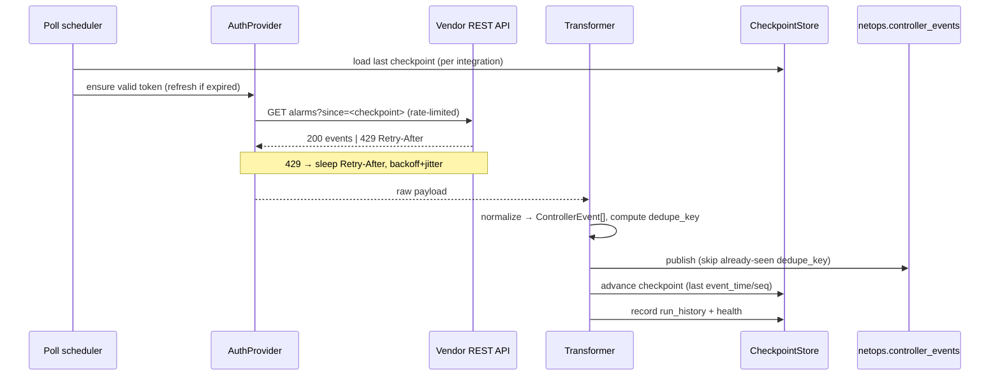

# NMS Integration Framework — finalized design

> Owner brief 2026-07-03: a vendor-neutral framework that ingests third-party
> network-management platforms (Catalyst Center, Meraki, vManage, NDFC, Versa
> Director/Concerto, Prime, generic) and turns their alarms/inventory/topology/
> tunnel-state/health/policy-changes into normalized RCA evidence — **read-only,
> phase 1, no config push.** This document is the *finalized* design: it analyzes
> the proposed architecture against what Correlix already has and adapts it.

## 0. Governing principle — controller INTELLIGENCE ingestion, not log ingestion

> **We are not building "vendor log ingestion." We are building "vendor
> controller intelligence ingestion."** (Owner, 2026-07-03 — the north star.)

A vendor controller is a **domain expert** that already computed things Correlix
would otherwise infer: which tunnels are up, which sites are degraded, what the
per-app QoE is, what changed and when, what the fabric topology is, how it scores
health. The framework's job is to **harvest that intelligence** and reconcile it
against direct telemetry — NOT to tail the controller's logs.

This flips the default posture in concrete ways:

| "Log ingestion" (rejected) | "Controller intelligence ingestion" (this design) |
|---|---|
| Tail alarm/audit streams; everything is an event | Extract **metrics + state + events** — the three classes (§3); alarms are the *smallest* slice |
| Store lines, search later | Normalize into typed **state** (with flap history) + **metrics** (tagged) + **evidence**, joined to Correlix entities |
| Controller = another noisy feed | Controller = a **second opinion from a domain authority** — reconciled against telemetry, with contradiction/staleness made explicit |
| Value = "we have the logs" | Value = **topology, inventory, health, change-windows, ownership, per-app SLA** the controller already knows, turned into RCA leverage |

Everything below serves this principle: the three-class model (§3) exists so we
capture the *intelligence* (state + metrics), not just the *log* (events); the
evidence hierarchy (§5) exists so the controller's view *informs* RCA without
overriding ground truth. If a design choice would reduce a controller to a log
tail, it's wrong.

## 1. Analysis — what the spec gets right, and the three things to change

The brief is strong on the connector runtime (retry/429/checkpoint/dedup/rate
limit), the vendor list, and the read-only-first discipline. But three parts of
it **reinvent machinery Correlix already owns**, and finalizing means mapping
onto that machinery instead of building a parallel stack.

### Finding 1 — Do NOT invent a parallel signal/plane/authority model. Map onto the correlation engine's existing axes.

The spec proposes a new `_signal = controller_event`, `_plane =
management_plane`, `_authority = vendor_controller`, and an `evidence_role`
enum. Correlix's correlation engine (`src/correlation/signals.py`) **already**
has exactly these axes:

| Spec concept | Existing Correlix axis | Finalized decision |
|---|---|---|
| `_signal = controller_event` | `Signal.kind` (free string) | new kinds `controller_alarm`, `controller_tunnel_state`, `controller_policy_change`, … |
| `_source_system` | `Source` enum (flow/probe/metric/syslog/trap/cloud…) | **add `Source.CONTROLLER`** |
| `_plane = management_plane` | `ModalityClass` (active_probe/passive_flow/control_plane/device_telemetry) | **add `ModalityClass.MANAGEMENT_PLANE`** |
| `_authority = vendor_controller` | `ObserverType` (device/vantage_agent/cloud_api…) + the probe-authority/independence model | **add `ObserverType.CONTROLLER`**; authority = a MEDIUM witness (admissible, never sole-confirmer) |
| `evidence_role = supporting/contradicting/discriminating` | signature `requires`/`supporting`/`discriminators` clauses | expressed by **how signatures consume the new kinds** — no new field |

**Why this matters (the elegant part):** the engine's independence gate already
requires **≥2 independent modalities** to reach `confirmed`. If a controller
event is its own modality (`management_plane`), then the spec's hard rule —
*"controller events must not confirm RCA alone"* — is enforced **for free** by
the existing gate: one management-plane witness can only ever reach `suspected`;
it lifts to `likely`/`confirmed` **only when paired** with device telemetry,
probes, or flows (a second, independent modality). That is precisely the desired
behavior ("upgrade confidence when corroborated"), and it needs zero new
correlation logic — just a new modality value the gate already knows how to
count. This is the single most important finalization decision.

### Finding 2 — Reuse the existing Provider/Registry/Normalize seam; ADD only the polling runtime.

`integration/provider.go` already defines `Provider { VerifyWebhook; Normalize
}` + a `Registry`, and `IntegrationEvent` already carries **3-level idempotency**
(`ProviderEvtID` / `ExternalID` / `AlertID`) and an `ExternalSeq` ordering
cursor — the dedup/ordering design the spec asks for is already solved and
battle-tested (it powers the ServiceNow/Jira inbound sync). The finalized
framework:

- **Reuses** the Provider/Registry + `Normalize(tenant, body) → []event` shape
  and the 3-level dedup keys for the **transform + webhook** layer.
- **Adds** what the ticketing Provider lacks: a **poll runtime** (scheduler,
  `CheckpointStore`, `RateLimiter`, `RetryPolicy` with 429/Retry-After,
  `HealthReporter`) — because controller connectors poll REST APIs, whereas the
  ticketing providers are webhook-only.

So `ConnectorSpec/AuthProvider/Poller/WebhookHandler/Transformer/CheckpointStore/
RateLimiter/RetryPolicy/HealthReporter` are the **new** interfaces; the
`Transformer` is the existing `Normalize` idea generalized to controller events.

### Finding 3 — Split storage: config in Postgres, events on the existing evidence bus (ClickHouse corr_signals), not a new parallel event store.

The spec lists `controller_events_raw` + `controller_events_normalized` as new
tables and a `netops.controller_events` topic. Finalized:

- **Config is relational** (slow-moving) → Postgres, RLS, matching every other
  Correlix config store: `integrations`, `connector_checkpoints`,
  `connector_health`, `connector_run_history`. Credentials use the **existing
  Vault** (per-tenant DEK, encrypted at rest, write-only) — no plaintext, no new
  secret store; `integration_credentials_metadata` holds only references + which
  fields are set.
- **Events flow on the evidence path that already exists.** Go connectors
  normalize → POST to the Vector aggregator source (exactly like the metric-
  events lane, `METRIC_EVENT_SINK_URL` → `netops.metrics`) on a new topic
  `netops.controller_events` → the Python correlation service maps them to
  `corr_signals` (source=controller, modality=management_plane). Raw landing for
  audit/replay reuses the existing OpenSearch/ClickHouse raw-event pattern (a
  `controller_events` index/table), same as syslog/traps land raw before
  becoming signals. **No new bespoke event store, no new consumer** — the
  correlation engine ingests controller events through the same door as syslog.

## 2. Finalized architecture

```
Vendor NMS (Meraki / Catalyst / vManage / NDFC / Versa / Prime)
        │  REST poll (checkpointed, rate-limited, retried)   │  webhook (signed)
        ▼                                                     ▼
┌─────────────────────────  Go connector runtime  ─────────────────────────┐
│  AuthProvider → Poller / WebhookHandler → Transformer → ControllerEvent   │
│  CheckpointStore · RateLimiter · RetryPolicy(429/Retry-After) · Health    │
└───────────────┬───────────────────────────────────┬──────────────────────┘
   config (PG, RLS, Vault secrets)      normalized ControllerEvent
   integrations/checkpoints/health              │
                                                ▼
                              raw landing (controller_events index, audit/replay)
                                                │  POST → Vector source
                                                ▼
                                netops.controller_events (Redpanda)
                                                │
                                                ▼
                     Python correlation → Signal(source=controller,
                       modality_class=management_plane, kind=controller_*)
                                                │
                                                ▼
                     corr_signals ── existing engine, NO change ──▶ RCA object
                       (independence gate: management_plane is one modality →
                        controller alone = suspected; +telemetry = confirmed)
```

### Polling flow (Mermaid)



### Webhook flow (Mermaid)

```mermaid
sequenceDiagram
    participant V as Vendor (Meraki/Catalyst)
    participant WH as WebhookHandler
    participant Sig as Signature verify
    participant T as Transformer
    participant Bus as netops.controller_events
    V->>WH: POST /api/integrations/{id}/webhook (shared secret / HMAC)
    WH->>Sig: verify signature + replay window
    Sig-->>WH: ok | 401
    WH->>T: normalize verified body → ControllerEvent[]
    T->>Bus: publish (dedupe by vendor event_id)
    WH-->>V: 200 (fast ack; processing is async)
```

## 3. Three normalized signal classes (finalized — owner update 2026-07-03)

Controllers are **intelligence sources**, not just log feeds. A connector's
`Transformer` routes each vendor response into **one of three classes** — never
forcing everything into `controller_event`. This is the core of the finalized
model; each class has its own shape, storage, and role in RCA.

### 3.1 `controller_metric` — continuous time-series

Tunnel latency/loss/jitter, BFD stats, app QoE, interface util/errors/drops,
device CPU/mem, wireless/client health, fabric health, WAN path SLA.

- **Storage:** the existing metrics store (VictoriaMetrics), via the metric-
  events lane — emitted as `controller_metric_*` / `device_*` series.
- **Tags (mandatory):** `tenant_id, integration_id, source_system, device,
  site, interface, tunnel, transport, app` + normalized tags. These are the
  join keys that let a vManage tunnel-latency metric line up with the same
  path a STAMP probe measures.
- **RCA role:** feeds the existing metric CUSUM/anomaly path; corroborates
  probe/telemetry on the same entity.

### 3.2 `controller_state` — current operational state (with flap history)

BFD up/down, OMP peer up/down, control-connection up/down, BGP neighbor
up/down, tunnel up/down, device reachable/unreachable, interface admin/oper,
policy/template deployment status, fabric node/member status.

- **Storage:** a `controller_state_current` table (ClickHouse for the
  device-scoped state lane, matching corr_objects/telemetry; PG acceptable for
  low-volume). **Required columns:** `first_seen, last_seen, previous_state,
  current_state, flap_count` — so a flapping control-connection is visible as
  churn, not a single point.
- **On change:** a state transition **optionally emits a normalized event**
  into `netops.events` (e.g. control-connection up→down) so it becomes RCA
  evidence; steady-state is just a snapshot.
- **RCA role:** controller-derived state — tier 2 of the evidence hierarchy
  (below direct telemetry, above raw alarms).

### 3.3 `controller_event` — alarms, audit logs, config/policy changes, incidents

Tunnel-down alarm, device-unreachable alarm, config/template push, policy
change, controller audit log, fabric alarm, site-health-degraded, app SLA
violation.

- **Storage:** Redpanda `netops.controller_events` + normalized `netops.events`
  + a raw payload table for replay/debug.
- **Canonical fields** (the spec's set): `tenant_id, integration_id,
  source_system, vendor, product, event_id, event_time, ingest_time,
  event_type, normalized_event_type, severity, category, device_id,
  device_name, site_id, site_name, interface_name, tunnel_id, peer_id,
  application, message, raw_payload, dedupe_key, confidence, plane
  (=management_plane), authority (=vendor_controller), evidence_role,
  correlation_hints{}`.
- **`normalized_event_type`** bridges to the signal `kind`: `controller_alarm`,
  `controller_tunnel_state`, `controller_bfd_down`,
  `controller_control_connection_loss`, `controller_policy_change`,
  `controller_device_unreachable`, `controller_inventory_context`,
  `controller_topology_context`, `controller_health_score`.

### 3.4 The Transformer returns all three

```
Transform(raw) → (metrics []ControllerMetric, states []ControllerState, events []ControllerEvent)
```

The connector runtime routes each slice to its lane. All three carry the
`management_plane` modality + `vendor_controller` authority so the engine treats
them consistently, but only `controller_event` (and state *changes*) become
discrete corr_signals; `controller_metric` rides the metrics plane.

## 4. Migration proposal (0020_nms_integrations.sql — Postgres, RLS)

Config + state (relational). The three *data* classes land on their own lanes
(§3): metrics → VictoriaMetrics; events → ClickHouse/Redpanda; only state's
current-snapshot is relational here.

- `integrations` — id, tenant_id, vendor, product, display_name, enabled,
  base_url, auth_type, poll_interval_s, data_sources[], created_at.
- `integration_credentials_metadata` — integration_id, which secret fields are
  set (booleans), vault refs. **No plaintext.**
- `connector_checkpoints` — integration_id, stream, last_event_time, last_seq,
  updated_at.
- `connector_health` — integration_id, healthy, last_success, last_error,
  events_ingested, error_rate, updated_at.
- `connector_run_history` — integration_id, started_at, finished_at, status,
  events, error (bounded retention).
- `controller_state_current` — integration_id, entity (device/tunnel/peer/…),
  state_kind, current_state, previous_state, first_seen, last_seen, flap_count
  (the §3.2 state lane; ClickHouse if volume warrants, PG for low-volume).

All `tenant_iso` FORCE-RLS. Metric samples (§3.1) and controller events (§3.3)
do NOT live in PG — they ride VictoriaMetrics and the ClickHouse/Redpanda
evidence path respectively.

## 5. RCA & AI integration (finalized)

### Evidence hierarchy (owner rule, 2026-07-03)

Controller data is valuable but **not automatically authoritative**. Three
tiers, encoded as witness authority on the `management_plane` modality:

1. **Direct device telemetry** (SNMP / gNMI / syslog / flow / probes) — highest
   authority; can anchor `confirmed`.
2. **Controller-derived state** (vManage/Meraki/Catalyst/Versa/NDFC state) —
   corroborating; a strong witness but tier-2.
3. **Controller-raised alarms/events/health/assurance** — lowest; context and
   corroboration only.

Controller evidence **can**: raise confidence (as a second independent
modality), identify domain ownership (which seam/controller owns the fault),
enrich topology/site/app context, mark change windows (`controller_policy_change`
— the long-missing "what changed?" class), and explain the controller's
perspective. It **cannot**: confirm root cause alone (enforced free by the
independence gate — one management-plane witness caps at `suspected`), override
direct telemetry without contradiction handling, or be the sole source of truth.

### Contradiction & staleness handling

When controller evidence **conflicts** with direct telemetry (e.g. vManage says
tunnel up, but STAMP probes + BFD syslog say down), the controller signal is
marked **`contradicting`** (or **`stale`** if its `last_seen` lags the telemetry
window) rather than silently averaged in. The RCA Inspector surfaces this
explicitly — "vManage reports the tunnel healthy; direct probes disagree
(controller view may be stale)" — so the operator sees *both* perspectives and
which one the engine weighted. This is the anti-black-box property extended to
controller data: never let a controller's optimism mask a real fault, never let
its alarm alone declare one.

### Signatures & AI

Signature clauses reference the `controller_*` kinds as **supporting/
discriminating** (a vManage `controller_tunnel_state=down` corroborates
`sig.ent.wan-edge.sdwan-tunnel-degraded`; a `controller_policy_change` in the
window discriminates change-induced incidents). The AI answers "what did the
controller report / did vManage report the same / is this confirmed by telemetry
or controller-only / what changed / which source is authoritative" directly from
the RCA object's evidence set + the modality/authority tags — no new retrieval.
- **AI**: no new retrieval needed — controller events are cited evidence on the
  RCA object, so the assistant answers "what did the controller report / did
  vManage report the same / is this confirmed by telemetry or controller-only /
  what's missing" from the object's evidence set + the `management_plane`
  modality tag (authoritative-domain answer = the seam owner + which modalities
  corroborate).

## 6. Phase plan

| Phase | Scope | Testable without vendor gear? |
|---|---|---|
| **P1** | Framework foundation: ControllerEvent model + connector interfaces + retry/429/dedup/ratelimit/checkpoint runtime (pure, tested) + migration 0020 + Source.CONTROLLER/ModalityClass.MANAGEMENT_PLANE + `netops.controller_events` topic + feature flag | ✅ pure runtime + schema |
| **P2** | Transformers + fixtures + tests for Meraki, Catalyst Center, vManage, NDFC, Versa Director, Prime, generic (the `fixtures/*` set) | ✅ fixtures |
| **P3** | Poll/webhook wiring per vendor (auth flows) + health/run-history persistence | ⚠️ needs live controllers |
| **P4** | Python producer: ControllerEvent → corr_signals (management_plane) + signature clauses that consume `controller_*` kinds | ✅ fixture-replayable |
| **P5** | UI: Settings → Integrations (wizard, test-connection, data-source pick, webhook URL, sync status, sample/normalized preview, pause) | ✅ shell |
| **P6** | AI evidence answers + docs (README, per-vendor, security, rate-limits, canonical schema) | ✅ |

Read-only throughout; the connector interface leaves room for a future
write-back capability behind a separate flag (never in phase 1).

## 6a. Reference validation — Datadog's Cisco SD-WAN integration

The owner cited Datadog's Cisco SD-WAN integration
(docs.datadoghq.com/integrations/cisco_sdwan). It **confirms** the finalized
model directly:

- **REST polling, not webhooks** for vManage / Catalyst SD-WAN Manager (matches
  the `Poller`; webhooks are Meraki/Catalyst).
- **Least-privilege read-only creds** — only the "Device monitoring" permission
  group. Reinforces phase-1 read-only + a documented minimal-permission service
  account per vendor (security.md).
- **Consistent site/device tagging** (`admin_status`/`oper_status`) — maps to
  our metric tags + `device_id`/`site_id`/`interface_name` join keys.
- **40+ continuous metrics AND discrete state** — Datadog blends them; Correlix
  splits them across the **three signal classes** in §3 (metric → VM; state →
  state table + change-events; alarms → controller_events). This is why §3's
  three-class routing (owner update) is the right model, not "everything is an
  event."

## 7. Key deviations from the brief (summary)

1. **Three signal classes, routed per class** (owner update): `controller_metric`
   → VictoriaMetrics; `controller_state` → state table (+ change-events);
   `controller_event` → corr_signals — never "everything is an event."
2. **No parallel signal model** — map to `Source.CONTROLLER` +
   `ModalityClass.MANAGEMENT_PLANE`; the independence gate enforces
   "controller-alone-can't-confirm" for free.
3. **Reuse Provider/Registry + 3-level dedup**; add only the poll runtime.
4. **Config+state → Postgres+Vault; metrics → VM; events → corr_signals bus** —
   no bespoke event store/consumer.
5. **`evidence_role` + the 3-tier evidence hierarchy** are expressed by signature
   clauses + witness authority, with explicit contradiction/staleness surfacing
   in RCA Inspector.

Everything else in the brief is adopted as-is.
