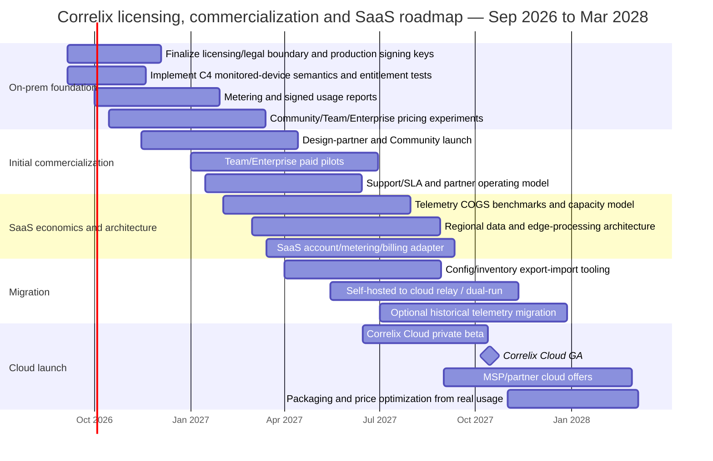

# Correlix Licensing and Tiering Strategy for On-Prem Launch and Future SaaS

## Executive summary

Correlix should **not imitate the dominant full-stack observability vendors' increasingly granular telemetry billing models at launch**. The market has moved toward a mixture of host, device, active-series, ingestion, retention, session, synthetic-run and AI-token pricing. That aligns vendors' revenue with cloud cost, but it also creates a buyer problem: cost control has become important enough that Gartner explicitly evaluates “Observability Cost Control,” Grafana's 2026 survey says cost remains the most important observability-tool selection factor for 65% of respondents, and major vendors are adding adaptive telemetry, consumption controls and more predictable resource units. citeturn18search1turn18search3turn10search4turn14search8

Correlix has an opportunity to enter with a simpler message:

> **Discover everything. Monitor what matters. Pay primarily for monitored devices—not discovery, raw inventory, processors, or surprise telemetry bursts.**

That model fits network observability considerably better than per-GB or per-metric pricing. Datadog publicly prices Network Device Monitoring at $7/device/month on an annual plan; SolarWinds Self-Hosted starts at $8/node/month; LogicMonitor uses a normalized Hybrid Unit beginning at $16/unit in its current package model; and Auvik specifically distinguishes billable infrastructure devices from the broader set of devices it discovers or monitors. citeturn17search3turn14search3turn14search8turn6search10

Your subsequent C4 decision that a Community “device” means a **device with at least one intentionally enabled collector**, rather than every inventory row, is therefore the right commercial definition. It should supersede the older licensing document's statement that the device ceiling is enforced at discovery admission. Discovery of a /24, /16 or cloud estate should not consume licenses. A device that has SNMP, gNMI, flow, syslog or another qualifying monitoring configuration enabled counts exactly once, regardless of how many collectors are attached; temporary reachability or telemetry loss does not free the entitlement. fileciteturn0file0

The current Correlix design-of-record is also fundamentally sound: **Apache-2.0 open core plus clearly separated commercial add-ons; one repository; one binary/image set; signed offline entitlement files; no license file means Community; source licensing and runtime tiering are separate axes; and security/isolation/RLS/OIDC can never be weakened by licensing.** fileciteturn0file0 I recommend preserving this architecture.

The permanent Community tier should also remain a **real product rather than a time-limited demo**. New Relic gives its perpetual free tier broad platform capability with a 100 GB/month allowance rather than stripping out the observability engine, while Grafana Cloud makes essentially the whole service catalog available within free usage ceilings. Correlix's current philosophy—full discovery, topology, core correlation/RCA and diagnostics, but limits on scale, retention, tenants and premium operational workflows—is consistent with those successful freemium patterns. citeturn17search2turn16search0

My recommended initial commercial structure is **three runtime entitlement tiers plus an Enterprise MSP contract profile**, rather than introducing more feature-tier code:

| Tier / contract profile | Recommended introductory price | Primary unit | Core limits | Main differentiation | Target customer |
|---|---:|---|---|---|---|
| **Community** | **$0 permanently** | Monitored devices | 25 monitored devices; 1 tenant; 7-day retention; 5 watched prefixes | Full discovery/topology/correlation/RCA; processors and sensitive-data protection free; basic security/hardening; OIDC; basic alerts | Individual network engineer, lab, branch, homelab, evaluator |
| **Team** | **$4–$6 / monitored device / month**, annual; consider a ~$249–$299 monthly floor | Monitored device | Up to 250; 5 tenants / 1 org; 30-day retention; 100 BGP prefixes | Security findings, expanded frameworks, drift, reports, pcap, full notifications, BYO AI, saved/shared investigations | Network/IT operations teams, SMB/mid-market |
| **Enterprise** | **$6–$9/device equivalent before volume discount; $18k–$30k ARR floor** | Committed monitored-device capacity | Contracted capacity; 90 days + archive; org hierarchy | SAML/SCIM/LDAP, SIEM export, security dialects, hosted AI allowance, enterprise API/admin controls, 24×7 support | Regulated enterprise, larger estates |
| **Enterprise MSP** | **$3–$6 pooled device/month at volume; $24k+ ARR floor** | Pooled monitored devices across tenants | Contracted pool; many managed tenants | MSP/fleet management, delegated administration, pooled licensing, cross-tenant operational views, branding/reporting options | MSP/MSSP, service providers |

These are **market-entry hypotheses, not a valuation of Correlix**. Correlix currently has no paying-customer elasticity data, target ACV/ARR and cloud COGS are unspecified, so the price ranges should be tested in design-partner conversations before they become contractual list prices.

I would **not bill separately for processors**. Filtering, redaction, masking, aggregation, transformation, sampling and routing should remain available at every tier. OpenTelemetry itself treats processors as standard pipeline components that transform, filter and enrich telemetry, and Grafana is explicitly making adaptive telemetry/cost control a central part of its current commercial proposition. Making cost-reduction and sensitive-data controls premium would create exactly the wrong incentive. citeturn16search10turn16search0

For future Correlix Cloud, retain the monitored-device unit but introduce only a **small secondary cost meter for truly variable SaaS COGS**, especially logs, flows, DEM/session data and hosted AI. In other words:

> **On-prem: device entitlement.  
> SaaS: device entitlement + included telemetry envelope + transparent overage for genuinely high-cost consumption.**

Do not meter metrics, logs, traces, flows, processors, retention, sessions, AI tokens and collectors independently at launch. That is commercially precise but cognitively expensive.

The cloud migration strategy should be especially strong. Dynatrace now supports one DPS commitment shared across Managed and SaaS accounts, while SolarWinds explicitly connects self-hosted and SaaS with Platform Connect to support migration without rip-and-replace. Correlix should go further: **100% credit of unused on-prem subscription value into Correlix Cloud, one 60–90-day dual-run migration period with no double billing, free migration of configuration/inventory/current state, and optional historical telemetry migration.** citeturn13search5turn14search0turn14search10

The largest strategic issue I would revisit before GA is **retention gating on self-hosted deployments**. Seven/30/90-day tiers are commercially intuitive in SaaS because storage costs Correlix money. They are less naturally defensible when the customer supplies the disks. The current 7/30/90 design is workable for launch and roughly market-comparable—New Relic's free retention is at least eight days and Grafana Cloud Free uses 14 days—but Correlix should test whether on-prem buyers perceive retention limits as arbitrary. Long term, the better on-prem upsell may be **retention management, archive automation, backup/restorability, legal hold and lifecycle policy**, while SaaS retains explicit storage-duration pricing. citeturn17search2turn16search0

The second issue to watch is **SAML being Enterprise-only**. SAML/SCIM are commonly commercial features, but New Relic currently includes SAML in its Standard paid tier rather than reserving it exclusively for Enterprise. I would keep the current Correlix decision for launch but measure SSO-related losses: if otherwise-qualified Team prospects refuse to buy without SAML, move SAML down rather than losing customers to an artificial packaging boundary. citeturn17search2

The overall market-entry position I recommend is:

> **Correlix: local-first, network-native observability with predictable device pricing. Unlimited discovery. Full RCA in Community. No charge for processors. No surprise ingest bill on-prem. Sensitive data can stay local. Move to Correlix Cloud later without buying the product again.**

That is sharper than simply advertising “another observability platform.”

## Correlix starting point and decision framework

The internal licensing work is already more mature than a typical pre-customer product. The September 4 design-of-record defines Apache-2.0 core code and source-available commercial add-ons, requires a physical `enterprise/` boundary, uses semantic features rather than `if tier == Enterprise` checks, and explicitly separates **source-code license** from **runtime entitlement**. It also specifies one binary and image set so an upgrade is accomplished by installing a signed entitlement file rather than replacing software. fileciteturn0file0

That distinction should be preserved and expanded into **three orthogonal commercial axes**:

| Axis | Correlix choices | Recommendation |
|---|---|---|
| **Source license** | Apache-2.0 core / Correlix commercial source-available code | Keep exactly separate from product tier |
| **Runtime entitlement** | Community / Team / Enterprise | Keep only these three in code; feature checks use semantic entitlements |
| **Delivery model** | Customer-managed on-prem / future Correlix Cloud / possible private or BYOC later | Do not create new feature tiers solely because hosting changes |

This is important because competitors increasingly combine entitlement and consumption in confusing ways. New Relic, for example, has a combination of edition, data ingest, users and compute capacity; Grafana prices different services through active series, host-hours, containers, sessions and test executions; Dynatrace uses host/memory/GB/data-point/session consumption across capabilities. Those models can be economically rational while still being difficult for a network buyer to estimate. citeturn17search2turn16search0turn17search8

Correlix's current locked tiering is already close to the recommended shape. Community has 25 devices, one tenant, seven-day retention and five watched BGP prefixes. Team increases to 250 devices, five tenants, 30 days and 100 prefixes while introducing security findings and operational workflows. Enterprise provides contracted scale, organization hierarchy, 90-day-plus archival capability, security dialects, SIEM export, enterprise identity and MSP capabilities. fileciteturn0file0 fileciteturn0file1

The important amendment is **C4**. The older implementation note says the device ceiling is enforced at discovery admission/manual device creation. That should be changed. The authoritative unit should now be:

\[
\text{Licensed Device}
=
\text{Unique canonical device with ≥ 1 qualifying collector intentionally enabled}
\]

not:

\[
\text{Licensed Device}
=
\text{Inventory row}
\]

and not:

\[
\text{Licensed Device}
=
\text{Device that emitted telemetry recently}
\]

This definition is commercially cleaner because it measures monitoring intent, does not punish discovery, is stable during outages, and maps to real ongoing telemetry workload. LogicMonitor's Hybrid Unit similarly defines an on-prem resource as a **collector-monitored device**, while Auvik's billing guidance specifically excludes many discovered/monitored non-core devices from its billable-device count; SolarWinds also exempts ICMP-only nodes from node consumption. citeturn14search8turn6search10turn14search13

It should also be counted once regardless of telemetry diversity:

```text
Router A
  SNMP enabled
  gNMI enabled
  syslog enabled
  NetFlow enabled

Licensed units = 1
```

That simplicity becomes an asset in both sales and engineering.

Your current tiering material contains a useful second principle: **charge for scale and high-value operational outcomes, not for honesty or basic product integrity.** Correlation/RCA, telemetry coverage status, “not collected” states, isolation and core diagnostics are deliberately not paid gates. fileciteturn0file1 This is strategically important. Gartner's current observability research explicitly includes cost control, interoperability, actionable insights and exploration of telemetry as critical platform capabilities; hiding the core correlation engine in a premium tier would make it hard for Community users to discover Correlix's differentiating value. citeturn18search3

The broader premium-feature inventory in your working notes—TAC automation, advanced DEM, hosted Iris, cloud connectors, data-protection workflows and other items—should remain **a roadmap of monetizable capabilities rather than an immediate explosion of license gates**. fileciteturn0file2 An early product with no customers benefits more from three understandable upgrade reasons than thirty individual entitlements.

The three primary reasons to upgrade should therefore be:

**Scale** — more monitored devices, tenants, watched prefixes and managed organizations.

**Operational depth** — findings, drift, advanced frameworks, reporting, broader notification/TAC/investigation workflows.

**Enterprise control** — identity lifecycle, SIEM export, MSP fleet management, advanced data governance, support and large-scale archival.

That is much easier to buy and explain than a feature-by-feature menu.

## Competitive landscape and market signals

The observability market does **not** have one dominant pricing unit. Gartner's 2025 Observability Platform work includes Datadog, Dynatrace, Elastic, Grafana, LogicMonitor, New Relic, SolarWinds and Splunk among the evaluated vendors and explicitly identifies cost optimization as a major market force; Gartner's Critical Capabilities separately evaluates “Observability Cost Control.” citeturn18search1turn18search3

The market is splitting into three broad commercial philosophies:

**Resource/entity pricing** is common where buyers think in infrastructure entities: Datadog hosts/devices, Splunk hosts, LogicMonitor Hybrid Units and SolarWinds nodes. citeturn17search3turn17search0turn14search8turn14search13

**Telemetry consumption pricing** is common where cloud storage/compute dominate economics: New Relic data GB, Elastic ingest/retention GB and Grafana active series/GB. citeturn17search2turn16search14turn16search0

**Hybrid consumption** is increasing because no single resource unit describes modern infrastructure well. LogicMonitor normalizes on-prem devices, cloud IaaS, PaaS, wireless APs and Kubernetes pods into Hybrid Units; Dynatrace's DPS makes numerous host/data/session capacities available under one annual commitment. citeturn14search8turn13search5

The table below uses public list pricing where vendors expose it; “quote” means the public page does not provide a directly comparable figure.

| Vendor | Primary pricing unit / public entry point | Permanent free strategy | Delivery | Important feature gates | Public retention examples | Support / SLA pattern | Migration / expansion model |
|---|---|---|---|---|---|---|---|
| **Datadog** | Infrastructure Pro **$15/host/mo** annual; Enterprise $23; Network Device Monitoring **$7/device/mo**; wireless AP $4. citeturn17search3 | Infra Free supports up to **5 hosts** with **1-day metric retention**. citeturn1search7 | SaaS platform; agent runs on local/on-prem/cloud hosts and sends data to Datadog. citeturn13search1 | Product-by-product monetization: NDM, logs, APM, security, synthetics, custom metrics, etc. citeturn17search3 | Infra paid metrics up to 15 months; free 1 day. citeturn1search7 | Free documentation/community; Standard on paid plans; Premier is priced as a percentage of spend with faster critical response. citeturn12search0 | Add agents/integrations to existing environments; no equivalent self-hosted Datadog backend exposed as a migration target/source in the standard product model. citeturn13search1 |
| **Splunk Observability Cloud** | Infrastructure **$15/host/mo** annual; App & Infra **$60**; End-to-End **$75**. citeturn17search0 | Pricing page advertises a free edition/trials; perpetual allowance details are less prominent than New Relic/Grafana. citeturn17search0 | Observability Cloud is cloud service; Splunk Enterprise/AppDynamics provide adjacent on-prem/hybrid options. citeturn15search2turn17search0 | APM appears above Infrastructure tier; RUM and browser synthetics in End-to-End; DB/security add-ons. citeturn17search0 | Product/contract specific rather than a single simple public retention ladder. | Commercial support; Splunk Cloud Platform publishes availability/SLA mechanics. citeturn15search2 | Portfolio supports cloud and on-prem products, but public pricing does not present Observability Cloud as a single-license transfer from self-hosted Splunk. citeturn15search2 |
| **Dynatrace** | Foundation **$7/host/mo**; Infrastructure **$29/host/mo**; Full Stack **$58 per 8-GiB host/mo**; telemetry has additional GB/data-point/session rates. citeturn17search8 | Trial rather than a large permanent free tier. | **SaaS and on-premises** monitoring environments; Government cloud also offered. citeturn13search0 | Foundation → Infrastructure → Full Stack; additional telemetry/session capabilities use consumption. citeturn17search8 | Full-stack pricing lists **10-day trace retention**, extensible much longer. citeturn17search8 | Enterprise support can provide 30-minute critical response and higher SaaS service objectives than Standard. citeturn12search4 | **DPS for Hybrid** allows one annual commitment across Managed and SaaS accounts—particularly relevant to Correlix. citeturn13search5 |
| **New Relic** | **100 GB/mo free**, then $0.40/GB original data or $0.60/GB Data Plus; user and advanced-compute charges can also apply. citeturn17search2 | Strong **perpetual free tier**: 100 GB/mo, unlimited basic users, one full-platform user and broad capability access. citeturn17search2turn17search6 | SaaS; instrumentation runs in customer environments and reports to regional New Relic endpoints. citeturn15search7turn15search0 | SAML appears at Standard; Pro adds stronger support/Data Plus eligibility; Enterprise adds advanced compliance/support. citeturn17search2 | Free has at least **8 days** default retention; Data Plus offers extended retention up to 90 days over defaults. citeturn17search2 | Standard 2-business-day response; Pro 2-hour critical; Enterprise 1-hour critical. citeturn17search2 | Region chosen when account is created; New Relic currently says customer data cannot be transferred/shared between existing accounts across regions, illustrating why Correlix should design migration early. citeturn15search0 |
| **Zabbix** | Self-hosted software has **no license fee or monitored-entity cap**; paid support is separate. Cloud starts around **$50/mo** and scales by NVPS/storage. citeturn3search1turn3search0 | Open-source/self-hosted itself is the permanent free offer. citeturn3search1 | Self-hosted and Zabbix Cloud. citeturn3search0turn3search1 | Commercialization is predominantly hosting/support/services rather than locking ordinary monitored entities. citeturn3search1 | Self-hosted retention is customer-controlled; cloud storage/throughput selected by plan. citeturn3search0 | Silver/Gold/Platinum/Enterprise support subscriptions provide progressively stronger coverage; software continues to function after support subscription expiration. citeturn3search1 | Natural open-source → support/cloud expansion, although cloud is separately operated rather than a simple license-file flip. citeturn3search0turn3search1 |
| **Grafana Cloud / Grafana** | Multi-unit: **$6.50/1k metric series** starting Pro, **$7.20/host-month** equivalent Kubernetes host pricing, GB telemetry, sessions, tests; $19/mo Pro platform fee. citeturn16search0 | Strong **always-free** plan with broad services and limited usage; **14-day retention** across core telemetry. citeturn16search0 | Grafana Cloud plus self-hosted/open-source options; Enterprise offers public cloud, Federal Cloud, BYOC and some self-hosted options. citeturn16search0 | Free exposes broad functionality; paid differentiation emphasizes volume, retention, support and deployment/compliance. citeturn16search0 | Free 14d; Pro metrics **13 months**, logs/traces/profiles **30 days**. citeturn16search0 | Community support free, **8×5 email** Pro, premium Enterprise. citeturn16search0 | Open standards and multiple deployment models reduce lock-in; public pricing does not present one universal self-host→Cloud transfer price. citeturn16search7turn16search0 |
| **Elastic** | Self-managed Basic is free/open; Serverless Observability uses consumption such as roughly **$0.07–$0.09/GB ingest** for relevant workloads plus retention. citeturn16search2turn16search14 | Free/open self-managed stack; cloud trial also available. citeturn16search2turn5search0 | Self-managed **anywhere, including air-gapped/private/public cloud**, plus Elastic Cloud Hosted/Serverless. citeturn16search2 | Commercial subscriptions add advanced enterprise/security/support capabilities; serverless packages differentiate observability capabilities. citeturn16search2turn16search14 | Serverless separates ingestion and retained storage rather than using a single fixed-day entitlement. citeturn16search14 | Support varies by subscription; self-managed Enterprise provides higher-grade support. citeturn5search14 | Same ecosystem spans self-managed and cloud, giving buyers deployment choice; actual migration remains project-specific. citeturn16search2 |
| **LogicMonitor** | **Essentials $16/Hybrid Unit**, Advanced $27, Signature $53. One HU = one on-prem collector-monitored device, one cloud IaaS, seven PaaS, five APs or seven K8s pods. citeturn14search8 | **15-day full-platform trial**, not a permanent free infrastructure tier. citeturn14search8 | SaaS observability with collectors in customer/hybrid infrastructure. citeturn14search8 | Advanced/Signature add automation/AI; logs, uptime and other capabilities have package/add-on distinctions. citeturn14search8 | LM Logs publicly offers 7/30/90-day/1-year pricing options; other time-series retention can be contract dependent. citeturn14search1turn12search16 | Base support plus enhanced/premier options. citeturn14search8 | Hybrid Unit is explicitly intended to allow capacity to shift among on-prem/cloud/edge without creating separate siloed licenses. citeturn14search8 |
| **SolarWinds Observability** | Self-Hosted starts **$8/node/mo**; SaaS Network & Infrastructure has publicly listed **$15.75/node/mo**; different entity ratios apply. citeturn14search3turn4search8 | Fully functional **30-day trial** rather than permanent free production tier. citeturn14search3 | Explicit **Self-Hosted and SaaS** offerings. citeturn14search3 | Essentials/Advanced/Premier and Enterprise-scale packaging; SaaS APM/DEM can be attached. citeturn14search13 | Depends on product/module rather than one universal ladder. | Enterprise-scale licensing includes Advanced Support and HA/scaling components. citeturn14search13 | Particularly strong transition model: Platform Connect lets self-hosted feed SaaS without rip-and-replace; Premier includes SaaS network/infra entitlements; current module customers receive conversion pricing. citeturn14search0turn14search10turn14search13 |
| **Kentik** | Pro starts at roughly **$2,000/month annual commitment**; Premier is quote-based. citeturn7search0 | 30-day trial rather than permanent free. citeturn7search0 | SaaS-centric network observability. citeturn7search0 | Pro/Premier differentiate scale, users and advanced services; service-provider/security capabilities can be add-ons. citeturn7search0 | Public package examples include **120 days traffic retention** and **45 days forensic** retention. citeturn7search0 | Commercial support/package dependent. citeturn7search0 | Clear Pro→Premier expansion; multi-tenant portal is monetized, with tenant ceilings and advanced portal options. citeturn7search18turn7search0 |

Two network-oriented vendors provide additional validation for Correlix's Community design. PRTG's permanent free edition is limited to 100 sensors—roughly ten devices in Paessler's own examples—while its trial temporarily removes that limit. citeturn6search0turn6search3 Auvik's licensing guidance deliberately distinguishes billable core network infrastructure from many other discovered devices, which strongly argues against charging a Correlix user merely for running broad discovery. citeturn6search10

There are several important market signals behind the table.

First, **a useful permanent free tier works when the product has a low marginal delivery cost or creates a strong ecosystem funnel**. New Relic and Grafana expose broad functionality but meter consumption; Zabbix and Elastic can offer substantial free self-managed capability because customers carry infrastructure cost. citeturn17search2turn16search0turn3search1turn16search2 Correlix initially looks much more like the latter category than a pure SaaS vendor, which is why a meaningful no-expiry Community edition is strategically sensible.

Second, **predictability is becoming a product feature**. LogicMonitor says its packages were designed around predictable Hybrid Units; Grafana's current pricing language explicitly critiques simplistic “send more, charge more” economics and emphasizes adaptive telemetry; New Relic gives billing-related usage query/alert tools; Datadog provides multiple host-accounting mechanisms but illustrates how detailed high-watermark resource counting can become. citeturn14search8turn16search0turn17search2turn1search2 Correlix should make predictability part of positioning, not merely a billing implementation detail.

Third, **hybrid deployment is still commercially important**. Dynatrace documents SaaS and on-prem monitoring environments and now supports shared DPS commitments across Managed and SaaS. SolarWinds actively markets self-hosted/SaaS coexistence and migration. Elastic explicitly sells self-managed deployment for air-gapped/private environments. citeturn13search0turn13search5turn14search0turn16search2 This supports Correlix starting local rather than treating on-prem as a temporary embarrassment.

Fourth, current analyst work points toward **platform consolidation plus cost control**, not ever-increasing tool fragmentation. Gartner's Observability Platform research highlights cost optimization and AI; Gartner also argues that event intelligence is a starting point for tool consolidation. citeturn18search1turn18search12 Correlix's full correlation engine therefore belongs in the free/core product because it is the mechanism by which the platform proves it can replace multiple point tools.

Finally, adjacent Forrester network research continues to emphasize hybrid visibility, flow analysis, packet data, relationship mapping and operational resilience; these are areas where Correlix's network-native depth can differentiate from application-first observability platforms. citeturn18search10 IDC's 2025 observability material available through vendor-published excerpts similarly emphasizes telemetry correlation and interoperability, but because those are vendor-hosted summaries rather than the complete IDC report, they should be treated as secondary evidence rather than independent pricing guidance. citeturn8search9turn8search16

## Recommended Correlix licensing and tier model

I recommend **retaining the current Community / Team / Enterprise runtime vocabulary**. Do not introduce Starter, Pro, Business, Ultimate and similar names before customer behavior proves a need. Every extra tier creates another sales explanation, documentation branch, entitlement matrix and upgrade boundary.

The fourth commercial offering should instead be an **Enterprise MSP profile**, backed by the same Enterprise runtime entitlement vocabulary. That gives sales a distinct MSP proposition without adding a fourth security-sensitive tier check throughout the product.

### Recommended tier matrix

| Tier name | Introductory price hypothesis | Unit | Limits | Recommended included features | Target customer |
|---|---:|---|---|---|---|
| **Community** | **$0 forever** | Monitored device | **25 monitored devices**, unlimited discovery, 1 tenant, 7-day local retention, 5 watched prefixes | Full discovery/inventory/topology; SNMP/gNMI/syslog/traps/flows/probes within device ceiling; full correlation/RCA; network diagnostics; OIDC/local auth; basic alerting; baseline hardening/exposure; free processors/redaction/filtering; evidence-only Iris | Individual engineer, small site, evaluation, lab, early adopter |
| **Team** | **$4–$6/device/mo annual**; self-serve floor around $249–$299/mo is worth testing | Monitored device | **250**, 1 org/5 tenants, 30-day retention, 100 watched prefixes | Community + security findings, expanded frameworks, drift/config versioning, pcap workflows, reports, full notification channels, shared investigations/views, BMP, threat/advisory lane, BYO AI provider, limited owner-doc skills | Network/IT team, SMB/mid-market, regional enterprise |
| **Enterprise** | **$6–$9/device-equivalent before volume discount**, typically **$18k–$30k minimum ARR** initially | Contracted monitored-device capacity | Contracted/unlimited-by-license, org hierarchy, 90 days + archive, unlimited prefixes | Team + security dialects, SIEM export, SAML/SCIM/LDAP, hosted provider quota, advanced governance/export, enterprise APIs/session policy, archival/restorability, enterprise reporting, 24×7 support | Regulated and larger enterprises |
| **Enterprise MSP** | **$3–$6 pooled device/mo at volume; $24k+ ARR floor** | Pooled monitored devices across managed tenants | Contracted pool; many tenants/orgs | Enterprise + MSP/fleet console, delegated tenant administration, pooled entitlements, customer reports, service-provider API, optional branding, consolidated usage/export | MSP, MSSP, carrier/service provider |

The feature cuts largely preserve the current binding decisions. fileciteturn0file0 The wider Team/Enterprise candidate features in the working tier document and premium-feature inventory should be enabled gradually rather than all being locked on day one. fileciteturn0file1 fileciteturn0file2

**Community should be intentionally generous in product depth.** Discovery, topology, correlation, RCA, evidence, network protocol depth and troubleshooting are what create product affection and word-of-mouth. New Relic and Grafana both demonstrate the value of exposing broad functionality in permanent free tiers and monetizing usage/scale instead. citeturn17search2turn16search0

**Community should be intentionally constrained in organizational scale.** One tenant, no MSP fleet management, limited retention and 25 monitored devices create natural expansion without making the product feel fake. That is a better boundary than hiding basic troubleshooting features.

**All processors should be free.** That includes at least standard filtering, redaction/masking, transform, routing, batching, sampling, compression and telemetry hygiene. OpenTelemetry processors are explicitly designed to transform/filter/enrich telemetry in the pipeline. citeturn16search10 In SaaS, Correlix should meter **post-processor accepted telemetry**, not the raw bytes that existed before the customer filtered them. That means a customer who removes noisy logs or high-cardinality labels actually reduces the bill.

**Sensitive-data safety should never be premium.** Encryption, tenant isolation, RLS, authorization, basic redaction/masking, data-deletion capability and secure transport are safety properties. Your licensing model already establishes the principle that a license problem cannot weaken isolation, RLS, authentication, authorization or integrity. fileciteturn0file0 Preserve that invariant when SaaS arrives.

Premium data-protection features can instead be **management and governance workflows**: audited reveal, customer-managed keys where expensive to operate, legal hold, data classification policy orchestration, fine-grained approval workflows and large-scale compliance reporting. The protection itself remains universal.

**OIDC should remain free.** The design-of-record correctly makes OIDC core. fileciteturn0file0 SAML/SCIM can remain Enterprise initially because they materially serve centralized identity lifecycle at larger organizations, but measure the gate. New Relic currently includes SAML at Standard, so Correlix could lose otherwise good Team deals if Enterprise becomes the only route to a customer's mandatory SSO standard. citeturn17search2 I would specifically capture `lost_due_to_saml_gate` in CRM win/loss data.

**Multi-tenancy needs a critical distinction:** tenant isolation is not an MSP feature; **fleet management of many tenants** is. Every tier must have correct tenant isolation. Enterprise MSP monetizes centralized creation, delegated administrators, cross-tenant operational views, billing exports, pooled capacity, branding, org hierarchy and automation. Kentik likewise treats multi-tenant portal scale as commercial value, with tenant ceilings differentiated by package. citeturn7search18

The license mechanism itself should stay offline-capable. The current signed Ed25519 JSON file, with no license file meaning Community and short-lived signed files supporting Team/Enterprise trials, is particularly suited to sensitive and disconnected environments. fileciteturn0file0 Do **not** discard this when SaaS arrives. Cloud can add account-based entitlement, but the semantic entitlement service should remain identical.

That produces a clean architecture:

```text
                         CORRELIX ENTITLEMENTS

                 source licence          delivery
                       │                    │
        Apache-2.0 / Enterprise     Self-managed / Cloud
                       │                    │
                       └───────┬────────────┘
                               │
                        runtime entitlement
                               │
              Community ─ Team ─ Enterprise
                               │
                    semantic capabilities
                               │
       devices / retention / tenants / findings /
          SSO / MSP / SIEM / hosted AI / etc.
```

The product code should continue asking:

```text
Entitled(FeatureSIEMExport)
```

rather than:

```text
tier == "enterprise"
```

as your current design requires. fileciteturn0file0

## Pricing, free tier and cloud migration economics

There are five plausible pricing models for Correlix, but they are not equally suitable.

| Model | Advantages | Problems for Correlix | Recommendation |
|---|---|---|---|
| **Per monitored device** | Highly understandable for network teams; predictable; directly comparable to Datadog NDM/SolarWinds; simple offline entitlement | Device types have different telemetry volumes; less natural for cloud-native/DEM | **Primary launch model** |
| **Per host** | Common in full-stack observability; procurement familiar | Poor semantic fit for routers, switches, APs, controllers, SaaS/cloud entities | Do not use as network product's master unit |
| **Per GB ingest** | Strong SaaS COGS alignment; easy to measure | Punishes noisy telemetry; unpredictable; discourages troubleshooting/discovery; weak on-prem rationale | Use only as secondary SaaS overage |
| **Per metric/series** | Aligns metric backend cost/cardinality | Hard for network teams to forecast; users do not think in series | Avoid as customer-facing primary unit |
| **Hybrid resource + telemetry** | Predictable base plus COGS protection | More billing complexity | **Long-term SaaS model**, after measurement exists |

The device benchmark is compelling. Datadog NDM is $7/device/month annual; SolarWinds Self-Hosted begins at $8/node/month and SaaS Network & Infrastructure around $15.75/node/month; LogicMonitor's lowest current Hybrid Unit is $16/month. citeturn17search3turn14search3turn4search8turn14search8 Correlix can enter below those list prices without positioning itself as cheap/freeware.

My **base recommendation** for on-prem Team is $4–$6 per monitored device/month, annual commitment. That is sufficiently below high-profile commercial network tools to create a new-vendor incentive while preserving room for support, discounting and eventual SaaS hosting.

Because a customer moving from device 25 to 26 should not face a shocking cliff, test two packaging mechanics:

| Mechanic | Example | Assessment |
|---|---|---|
| **Pure per-device** | $5 × all 26 devices = $130/mo | Very simple, but low ACV and potentially expensive sales/support relative to revenue |
| **Team starter pack** | $249/mo includes first 50; then ~$4/device to 250 | **Recommended**: predictable procurement, reasonable support economics, still accessible |
| **Keep first 25 as paid-plan credit** | Pay only devices above 25 | Customer-friendly and mirrors free allowances retained in paid Grafana/New Relic plans, but can depress smaller paid ACV. citeturn16search0turn17search2 |

I favor the **50-device Team starter pack** because it keeps the purchase decision simple:

```text
Community    0–25      $0
Team         26–50     $249/mo annual
Team         51–250    $249 + ~$4/device above 50
Enterprise   >250 or enterprise capabilities → annual quote
```

Do not put that exact formula into the license architecture. The signed license should simply contain ceilings/features; pricing remains an order-form concern.

Since customer willingness-to-pay is unknown, treat these three ranges as experiments:

| Price-sensitivity scenario | Team effective rate | Enterprise annual floor | Future SaaS uplift | Appropriate when |
|---|---:|---:|---:|---|
| **High sensitivity / land-grab** | $3–$4/device/mo | $12k–$18k | +20–30% | Early design partners, competitive replacement, weak brand |
| **Base recommendation** | **$4–$6** | **$18k–$30k** | **+30–50%** or usage envelope | Initial public list |
| **Low sensitivity / value-led** | $6–$8 | $30k–$50k | +40–70% | Correlix proves unique RCA/security/TAC value and strong ROI |

These are not derived COGS prices; they are intentionally positioned relative to current public market anchors. citeturn17search3turn14search8turn14search3

For Enterprise, **volume discounts should lower the unit price as device count grows**, while the contract floor pays for premium support and enterprise product obligations. Do not make the larger customer pay a higher per-device rate *and* a higher base fee merely because the feature set is richer; that invites procurement resistance. Enterprise value can instead be captured through a minimum annual commit and premium capabilities.

For MSPs, use **pooled device capacity**. A provider with:

```text
Tenant A     80 monitored devices
Tenant B     15
Tenant C    250
Tenant D     40
```

should consume:

```text
385 pooled monitored-device units
```

rather than requiring four individual licenses. This is the functionality MSP buyers are paying for. Tenant creation and safe data separation themselves should not be artificially charged one by one.

A starting MSP proposal could be:

```text
$24k–$36k annual minimum
includes 500 pooled monitored devices
includes 25–50 managed customer tenants
additional devices at a volume rate
additional tenant count primarily a capacity/sales guardrail,
not a punitive per-tenant tax
```

Kentik's commercial multi-tenant portal ceilings show that tenant scale is a legitimate service-provider packaging dimension, but Correlix can differentiate by keeping pooled device economics simpler. citeturn7search18

**The permanent free tier and trial should coexist.**

Community:

```text
Permanent
No credit card
No expiry
No phone-home requirement
25 monitored devices
Unlimited discovery
Real product
```

Trial:

```text
30 days
Team or Enterprise features
Signed evaluation licence
No card required initially
Works offline after licence issuance
```

That mirrors the distinction between perpetual free adoption at New Relic/Grafana and time-limited full-product evaluation used by LogicMonitor, SolarWinds, PRTG and others. citeturn17search6turn16search0turn14search8turn14search3turn6search0

At trial expiry, **never delete customer data or weaken a security property**. The exact grace/degradation rule is still explicitly open in the current design-of-record. fileciteturn0file0 Before GA, establish one deterministic policy. My recommendation is a 30-day administrative grace for paid subscriptions and a shorter evaluation grace for trials; paid-only creation/configuration actions can become unavailable after grace, but existing data remains viewable/exportable and over-ceiling state is clearly listed. Do not silently choose which customer devices disappear.

Retention needs more nuance.

The existing:

```text
Community     7 days
Team         30 days
Enterprise   90 days + archive
```

is broadly market-comprehensible. New Relic free starts at at least eight days; Grafana Cloud Free uses 14 days and Pro logs/traces 30 days; LogicMonitor sells logs with 7/30/90-day/one-year options; Dynatrace separately prices or entitles retention depending telemetry class. citeturn17search2turn16search0turn14search1turn17search8

But on-prem is different because Correlix does not pay the disk bill. I would therefore **keep 7/30/90 for the first commercial version because it is already designed and creates a clean upgrade axis, but explicitly test it in interviews**. If customers strongly reject it, pivot self-managed monetization from “you may store only N days” toward:

```text
Community   basic retention lifecycle
Team        configurable lifecycle + backup/version policy
Enterprise  archive automation + remote archive + restore drills +
            compliance retention/legal hold
```

while keeping hard storage-duration pricing for Correlix Cloud.

### Future SaaS pricing

Do not take the on-prem device rate and simply add a generic “cloud premium.” Build a transparent model from actual COGS.

I recommend:

```text
SaaS subscription
    =
monitored-device entitlement
    +
included telemetry envelope
    +
rare, predictable high-volume overage
    +
optional hosted-AI usage
```

The included envelope should cover normal metrics/events/correlation so a typical network customer sees one predictable bill. Meter overages primarily for **logs, flow data, very high-frequency metrics, DEM sessions/synthetics and hosted AI** because those can vary by orders of magnitude.

This is preferable to making seven billing meters visible. Elastic, Grafana, Dynatrace and New Relic all demonstrate that ingestion, storage and processing are economically distinct, but their complexity also illustrates why Correlix should expose as little of that complexity as necessary. citeturn16search14turn16search0turn17search8turn17search2

Because actual Correlix cloud benchmarks do not yet exist, the following is a **planning scenario, not measured COGS**:

```text
Illustrative balanced SaaS telemetry COGS

Storage / retention       ██████████████████████  45%
Processing / correlation  ███████████████         30%
Telemetry ingest/network  ████████████            25%

                           0%    20%    40%    60%
```

A flow/log-heavy estate could shift toward storage/network; high-frequency correlation/AI could shift toward processing. The first cloud pilots should replace these percentages with measured values.

That cost model has an important implication: **free processors benefit Correlix economically.** If a customer's local processor drops irrelevant logs, aggregates metrics, redacts fields or samples traffic before cloud transmission, Correlix receives fewer bytes, stores less and queries less. Grafana similarly promotes adaptive telemetry as a way for customers to reduce unused data and cost. citeturn16search0

### On-prem to SaaS migration

Correlix should design the migration commercial policy **before** Cloud GA. SolarWinds' Platform Connect and Dynatrace's shared Managed/SaaS commitment demonstrate that hybrid transition itself can be a competitive capability. citeturn14search0turn14search10turn13search5

My recommended policy is:

| Migration item | Customer price |
|---|---:|
| License/entitlement transfer | **$0** |
| Remaining prepaid on-prem term | **100% credit** toward first Correlix Cloud commitment |
| Configuration, inventory, users, policies, dashboards | **$0** |
| 60–90 day dual-run period | **Included once** |
| Historical telemetry up to a defined allowance, e.g. 500 GB–1 TB on annual deal | **Included** |
| Very large historical telemetry import | Cost-based or $0.05–$0.15/GB planning range; waive strategically |
| Complex enterprise migration services | Optional fixed/quoted professional services |

More importantly, do not require historical-data migration at all.

Offer three paths:

```text
CONTROL-PLANE MIGRATION
Move inventory/config/policies/users; old telemetry remains on-prem.

FORWARD-ONLY
Cloud begins collecting new telemetry from cutover date.

HISTORICAL BACKFILL
Selected history is imported when customer requires it.
```

For sensitive organizations, the first two are often preferable because they minimize unnecessary data movement.

The cloud migration should use the **same entitlement vocabulary**. Team remains Team. Enterprise remains Enterprise. Hosting is an added delivery service, not a new product identity.

## Operational, security and go-to-market design

Licensing needs two data models that should not be conflated:

```text
ENTITLEMENTS
"What is this customer allowed to do?"

METERING
"What did this customer actually consume?"
```

The current signed license already provides the entitlement side. fileciteturn0file0 Build metering as a separate service/data contract.

At minimum, record daily per-tenant:

| Meter | Needed on-prem? | Needed SaaS? | Billing meter? |
|---|---:|---:|---:|
| Unique monitored devices | Yes | Yes | **Primary** |
| Peak monitored devices | Yes | Yes | Entitlement/audit |
| Tenant/org count | Yes | Yes | Entitlement, MSP capacity |
| Watched prefixes | Yes | Yes | Entitlement |
| Effective retention | Yes | Yes | Entitlement + SaaS COGS |
| Metrics samples/series | Diagnostic | Yes | Usually internal initially |
| Log accepted bytes | Diagnostic | Yes | Potential SaaS overage |
| Flow accepted bytes/records | Diagnostic | Yes | Potential SaaS overage |
| Trace accepted bytes/spans | Diagnostic | Yes | Potential SaaS overage |
| DEM sessions/journeys/checks | Diagnostic | Yes | Potential future meter |
| Hosted AI input/output tokens | Yes where hosted | Yes | **Pass-through/allowance** |
| Processor input/output ratio | Diagnostic | Yes | Cost optimization, **not a fee** |

The metered-device state should come from configuration rather than telemetry activity:

```text
Device counts:
    collector enabled = yes
```

not:

```text
Device counts:
    packet arrived in last 15 minutes
```

This avoids entitlement churn during an outage.

Concurrency matters. At 25 devices:

```text
Request A sees 24 → enable device 25
Request B sees 24 → enable device 26
```

must not result in 26 monitored Community devices. Enforce the state transition transactionally at the authoritative store, not only in the UI.

For paid plans, I recommend **soft commercial overage plus alerts**, not sudden shutdown. Community can hard-block the 26th monitoring activation because it is a published free ceiling. Team/Enterprise should usually alert at perhaps 80/90/100%, permit a brief contractual overage window, and true-up rather than causing monitoring to stop during an incident. Datadog, New Relic and Grafana all expose mechanisms around usage tracking and variable capacity rather than treating every instantaneous spike as an operational kill switch. citeturn1search2turn17search2turn16search0

This also fits the existing Correlix principle that **burst is an SLO concern, not an automatic billing event**. fileciteturn0file1

For on-prem licensing, the lack of phone-home should be positioned as a strength, not a limitation. The current design uses offline signed files and keeps the private signing key outside the runtime; this is appropriate for disconnected and sensitive networks. fileciteturn0file0 Elastic's explicit air-gapped/self-managed positioning and Dynatrace's on-prem option confirm there remains a market for controlled deployment. citeturn16search2turn13search0

For SaaS, sensitive-data architecture should be designed around **edge minimization**:

```text
Network / devices
       ↓
Correlix local collectors
       ↓
FREE PROCESSORS
  filter
  redact
  mask
  aggregate
  normalize
  sample
       ↓
policy-approved telemetry only
       ↓
Correlix Cloud
```

New Relic exposes regional data-hosting choices and warns that region selection has sovereignty consequences; it also notes that existing customer data is not currently transferable between regions. citeturn15search0 This is a useful warning for Correlix: make region a first-class tenant property before storing production telemetry, not something bolted on later.

At SaaS launch, baseline capabilities should include encryption in transit/at rest, isolation, secure deletion, regional placement where offered, processors and export. None should require an enterprise upgrade merely to be safe.

Hosted AI requires separate controls. Team's BYO provider-key model is excellent because it lets customers choose cost/privacy terms. fileciteturn0file1 Enterprise hosted AI should have an explicit included token quota and tenant-level policy controlling whether potentially sensitive evidence can be sent to an external model. Do not infer that “AI enabled” means arbitrary telemetry can leave the customer's chosen processing boundary.

### Go-to-market position

The strongest introductory message is **not** “cheaper Datadog.”

It is:

> **Network-native observability that gives you the full troubleshooting engine before asking you to buy.**

The supporting proof points are:

```text
Unlimited discovery
25 monitored devices free forever
Full network topology and RCA
No charge per discovered object
No charge for processors
No phone-home needed on-prem
Sensitive data can remain local
Simple monitored-device pricing
Cloud migration later without repurchasing the platform
```

This directly addresses current buyer concerns about tool cost and complexity. Grafana's 2026 survey says cost was the leading selection consideration among respondents, while prior survey results also highlighted complexity, excessive cost, unpredictable cost and vendor lock-in as significant concerns. citeturn10search4turn9search11

Do not lead marketing with “Apache-2.0 open core” alone. That matters to developers and procurement, but the customer outcome should be:

> **Try it locally, see your entire network, prove the RCA, then pay when you need scale and enterprise operations.**

For design partners, provide **12-month price protection** and a highly visible “Founding Customer” discount while keeping the normal list price intact. A 30–40% launch discount that expires is strategically safer than permanently setting the list price 40% too low before you know willingness-to-pay.

Competitive migration offers should include an importer for inventory, SNMP credentials/references, device groups, topology metadata and alert definitions where legally/technically possible. Offer a 60–90-day overlap credit so a customer can compare Correlix against SolarWinds, PRTG, Zabbix, LogicMonitor or another platform before removing it.

For MSP partners, provide a free or near-free **NFR/internal-use license**, pooled customer capacity and a partner margin hypothesis in the 20–25% range to test. Do not make partners buy a full production license simply to demonstrate the product. The enterprise runtime should remain the same; partner economics belong in contracts.

Onboarding should optimize for one measurable outcome:

```text
install
   ↓
discover
   ↓
choose monitored devices
   ↓
collect
   ↓
first useful topology/RCA
```

Measure **time to first useful RCA**, not merely “agent installed.”

A Community user who installs Correlix, discovers 350 devices and monitors 12 should see something like:

```text
Inventory
348 discovered devices

Monitoring
12 / 25 Community monitored devices

Discovery does not consume your monitoring allowance.
```

That message itself teaches the pricing model.

## Roadmap, risks, metrics and implementation checklist

The first 18 months should avoid building billing infrastructure before Correlix has enough usage data to know what should be billed. The sequence should be **on-prem product-market evidence → robust metering → SaaS cost evidence → cloud billing**, rather than the reverse.



The exact Cloud GA date should move if telemetry unit economics are not understood by then; the milestone is a sequencing target, not a promise.

The implementation checklist should be managed as commercial readiness, not just code completion:

| Workstream | Required implementation | Exit criterion |
|---|---|---|
| **License legal boundary** | Counsel-approved commercial license/CLA; physical source boundary; SPDX and release consistency | No placeholder commercial license text; release artifacts agree |
| **C4 device semantics** | Replace inventory/discovery admission counting with unique monitored-device state based on enabled collectors | Discovery of arbitrary inventory creates zero usage until monitoring is enabled |
| **Entitlement engine** | Continue semantic feature/ceiling checks | No business code depends on raw tier strings |
| **Production signing** | Replace lab key with formal key ceremony/rotation process | Production releases cannot be signed using lab key |
| **Metering** | Daily tenant usage records; signed downloadable report | Customer and Correlix derive same counts independently |
| **Usage UX** | Device/tenant/retention/prefix usage bars; warnings | Admin understands current and projected entitlement |
| **Paid expiry policy** | Decide grace and overage behavior | No silent data loss/security degradation |
| **Community onboarding** | No-license/no-phone-home installation | Fresh install reaches useful monitoring without sales contact |
| **Trial issuance** | 30-day signed Team/Enterprise evaluation license | No image replacement required to start/end trial |
| **Billing abstraction** | Keep billing outside entitlement semantics | Stripe/ERP/etc. can change without product-tier rewrites |
| **Cloud cost telemetry** | Ingest/storage/query/AI cost allocation per tenant | COGS per monitored device can be computed |
| **Edge processors** | Filtering/redaction/transformation before cloud | Customer can demonstrably reduce transferred/stored bytes |
| **Region architecture** | Tenant region fixed and auditable | No accidental cross-region placement |
| **Migration tooling** | Config/inventory export/import plus dual-run | Self-hosted customer can move without rebuild-from-zero |
| **MSP controls** | Pooled entitlement, delegated roles, fleet views | MSP can operate customers without weakening isolation |
| **Support operations** | Severity definitions, response targets, escalation | Team/Enterprise promises are operationally achievable |

The principal risks are manageable but should be treated explicitly:

| Risk | Why it matters | Mitigation |
|---|---|---|
| **Price anchored too low** | No customers means no willingness-to-pay evidence | Publish a credible list price; discount early adopters rather than permanently lowering list |
| **25-device free tier is too generous** | Could delay paid conversion | Keep premium conversion around teams, retention, findings and org scale; measure users at 20–25 devices |
| **Free tier is too weak** | Funnel fails because users never see differentiation | Keep full correlation/RCA, discovery and diagnostics free |
| **On-prem retention gating feels artificial** | Customer supplies storage hardware | Test in interviews; migrate monetization toward retention management/archive if needed |
| **Telemetry SaaS COGS surprises** | Flow/log volume can vary massively | Measure before GA; free edge processors; included envelopes; explicit overage controls |
| **Billing becomes Datadog-like complexity** | Undermines positioning | One primary device unit; at most a few secondary high-cost meters |
| **SSO gate blocks Team deals** | Some mid-market buyers mandate SAML | Track lost deals; be prepared to move SAML to Team |
| **Feature gating damages safety** | Unacceptable security consequence | Preserve existing invariant: isolation/RLS/authn/authz/integrity are never licensed |
| **MSP licensing becomes per-tenant bureaucracy** | MSP margins/operations suffer | Pool devices; make tenant count a broad plan ceiling rather than per-customer invoice line |
| **Cloud migration creates double billing** | Discourages existing on-prem customer from adopting SaaS | Full unused-term credit + included dual-run period |
| **Data residency designed too late** | Hard to move telemetry later | Make region part of tenant creation before Cloud production |
| **Open-core boundaries become legally inconsistent** | Distribution/commercial risk | Preserve machine-readable licensing policy and CI consistency gate |

Most importantly, **do not overfit the product to analyst matrices before customers exist**. Gartner's research confirms cost control, interoperability, insights and platform breadth matter, but it cannot tell Correlix whether a network engineer will pay $4, $6 or $9/device. citeturn18search1turn18search3 That must come from design partners and actual conversion behavior.

The first post-launch dashboard should therefore measure these metrics:

| Metric | Why it matters | Early interpretation |
|---|---|---|
| Community downloads/installations | Top of funnel | Is free distribution creating awareness? |
| Successful-install rate | Installation quality | Download without activation is not acquisition |
| Time to first discovered device | Onboarding | Discovery friction |
| **Time to first useful RCA** | Product differentiation | Stronger than time-to-dashboard |
| Discovered devices per install | Inventory reach | Validates unlimited discovery strategy |
| Monitored devices per Community install | Entitlement utilization | Shows whether 25 is too low/high |
| % Community installs reaching 20+ devices | Upgrade-intent signal | Leading indicator of scale conversion |
| Community → trial conversion | Commercial interest | Free product creating purchase intent |
| Trial → paid conversion | Packaging/value | Central monetization measure |
| Free → paid median days | Funnel velocity | Helps tune outreach and trial triggers |
| **ARPMD — average revenue per monitored device** | Pricing efficiency | Core unit-economics KPI |
| ARR / ACV | Commercial traction | Segment economics |
| CAC and CAC payback | GTM efficiency | Whether sales motion fits ACV |
| Logo churn | Customer retention | Core satisfaction |
| Gross revenue retention | Base durability | Contract value retained |
| Net revenue retention | Expansion | Devices/features/cloud expansion |
| **Telemetry COGS per monitored device** | Cloud economics | Whether device pricing remains viable |
| GB accepted/device/day by signal | Capacity | Identifies logs/flows outliers |
| Storage GB/device/day | Retention economics | Cloud margin driver |
| Query/processing CPU per device | Correlation cost | Measures analytics expense |
| Hosted AI cost/tenant | AI economics | Prevents hidden margin leak |
| Processor input/output reduction | Cost-control value | Quantifies benefit of free processing |
| Support cost/customer | Tier economics | Tests minimum Team/Enterprise price |
| SAML-gated lost opportunities | Packaging health | Signals whether SSO should move tiers |
| On-prem → Cloud conversion | Delivery evolution | Measures migration proposition |
| Partner/MSP-sourced ARR | Channel leverage | MSP strategy performance |

The executive decisions I would make now are therefore:

**Keep** Apache-2.0 open core + commercial add-ons, one binary, signed offline licenses, semantic entitlements, Community/Team/Enterprise, RLS/isolation/authentication as non-gated safety properties, full core RCA in Community, and the 25-device Community ceiling. fileciteturn0file0

**Change** the definition and enforcement of that ceiling to **25 monitored devices**, explicitly meaning canonical devices with at least one qualifying collector intentionally enabled. Discovery and inventory do not consume capacity.

**Keep free permanently** discovery, topology, correlation/RCA, basic diagnostics, processors, filtering/redaction/masking, local sensitive-data processing, safety controls, OIDC and a meaningful monitoring estate.

**Monetize** scale, longer retention, team collaboration, security findings, advanced operational workflows, enterprise identity lifecycle, SIEM integration, MSP/fleet operations, hosted provider cost, archival/data-governance workflows and premium support.

**Launch on-prem Team around $4–$6 per monitored device/month equivalent**, preferably through a simple starter pack plus incremental device pricing; set Enterprise through annual capacity commitments and minimum ACV rather than creating dozens of add-on meters. Current comparable public network pricing makes this an aggressive but credible introductory position. citeturn17search3turn14search3turn14search8

**Do not meter ingestion on-prem.** Correlix is not paying for the customer's disks, network or compute.

**For SaaS, retain the device as the primary value unit**, then add an included telemetry envelope with narrowly scoped overages for genuinely expensive workloads. Meter post-processor accepted data so customers are rewarded for filtering rather than charged for data they deliberately discarded.

**Offer permanent Community plus a separate 30-day Team/Enterprise trial.** The free edition is the acquisition engine; the trial demonstrates paid workflow depth.

**Make cloud migration economically neutral:** no re-buy, 100% unused-term credit, free configuration migration, a temporary dual-run entitlement and optional—not compulsory—historical telemetry transfer. Dynatrace and SolarWinds provide strong market evidence that hybrid commercial continuity can itself be a product advantage. citeturn13search5turn14search0turn14search10

And above all, make the pricing promise simple enough to fit on the homepage:

> **Community: discover unlimited, monitor 25 for free.  
> Team and Enterprise: pay for monitored scale and operational value.  
> Processors and safety are never a tax.  
> On-prem today; move to Correlix Cloud when you choose.**