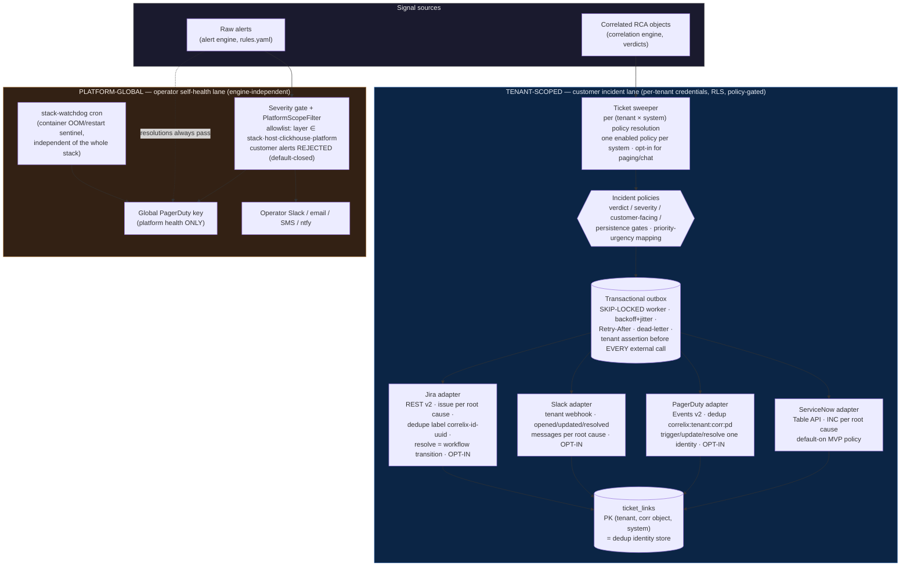

# Notification & Ticketing Architecture (#103)

Two lanes, one framework. Customer-facing destinations are tenant-scoped and
RCA-policy-driven; operator/platform channels are global and raw-alert-driven
by design.

## Invariants

1. **Raw customer alerts never reach a customer destination.** Only correlated
   RCA objects, through a tenant policy.
2. **One external incident per root cause per destination** — identity =
   `(tenant, correlation UUID, system)`; storms, retries, and crashes reuse it.
3. **Per-tenant credentials, write-only**, tenant asserted at delivery time;
   a mismatched connection is quarantined, never sent.
4. **Platform lane is engine-independent** — it must page even when
   correlation is down, which is why it stays raw-alert-driven behind a typed
   allowlist, and why the watchdog lives outside the stack entirely.
5. **Connectors are independent** — any combination per tenant; one
   destination's failure retries alone (separate outbox rows per system).
6. **Resolutions bypass severity, never scope** (#103-H): a customer or
   untyped resolution is rejected from the platform lane (default-closed,
   counted); an in-scope resolution for a never-opened incident is a safe
   destination-side no-op.
7. **Lifecycle cannot move backward**: the ticket link's state is the
   ordering authority — duplicate OPENs, stale UPDATE/OPEN after RESOLVE,
   and repeated RESOLVEs become audited no-op successes
   (`noop_duplicate` / `noop_stale_after_resolve`), never external calls.
8. **Platform deployment identity is trusted config** (PLATFORM_ENV /
   PLATFORM_REGION): staging cannot open or resolve production incidents;
   regions never share dedup identity; unset preserves legacy keys.
9. **Stable root-cause identity**: dedup keys on `(tenant, correlation-object
   UUID, system)` — the object UUID is version-stable (versions are rows
   under it; merges redirect to the canonical survivor); tenant slugs /
   display names / policy names never participate in identity.
10. **Connection scoping (MVP decision, documented)**: today one connection
   per (tenant, system) — the system name IS the default connection
   discriminator in keys and the one-enabled-policy invariant. Multi-
   connection (two PD services, regional SNOW instances) extends the same
   fields with a real connection id + migration; nothing hard-codes against it.
11. **Human display identity (#103 UX-2)**: every operator-facing string leads
   with the friendly handle — `P-XXXXXX` for RCA problems (ServiceNow
   short-description/custom field, PagerDuty summary + `problem_id` detail,
   Slack title/footer/resolve), `INC-XXXXXX` for operational incidents (Slack
   incident card, Incidents list). Raw UUIDs / internal ids NEVER appear in
   operator copy but stay canonical in dedup keys, button values, and APIs.
   Derivations are byte-identical Go↔TS (`problemDisplayID`/`friendlyProblemId`,
   `incidentDisplayID`/`friendlyIncidentId`).

## Managed platform channels (the operator lane's inventory)

Every destination in the platform-global lane is **managed**: its configuration
lives in the notification-channel store (`notify.ChannelConfig`, persisted via
`notifyConfigStore`), its secrets are write-only and sealed at rest with the
platform DEK, it is reconfigurable live (`Dispatcher.Replace` / `Remove`, no
restart), and it sits behind a per-channel severity floor. The admin surface for
all of them is **platform-owner only** (`requirePlatformAdmin`, CLAUDE.md §3a
rule 3): channels are platform-GLOBAL plumbing, so an org/tenant admin — who
holds `administration:admin` inside its own scope — is refused with 403 and can
neither read the operator's channel inventory nor repoint the platform's paging.

| Channel | Class | Default floor | Secret (write-only, sealed) | Scope filter | Admin endpoints |
|---|---|---|---|---|---|
| `email` (SMTP) | chatter | `warning` | password | — | `/api/notify/smtp[/test]` |
| `slack` | chat | `warning` | webhook URL | — | `/api/notify/slack[/test]` |
| `teams` | chat | `warning` | webhook URL | — | `/api/notify/teams[/test]` |
| `ntfy` | push | `critical` | topic token | — | `/api/notify/ntfy[/test]` |
| `twilio` | SMS | `critical` | auth token | — | `/api/notify/twilio[/test]` |
| `sns` | SMS / topic | `critical` | *(none stored — AWS keys stay in the environment)* | `platform` \| `all` (default `all`) | `/api/notify/sns[/test]` |
| `pagerduty` | paging | `critical` | routing key | `platform` (default) \| `all` | `/api/notify/pagerduty[/test]` |

Two notes on the newest entries (G10), which were env-only until now:

- **Teams** mirrors Slack exactly — same chat class, same `warning` floor, same
  whole-URL-is-the-secret handling. It carries no scope knob because scope
  exists for the paging classes whose global credential wakes a human.
- **SNS** stores only a destination (topic ARN / E.164 numbers / region). Its
  AWS credential is deliberately NOT part of the config: `AWS_ACCESS_KEY_ID` /
  `AWS_SECRET_ACCESS_KEY` stay in the deployment environment and are handed to
  the signer at build time, so nothing secret is ever written to the config
  file or returned by the API (`credentials_set: true` is all it will say). Its
  `scope` defaults to `all` rather than PagerDuty's `platform`, because unlike
  PagerDuty there is no per-tenant SNS adapter in the RCA lane for customer
  alerts to route to instead; operators paging humans should set `platform`.

The deprecated `TEAMS_WEBHOOK_URL` / `SNS_*` env wiring is migrated into the
store **once**, latched in `env_seeded`, and then ignored — so disabling a
channel in the admin UI is never overruled at the next boot by a variable still
sitting in `.env`. See `teams.md` for the Teams setup guide.

## Read surfaces (#103 UX-1 — "where did this go?")

- `GET /api/correlations/{id}/tickets` → `destinations[]`: every destination
  the RCA was filed to (SN + PD + Slack + Jira), plus legacy `status`/`pagerduty` keys.
- `GET /api/tickets/links` → all of the caller-tenant's ticket links (bounded,
  recency-first) — feeds the RCA Candidates "Notified via" column.
- `GET /api/incidents` → `notified_via[]` per incident: RECORDED notification
  deliveries (derived from `notified` timeline events; a delivery record,
  never an intent) — feeds the Operational Incidents "Notified via" column
  alongside the ITSM ticket chip.
