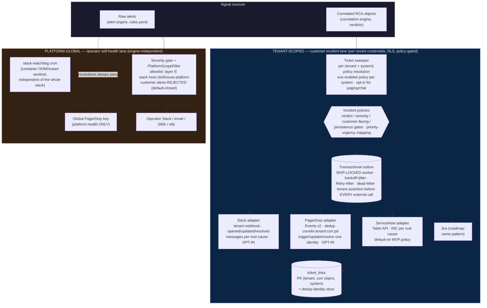

# Notification & Ticketing Architecture (#103)

Two lanes, one framework. Customer-facing destinations are tenant-scoped and
RCA-policy-driven; operator/platform channels are global and raw-alert-driven
by design.



## Invariants

1. **Raw customer alerts never reach a customer destination.** Only correlated
   RCA objects, through a tenant policy.
2. **One external incident per root cause per destination** — identity =
   `(tenant, correlation UUID, system)`; storms, retries, and crashes reuse it.
3. **Per-tenant credentials, write-only**, tenant asserted at delivery time;
   a mismatched connection is quarantined, never sent.
4. **Platform lane is engine-independent** — it must page even when
   correlation is down, which is why it stays raw-alert-driven behind a typed
   allowlist, and why the watchdog lives outside the stack entirely.
5. **Connectors are independent** — any combination per tenant; one
   destination's failure retries alone (separate outbox rows per system).
6. **Resolutions bypass severity, never scope** (#103-H): a customer or
   untyped resolution is rejected from the platform lane (default-closed,
   counted); an in-scope resolution for a never-opened incident is a safe
   destination-side no-op.
7. **Lifecycle cannot move backward**: the ticket link's state is the
   ordering authority — duplicate OPENs, stale UPDATE/OPEN after RESOLVE,
   and repeated RESOLVEs become audited no-op successes
   (`noop_duplicate` / `noop_stale_after_resolve`), never external calls.
8. **Platform deployment identity is trusted config** (PLATFORM_ENV /
   PLATFORM_REGION): staging cannot open or resolve production incidents;
   regions never share dedup identity; unset preserves legacy keys.
9. **Stable root-cause identity**: dedup keys on `(tenant, correlation-object
   UUID, system)` — the object UUID is version-stable (versions are rows
   under it; merges redirect to the canonical survivor); tenant slugs /
   display names / policy names never participate in identity.
10. **Connection scoping (MVP decision, documented)**: today one connection
   per (tenant, system) — the system name IS the default connection
   discriminator in keys and the one-enabled-policy invariant. Multi-
   connection (two PD services, regional SNOW instances) extends the same
   fields with a real connection id + migration; nothing hard-codes against it.
```
