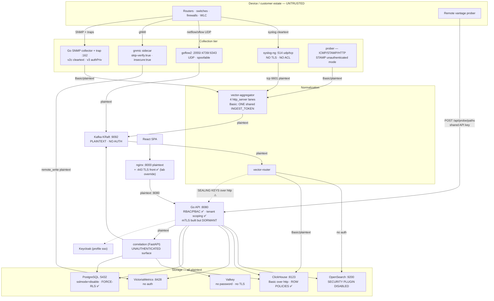
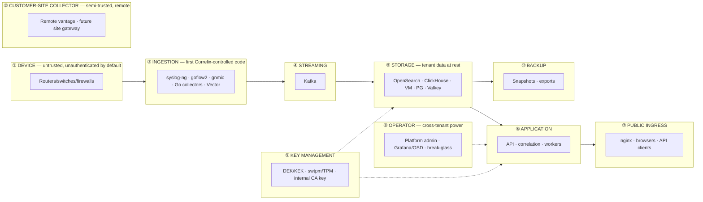
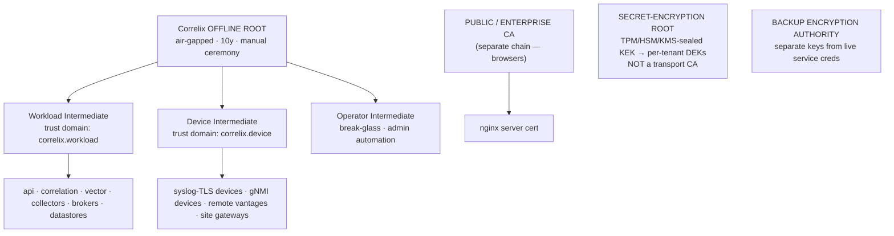

# Correlix Cloud-Native Security — High-Level Design

**Status: DRAFT for owner review. 2026-08-04. No implementation until reviewed (§12).**

Companions: `CORRELIX_CLOUD_NATIVE_SECURITY_LLD.md` (implementation detail),
`CORRELIX_SECURITY_IMPLEMENTATION_BACKLOG.md` (SEC-001…SEC-024),
`docs/adr/ADR-SEC-*.md` (decision records), `docs/runbooks/security/*`.

Predecessors NOT superseded: `docs/design/tls-architecture.md` (intra-stack
mTLS/SPIFFE, phases 1–4 landed), `docs/runbooks/tls-mtls.md`,
`docs/design/secret-custody.md`, `docs/design/transport-encryption-2026-08-04.md`
(the Zabbix-model draft this HLD absorbs and extends).

Every claim below is code-verified against branch `feat/observability-platform`
at 2026-08-04. Where a control is claimed to exist, the file is cited. Where a
path is called encrypted, BOTH ends were checked.

---

## 1. Executive summary

### 1.1 Where Correlix actually stands

Correlix has **unusually strong application-layer security and unusually weak
transport security.** That asymmetry is the entire story.

**Genuinely strong, verified:**
- **Tenant isolation is defence-in-depth and database-enforced.** ClickHouse
  `ROW POLICY` objects are converged on every API start by
  `src/backend/clickhouse_policies.go` (idempotent, self-healing so existing
  deployments catch up), and *guarded by tests* that fail if any policy on a
  `corr_*`/`path_*` table is written leniently
  (`clickhouse_policies_test.go:65-69`, `ch_convergence_test.go:96`,
  `cloud_costs_test.go:79-84`). PG uses FORCE-RLS + `withTenant`; OpenSearch
  uses per-tenant indices + filters.
- **A complete, tested intra-stack PKI exists in Go**: `internalca/` (stdlib
  ECDSA P-256 CA, SPIFFE URI SANs), `tlsconfig/` (TLS 1.2 floor, AEAD+ECDHE
  ciphers, `RenegotiateNever`, peer-identity allowlist, SPIFFE federation),
  `tls_ca.go` (CA key sealed under the platform DEK, SVID minting for api and
  nginx, TTL/2 reissue loop), `tls_server.go` (mTLS listener + expiry/handshake/
  identity-rejection metrics), `backend_client.go` (mTLS client for every
  internal backend, 14 call sites).
- **Envelope-encrypted secret custody** (`internal/vault`, AES-256-GCM,
  per-tenant DEK, AAD = tenant|field) with an swtpm sealing sidecar.
- **Public ingress TLS shipped 2026-08-03** (nginx front, TLS 1.2/1.3, HSTS,
  PFS, no session tickets — verified live).
- **LDAP is the reference client**: explicit CA bundle,
  `InsecureSkipVerify` structurally refused outside dev
  (`internal/ldap/ldap.go:311-317`).

**The enforcement gap — and it is large:**
> Nearly all of that PKI machinery is **built, wired into `main.go`, and
> switched off.** The live `deployment/docker/.env` sets **no `TLS_*` variable
> and no `SEAL_*` variable at all.**

Consequently, today: Kafka runs `PLAINTEXT` with **no authentication**;
OpenSearch runs with `DISABLE_SECURITY_PLUGIN: "true"` — **no authentication at
all** over every tenant's logs; VictoriaMetrics and Valkey are unauthenticated;
ClickHouse and the Vector→ClickHouse hop use **Basic credentials over
plaintext**; Postgres is pinned `sslmode=disable`; nginx→api is plaintext; the
correlation service exposes an **unauthenticated HTTP surface**; six services
share **one `INGEST_TOKEN`**; and — the sharpest one —
**per-tenant sealing keys are fetched over plaintext HTTP**
(`vector-router/cx-secret-backend.sh:24,55`), which undoes the sealed-fields
feature's own guarantee.

Two structural defects compound it: `TLS_FEDERATED_BUNDLES` is implemented in
Go but **absent from compose** (unreachable through the supported surface), and
enabling `TLS_INTERNAL_CA=true` without a seal provider **stores the CA private
key in plaintext** (`tls_ca.go:22-24` admits this) — an easy foot-gun that must
become a boot refusal.

### 1.2 Target end state

Every network connection in Correlix carries a **declared, stored, auditable
transport policy** with an outbound mode and an inbound *accept-set*; production
**fails closed** on any policy violation via an **executable validator**, not a
document; lab keeps working through an explicit profile; and every deviation
from encrypted+authenticated is a **recorded, owned, expiring exception** rather
than an accident.

### 1.3 Why a service mesh alone is not sufficient

A mesh (sidecar or ambient) secures generic TCP/HTTP between *pods*. It cannot:
- authenticate a **Cisco router** sending syslog or SNMP traps — the peer is not
  in the mesh and never will be;
- express **Kafka topic ACLs**, **ClickHouse row policies**, **OpenSearch
  roles**, or **tenant scoping** — mesh authz is L4/L7 path-based, not
  data-model-aware;
- prevent the real failure mode here, which is not "traffic was sniffed" but
  **"the datastore accepts anonymous connections"**. A mesh in front of an
  unauthenticated OpenSearch just encrypts the anonymity.
- exist at all in our **current deployment substrate** (Docker Compose; no
  Kubernetes files exist in the repo — `find` for k8s/Helm/kustomize returns
  nothing, and #114 confirms k8s packaging is unstarted).

Therefore: **native TLS + native authorization per component, with a common
workload-identity fabric** — and a mesh considered later only for generic
HTTP/gRPC service-to-service traffic under Kubernetes (§8).

### 1.4 Why a connection-policy model is needed

Because the answer to "is Correlix encrypted?" is currently *unknowable without
reading six config files per hop*, and because some peers **cannot** be
encrypted (NetFlow/sFlow/syslog-UDP are unauthenticated by protocol design).
A policy object makes the posture (a) queryable, (b) enforceable, (c) migratable
without downtime via accept-sets, and (d) **honest** — plaintext becomes a
declared risk acceptance with an owner and an expiry, not a silent default.

---

## 2. Scope

**In scope:** service-to-service transport security; device→collector security;
ingestion; event bus; storage; application and identity planes; secrets;
multi-tenancy interaction; deployment-time enforcement; security observability;
migration; certificate rotation; backup encryption; Docker Compose current
state; Kubernetes future state (design only).

**Out of scope (explicitly):** application rewrite; immediate Kubernetes
migration; replacing datastores, Keycloak, or collectors; inventing TLS inside
protocols that lack it (NetFlow/sFlow/SNMPv2c/TACACS+ — §6.6 handles these by
segmentation + declaration, never by pretence); changing RCA semantics, event
ordering, evidence handling, or tenant scoping.

**Non-negotiable invariants (constraints §10 of the brief, restated as design
law):** transport security is **never** the tenant boundary; ClickHouse row
policies stay database-enforced; no wildcard or shared service identities; no
hostname-verification disablement; no silent plaintext fallback; no private keys
in Git; the shared ingest token is eliminated in the target design.

---

## 3. Current architecture (as-built, verified)



**Documentation drift found (verified):**

| Drift | Evidence | Reality |
|---|---|---|
| `ARCHITECTURE.md:14,56-58,78` presents **Telegraf** as the SNMP collector and `netops.metrics` producer | `docker-compose.yml:313-315` — telegraf is `profiles: [legacy]`, not running | The **Go SNMP collector** (`collectors/poller.go`, `snmpv3.go`) is the real one |
| ~~`docs/UPGRADE.md`, `docs/STREAMING.md` still reference Redpanda~~ **— RETRACTED, this was a false positive in my first pass** | `UPGRADE.md:61-70` is a legitimate *migration* note for existing installs; `STREAMING.md:8` explicitly *records the removal*. Both are correct history, not drift | Kafka is the only bus, and the docs already say so correctly |
| `scripts/preflight-configs.sh:18` names its caller as `.github/workflows/config-preflight.yml` — **that workflow does not exist** | Real caller verified: `.github/workflows/fresh-install-integrity.yml:44` | Comment is stale; a reader looking for the CI gate is sent to a non-existent file |
| `tls-architecture.md` phases 1–4 marked ✅ ("landed") | True in code — but **dormant**; no `TLS_*` set in `.env` | "Landed" ≠ "enforced". The docs must distinguish *built* from *enabled* |

---

## 4. Trust boundaries



**The tenant boundary (⑪) is orthogonal to all of these** and is enforced at the
data layer (row policies, RLS, per-tenant indices, `principalTenant` filters) —
**never** by transport. This is design law: an mTLS peer is *authenticated*, not
*authorized for a tenant*.

---

## 5. Threat model (STRIDE-style, scored by current exposure)

| # | Threat | STRIDE | Exposure today | Target control |
|---|---|---|---|---|
| T1 | Telemetry spoofing (forged syslog/flows/traps) | S | **HIGH** — syslog hostname is "an UNVERIFIED CLAIM" (`syslog-ng.conf`), flow `sampler_address` spoofable, v1/v2c traps stamped `Authenticated:false` | Secure lanes (RFC 5425 mTLS, SNMPv3 authPriv); legacy lanes segmented + marked + expiring |
| T2 | Device impersonation | S | HIGH | Device PKI (cert→device→tenant binding); v3 engine-ID + credential binding |
| T3 | Collector compromise → full bus access | E | **HIGH** — one `INGEST_TOKEN` for 6 clients; Kafka has no ACLs | Per-collector identity + Kafka ACLs scoped to owned topics |
| T4 | Topic injection (write to another lane) | T | **HIGH** — no ACLs; bus bridge previously prefix-checked only | Kafka ACL matrix (LLD §6.7) |
| T5 | Unauthorized consumption of tenant telemetry | I | **HIGH** — anyone on the network can read Kafka/OpenSearch | mTLS + ACLs + OpenSearch Security plugin |
| T6 | Cross-tenant data access | I | **LOW** — row policies + RLS + tests | Preserve; add secure-transport isolation tests |
| T7 | Forged `tenant_id` in payload | S | LOW–MED — tenancy re-derived server-side (`device_tenant.csv`, `verified_tenant` quarantine) | Bind tenant to *transport identity* on secure lanes |
| T8 | Replay of telemetry/assertions | R | MED | SNMPv3 engine boots/time; STAMP auth mode; ingest nonce where applicable |
| T9 | Stale/leaked credentials | S | **HIGH** — shared static token, no rotation story | Short-TTL SVIDs (24 h) + per-peer PSK rotation |
| T10 | Stolen certificate | S | n/a (none issued) | Short TTL + allowlisted SANs + revocation-by-expiry + emergency CA rotation |
| T11 | CA compromise | E | **MED-HIGH** — CA key is plaintext if `SEAL_PROVIDER` unset | Boot refusal unless sealed; offline root; dual-root rotation |
| T12 | Service impersonation inside the stack | S | **HIGH** — nothing authenticates services | SPIFFE identity + peer allowlists |
| T13 | Plaintext credential exposure | I | **CRITICAL** — Basic creds + **per-tenant sealing keys** over plaintext HTTP | mTLS everywhere internal; sealing-key fetch over mTLS with a dedicated identity |
| T14 | Unauthorized DB access | E | **CRITICAL** — OpenSearch/VM/Valkey unauthenticated | Native auth on every datastore |
| T15 | API token theft | S | MED — bearer over TLS at the edge; plaintext internally | mTLS internally; token policy already exists |
| T16 | Admin console exposure (Grafana anon viewer, OSD security off) | E | **HIGH** — documented in `tls.conf.example` | Keep nginx `auth_request` gates; enable OSD security; restrict Grafana |
| T17 | Insecure fallback / downgrade | T | **HIGH** — plaintext `:8000` published beside `:443` | Fail-closed profile; remove plaintext listener post-migration |
| T18 | Expired certificate outage | D | n/a → will become MED once enabled | Expiry metrics (exist), renew-before windows, dual-root |
| T19 | Trust-store drift | T | MED | Bundle versioning + age metric + drift alert |
| T20 | Backup theft | I | **HIGH** — no backup-encryption domain today | Separate backup encryption authority |
| T21 | Compromised observability stack (Grafana/OSD as pivot) | E | MED | Separate identities, no shared creds, gate retained |
| T22 | Insider misuse / operator overreach | R | MED — break-glass is audited, time-boxed | Keep; add security-config change audit + step-up |

---

## 6. Target security architecture

### 6.1 Trust domains (five named; the diagram also shows an operator
intermediate — see the note under it)



*Diagram note (correction 2026-08-04): the five **named domains** are public
ingress, workload, device, secret-encryption root, and backup. The diagram also
shows an **Operator Intermediate** — that is a sixth, deliberate but
**deferred**, sub-CA for break-glass/admin automation. ADR-SEC-002 adopts the
five and records the operator intermediate as an open item (U2) rather than
silently reconciling the mismatch.*

Rationale for separation (ADR-SEC-002): a compromised *device* intermediate must
not mint a *workload* identity; the public chain must never be able to sign an
internal identity; and key-encryption custody must survive transport-PKI
compromise entirely.

### 6.2 Identity model

**Workload (SPIFFE-compatible).**

*Correction 2026-08-04 — my first pass said this was "already the format
`tls_ca.go:91-93` emits". That is shape-true but value-false.* What the code
actually emits today is:

```
spiffe://netops/ns/default/sa/<service>      ← ACTUAL (tls_ca.go:91-93)
```
with the trust domain from `TLS_TRUST_DOMAIN` (compose default `netops`,
`docker-compose.yml:1463`) and the namespace a **hardcoded literal `default`**,
not derived per service. `docs/runbooks/tls-mtls.md:33` allowlists exactly that
string.

The target below is therefore a **migration**, not a description of today:

```
spiffe://correlix.workload/ns/<namespace>/sa/<service>      ← TARGET
```

**Migration hazard (highest-risk detail in the identity work):** the trust
domain and namespace appear inside every issued SVID *and* every
`TLS_CLIENT_ALLOWED_URIS` allowlist. Changing either invalidates all of them
simultaneously. Options: (a) keep `netops` as the v1 trust domain and defer the
rename — **recommended for v1**, since the domain string carries no security
value and the churn is pure risk; or (b) rename during the dual-root window
when both bundles are trusted anyway. Namespaces (`ingress`/`app`/`ingestion`/
`storage`/…) are worth adding when the identity actually needs to distinguish
tiers; `default` is honest until then.
Namespaces: `ingress`, `app`, `ingestion`, `streaming`, `storage`, `identity`,
`ops`. Compose has no namespaces, so the LLD defines the mapping
(logical identity ↔ Compose cert file ↔ future k8s ServiceAccount) so the
identity string is stable across substrates.

**Device:**
```
spiffe://correlix.device/tenant/<tenant_id>/kind/<device|vantage|gateway>/id/<device_id>
```
The tenant is **inside the device identity** — that is what lets a secure syslog
lane bind tenancy to the certificate instead of to a spoofable hostname. It is
still not an authorization grant: the tenant claim is *checked against* the
registered device record; a mismatch is rejected (never trusted, never
auto-created).

**Rules:** no wildcards; one identity per service instance role; SAN must carry
the URI SAN (identity) *and* the DNS names actually dialled; hostname
verification mandatory everywhere.

### 6.3 The transport policy abstraction

The Zabbix-derived core, made repo-specific (full schema in LLD §6.2):

```yaml
transport_policy:
  name: vector-aggregator-to-kafka
  environment: production
  outbound:  { mode: mtls, server_name: kafka, trust_domain: correlix.workload,
               client_identity: "spiffe://correlix.workload/ns/ingestion/sa/vector-aggregator" }
  inbound_peer: { allowed_identities: ["spiffe://correlix.workload/ns/streaming/sa/kafka"] }
  accept: [mtls]                 # SET — [plaintext, mtls] only during migration
  tls: { minimum_version: TLS1.2, hostname_verification: required, plaintext_fallback: prohibited }
  authorization: { kafka: { produce: [netops.syslog, netops.metrics], consume: [] } }
  rotation: { leaf_ttl: 24h, renew_before: 8h, overlapping_trust_window: 7d }
  enforcement: { fail_on_missing_certificate: true, fail_on_expired_certificate: true, fail_on_plaintext: true }
  exception:   # required whenever accept ⊇ plaintext
    reason: "…", owner: "…", expires: "2026-09-30", ticket: "SEC-0xx"
```

Two Correlix-specific additions to the Zabbix model:
1. **`accept` is a set** (Zabbix's migration lever) *and* **every plaintext
   member requires an `exception` block with owner + expiry** — bypasses cannot
   be permanent or anonymous (brief constraint 18).
2. **`protocol_native` mode** for channels where "TLS" is meaningless but a
   security level exists: SNMPv3 (`min_level: authPriv`), SSH, TACACS+. Prevents
   the dishonest claim that generic TLS secures SNMPv3 (brief §6.16).

### 6.4 Configuration enforcement model

**Production checks must be executable, not prose** (brief constraint 19). The
repo already has the right hook: `scripts/preflight-configs.sh`,
`preflight-install.py`, and boot-time validation in the API. The design adds a
**production validator** that runs (a) at install, (b) at API boot, (c) in CI,
and refuses to start on any violation in the production fail-closed rule set (enumerated as V1–V16 in ADR-SEC-008; sourced from the brief's §4.4). Lab bypasses exist only via an
explicit profile with declared exceptions.

### 6.5 Deployment profiles

| | **lab** | **development** | **staging** | **production** |
|---|---|---|---|---|
| Plaintext transports | allowed, declared | allowed, warned | prohibited except declared exceptions | **prohibited** |
| Cert validation | may skip-verify **if declared** | required | required | required + SAN + issuer pinning |
| Secret sealing | passthrough allowed | swtpm | swtpm/TPM | **`REQUIRE_SEAL=true`** — boot fails unsealed |
| Legacy protocols (v2c, syslog-UDP, flow-UDP) | allowed | allowed | allowed w/ exception | allowed **only** with exception + segmentation + expiry |
| Enforcement severity | warn | warn | fail on new violations | **fail closed at boot** |
| Audit expectations | none | local | full | full + exception ageing report |

Self-signed dev certs (`scripts/gen-dev-cert.sh`, the lab TLS front) remain
first-class for lab — the profile is what keeps that from leaking into prod.

### 6.6 Protocols that cannot be secured (honesty clause)

NetFlow/IPFIX/sFlow (UDP, no auth), syslog UDP/TCP 514, SNMPv2c, TACACS+
(MD5 obfuscation, cleartext header). For these the design mandates: dedicated
telemetry VLAN/interface, source allowlists, rate limiting, `transport_
authenticated=false` stamped on every event (the SNMP trap path **already**
does this — `snmptrap.go:64`), a visible compliance exception, and a migration
deadline to the secure lane. **No claim of cryptographic authenticity is made
anywhere in UI, docs, or evidence chains.**

---

## 7. Component matrix (source → destination)

Priority: **P0** = fixes an unauthenticated/credential-exposing path;
**P1** = encryption gap; **P2** = hardening. `⚠` marks a verified critical gap.

| Source | Dest | Proto | Current transport | Target | Current authn | Target authn | Target authz | Trust domain | Credential | Rotation | Failure mode | Migration | Observability | Pri |
|---|---|---|---|---|---|---|---|---|---|---|---|---|---|---|
| Browser | nginx | HTTPS | **TLS ✅** (+ plaintext :8000 also published ⚠) | TLS 1.2+, HSTS | JWT/API key | unchanged | RBAC/PBAC | public | public/enterprise cert | ACME/manual | fail closed | drop :8000 | handshake errors, expiry | P1 |
| nginx | api | HTTP | **plaintext** | **mTLS** | none | SVID | SAN allowlist | workload | nginx SVID (already minted by `tls_ca.go:150-155`) | 24 h | fail closed | accept-set | identity rejections | **P0** |
| api | ClickHouse | HTTP | plaintext + Basic | TLS + client cert | Basic | mTLS + CH user | **row policies (keep)** | workload | SVID + CH user | 24 h | fail closed | dual listener | policy denials | **P0** |
| api | OpenSearch | HTTP | **plaintext, NO AUTH ⚠** | HTTPS + mTLS | **none** | SVID → OS role | index/tenant roles | workload | SVID | 24 h | fail closed | security plugin bootstrap | authz denials | **P0** |
| api | VictoriaMetrics | HTTP | plaintext, no auth ⚠ | via **vmauth** TLS | none | mTLS/token | route+tenant scoping | workload | SVID | 24 h | fail closed | vmauth in front | 401/403 rate | **P0** |
| api | Postgres | TCP | **`sslmode=disable`** | `verify-full` | password | SCRAM (+ optional cert) | per-service roles + **RLS (keep)** | workload | role + CA | 90 d | fail closed | `sslmode` ladder | TLS failures | **P0** |
| api | Valkey (compose service name `redis`, Valkey image) | RESP | **plaintext, NO AUTH ⚠** | TLS | **none** | ACL user | command/key-prefix ACL | workload | ACL user | rotate | fail closed | dual port | ACL denials | **P0** |
| *(Valkey scope correction, 2026-08-04)* | | | This store carries **RCA evidence** — probe paths, LLDP/BGP-LS topology, interface maps — not just cache, so tampering is an *integrity* issue, not only confidentiality. Publishers discard write errors (`_ = redisSetEX(...)`), so an auth failure would be **silent**; and `RedisAddr()` returns non-empty even with a bad password, so the file-fallback does **not** trigger. Both must be fixed alongside enabling auth | | | | | | | | | | **P0** |
| api | correlation | HTTP | plaintext | mTLS | **none ⚠** | SVID | peer allowlist | workload | SVID | 24 h | fail closed | accept-set | handshake | **P0** |
| vector-router | api (sealing keys) | HTTP | **plaintext + shared Basic ⚠⚠** | **mTLS, dedicated identity** | shared token | SVID | key-fetch scope only | workload | SVID | 24 h | fail closed | accept-set | key-fetch audit | **P0** |
| vector-* | Kafka | TCP | **PLAINTEXT, no auth ⚠** | mTLS | **none** | SVID | **topic ACLs** | workload | SVID | 24 h | fail closed | dual listener + deadline | ACL denials | **P0** |
| goflow2 | Kafka | TCP | plaintext | mTLS or SASL_SSL | none | identity | produce `netops.flows` only | workload | SVID | 24 h | fail closed | dual listener | ACL denials | P1 |
| correlation | Kafka/CH/PG | mixed | plaintext | mTLS/TLS | partial | SVID + users | consume-only ACLs, CH policies | workload | SVID | 24 h | fail closed | dual listener | denials | **P0** |
| collectors/prober | Vector lanes | HTTP | plaintext + **one shared token ⚠** | mTLS, **per-collector identity** | shared Basic | SVID | lane-scoped | workload | SVID | 24 h | fail closed | accept-set | per-lane rejections | **P0** |
| syslog-ng | Vector :6601 | TCP | plaintext | TLS | none | cert | — | workload | SVID | 24 h | fail closed | dual port | — | P1 |
| Device | syslog-ng | 514 UDP/TCP | **plaintext, unauth ⚠** | **6514 RFC 5425 mTLS** | **none** | device cert → device → tenant | tenant from cert | device | device cert | per-device | legacy lane marked + expiring | `transport_authenticated` | **P0** |
| Device | goflow2 | UDP | plaintext, unauth | **unchangeable** | none | **exporter allowlist only** | tenant map | n/a | n/a | n/a | drop unknown exporters | segmentation | spoof/rate metrics | P1 |
| Device | SNMP poll | UDP | v2c cleartext / v3 authPriv | **v3 authPriv required (prod)** | community / USM | USM | per-device creds | device | v3 creds (sealed) | rotation workflow | refuse below `min_level`, mark `policy_blocked` (≠ down) | per-device policy | level metrics | P1 |
| Device | SNMP trap | UDP 162 | v1/v2c unauth; **v3 fails open for unknown ⚠** | v3 authPriv; **unknown rejected** | partial USM | USM | per-source | device | v3 creds | rotation | **close the fail-open** | accept-set | `trap_policy_rejected` | **P0** |
| gnmic | Device | gRPC | **`skip-verify:true` global; `insecure:true` ×5 ⚠** | TLS+CA, mTLS preferred | user/pass | device cert or pinned CA | per-target | device | CA bundle + client cert | per-device | prod refuses insecure/skip-verify | per-target policy | per-target status | P1 |
| gnmic | VictoriaMetrics | HTTP | plaintext | via vmauth TLS | none | identity | ingest scope | workload | SVID | 24 h | fail closed | vmauth | 401 rate | P1 |
| Remote vantage | api | HTTPS | TLS *if* via front | mTLS or per-vantage PSK | **shared API key ⚠** | per-vantage identity | vantage-scoped | device | SVID/PSK | rotate | fail closed | accept-set | per-vantage audit | P1 |
| Operator | Grafana/OSD | HTTP(S) | gated by nginx `auth_request` ✅ | unchanged + OSD security on | platform-owner gate | + native roles | operator scope | operator | — | — | fail closed | — | access audit | P2 |

---

## 8. Service-mesh decision (summary; full record in ADR-SEC-004)

| Option | Verdict for Correlix |
|---|---|
| **Native TLS + native authz per component** | **CHOSEN** for Kafka, OpenSearch, ClickHouse, VM, Postgres, Valkey, syslog, gNMI, ingress. Only approach that reaches ACLs/row policies/roles, and the only one that works on Compose today |
| **SPIFFE-style workload identity (own `internalca`, SPIRE-compatible IDs)** | **CHOSEN** — already implemented and issuing SPIFFE URI SANs; SPIRE remains a drop-in later without changing identity strings |
| Sidecar mesh (Istio/Linkerd) | **DEFERRED** — no k8s substrate; cannot secure devices; would encrypt (not fix) anonymous datastores; heavy operational surface for an appliance product |
| Ambient mesh | Deferred, same reasons; re-evaluate at k8s |
| cert-manager | **ADOPT LATER**, k8s only, for certificate *resources*; identity model unchanged |
| Vault PKI | Deferred — real option if customers already run Vault; adds an operational dependency an air-gapped appliance may not have |
| App-managed certs | **Status quo, retained** for Compose (that is what `tls_ca.go` is), with the constraint that the CA key must be sealed and the roadmap moves the root offline |

**Explicit anti-goal:** a mesh must never be used to make an insecure Kafka or
datastore configuration *look* secure.

---

## 9. Phased roadmap

Each phase: dependencies · risks · rollback · telemetry-continuity · tenant
impact · tests · completion criteria. (Backlog carries the task-level detail.)

**Phase 0 — Inventory + production validation framework (SEC-001/002).**
Deps: none. Risk: low. Rollback: n/a (additive). Telemetry: none. Tenant: none.
Tests: validator unit tests incl. every fail-closed rule (ADR-SEC-008 V1–V16); CI runs it. Done when: an
insecure production config **fails** the validator in CI, and the as-built
inventory is committed and drift-corrected (ARCHITECTURE.md Telegraf/Redpanda).

**Phase 1 — Public ingress + nginx→API mTLS (SEC-004/005).**
Deps: **SEC-003.1/.2/.3 (corrected 2026-08-04 — this was wrongly "Deps: 0").**
Enabling the nginx→api hop enables `TLS_INTERNAL_CA`, which by §1.1 writes a
**plaintext CA key** unless sealing is in place — so the seal gate and CA
bootstrap must land first. Risk: med
(edge). Rollback: revert compose override; keep :8000 until cutover. Telemetry:
none. Tenant: none. Tests: handshake, wrong-SAN rejection, hot reload, browser
smoke. Done when: nginx→api is mTLS with SAN allowlist, and the plaintext
listener has a removal date.

**Phase 2 — PKI + workload identity foundation (SEC-003).** Deps: 0. Risk: med
(CA custody). Rollback: dual-root window. Telemetry: none. Tenant: none. Tests:
issuance, TTL/2 renewal, dual-root rotation, **boot refusal when CA unsealed**.
Done when: every service has an SVID and a trust bundle, root is offline, and
`TLS_FEDERATED_BUNDLES` is reachable from compose.

**Phase 3 — Kafka TLS + authn + ACLs (SEC-006/007).** Deps: 2. Risk: **high** —
the bus is the spine. Rollback: dual listener until the deadline. Telemetry:
**at risk** — this is the phase that can drop data; requires per-client cutover
with lag monitoring. Tenant: none directly. Tests: ACL denial per identity,
consumer-group scoping, migration continuity (no loss, no dupes, no
out-of-order). Done when: plaintext listener removed and
`allow.everyone.if.no.acl.found=false`.

**Phase 4 — Datastores + secret-sealing enforcement (SEC-008/009/010/011/012,
**SEC-018**).** *Correction 2026-08-04: SEC-018 (sealing enforcement, incl. the
plaintext sealing-key hop rated P0 ⚠⚠ in §1.1 and §7) was omitted from this
roadmap in the first pass and is placed here. It is the one item v1 cannot
ship without — the sealed-fields feature is undone by its own key
distribution until it lands.* Deps: 2. Risk: high
(OpenSearch security bootstrap is invasive). Rollback: per-store, staged.
Telemetry: at risk for OS/CH writes. Tenant: **must re-prove isolation under
new auth** — row policies and RLS must be re-tested, and CH policy recreation
after any access-storage reset must be guarded. Done when: no unauthenticated
datastore endpoint exists anywhere.

**Phase 5 — Secure device ingestion (SEC-013/014/015/016/017).** Deps: 2, 3.
Risk: high (customer devices). Rollback: legacy lane stays until deadline.
Telemetry: at risk per device. Tenant: cert→tenant binding must never
auto-create. Done when: secure lanes exist for syslog/gNMI/SNMP, legacy lanes
are marked unauthenticated with expiries, and flows are segmented.

**Phase 6 — Automated rotation (SEC-019).** Deps: 2. Risk: med. Tests:
**telemetry continuity across rotation** (the acceptance criterion that matters
most). Done when: dual-root rotation is exercised in staging without loss.

**Phase 7 — Kubernetes security (SEC-022).** Deps: #114 (k8s packaging, not
started). Design-only now.

**Phase 8 — Security UI + compliance + fault injection (SEC-020/021/023).**
Deps: 1–6. Read-only UI first (brief §6.24). Done when: posture is visible,
exceptions age visibly, and fault-injection suites run in CI.

---

## 10. Alternatives rejected (with reasons)

| Rejected | Why |
|---|---|
| One shared wildcard certificate | Destroys per-service identity; one theft = full impersonation; forbidden by brief constraint 6/7 |
| One shared service credential | Exactly today's `INGEST_TOKEN` problem — 6 services, no rotation, no attribution |
| "Put everything behind nginx" | Does not authenticate service-to-service or device traffic; leaves datastores anonymous |
| Service mesh as sole control | Cannot express Kafka ACLs, CH row policies, OS roles, tenant scoping; no k8s substrate; hides insecure backends |
| TLS without authorization | Encryption ≠ authorization (brief §12). An authenticated peer still needs ACLs/policies |
| Static long-lived certs | Revocation becomes the hard problem; short TTL + fast rotation is the SPIFFE model already chosen in `internalca` |
| Single CA for public + workload + device | Cross-domain minting; a device compromise could forge a service identity |
| TLS termination without backend encryption | Precisely the current nginx→api gap |
| Permanent plaintext migration listeners | Migration listeners must expire (constraint 18) |
| IP allowlisting as the only device identity | Spoofable on UDP; acceptable only as a *supplement* for protocols with no alternative |
| Shared tenant-wide SNMP credentials | Blast radius = every device in the tenant; per-device or per-group only |

---

## 11. Decisions — RESOLVED by the owner 2026-08-04

**Owner steer, verbatim in intent:** *"Pick secure methods and don't add too much
overhead — it shouldn't be overkill. I want to show customers this is a secure
environment where all components are transported via TLS securely."*

Followed by: *"We will stick with our design for the most part — I am just
giving high-level direction where you have to make decisions for me."*

**Read those together, because the second sentence bounds the first.** The
full design stands — every section of this HLD, all 27 LLD sections, all 24
backlog epics, all 8 ADRs and all 15 runbooks are written and retained,
including the paths deferred out of v1. Nothing is deleted; deferred work stays
**designed** so that starting Phase 2 is a scheduling decision, not a
re-derivation.

What the steer settles is (a) the **choice** at each decision point — always the
option with the fewest moving parts that still holds — and (b) the **v1
implementation scope**, which narrows to a claim we can actually prove:
*every Correlix-owned component communicates over TLS, and we can show you.*

### 11.0 The v1 decision set ("simple and provable")

| # | Decision | Chosen | Why this is the low-overhead option |
|---|---|---|---|
| D1 | **v1 scope** | **Intra-stack + public ingress only.** Every Correlix-owned component speaks TLS. Customer **device** lanes (syslog/SNMP/gNMI/flows) → Phase 2 | We control every endpoint in v1, so it is achievable and demonstrable. Customer hardware cannot be forced onto our timeline; pretending otherwise stalls the whole project |
| D2 | **PKI** | **Keep the existing in-process internal CA** (`internalca` + `tls_ca.go`) — already mints SPIFFE-SAN leaves and auto-rotates at TTL/2. **No SPIRE, no Vault PKI, no cert-manager, no offline-root ceremony in v1** | Zero new operational components. The rotation problem — the usual reason TLS projects fail operationally — is *already solved in code*. SPIRE stays a drop-in later because the identity strings are already SPIFFE-compatible |
| D3 | **CA custody** | **Sealing is mandatory**: boot refusal if `TLS_INTERNAL_CA=true` without `SEAL_PROVIDER` (closes the verified plaintext-CA-key defect, `tls_ca.go:22-24`). Offline root = documented future option | One check, large risk removed |
| D4 | **Trust domains (v1)** | **Two**: public ingress (separate chain) + one workload domain. Device/operator domains designed, deferred with D1 | Three intermediates for a single-appliance deployment is ceremony without benefit today |
| D5 | **Kafka authn** | **mTLS with the same internal CA** | SASL/SCRAM would add a *second* credential store to create, distribute and rotate. mTLS reuses certificates we already mint and auto-renew — genuinely **less** operational work, not more |
| D6 | **Datastores** | TLS + each store's **simplest sufficient** native auth; mTLS where the client is ours and costs nothing extra. **ClickHouse row policies and PG RLS stay exactly as-is** | The tenant boundary is already strong and tested; this project must not touch it. Elaborate per-client role matrices are deferred until a customer needs them |
| D7 | **Service mesh** | **No** (unchanged) | No k8s substrate; cannot secure devices; would mask insecure backends |
| D8 | **PSK infrastructure** | **None in v1.** SNMPv3 already carries its own; STAMP auth mode deferred | Avoids the PSK-sprawl risk (R4) entirely for now |
| D9 | **Production behavior** | **Fail closed** at boot, with clear actionable errors; lab profile is the escape hatch | The claim is worthless if a misconfigured upgrade silently degrades to plaintext |
| D10 | **Customer-facing deliverable** | Read-only **Transport Security** posture view + exportable report: every component path, mode, peer identity, cert expiry | This *is* the product outcome. Everything else exists to make this page honest |

**Explicitly deferred (designed, not built in v1):** device PKI and per-device
certificates; syslog RFC 5425 secure lane; gNMI certificate onboarding; STAMP
authenticated mode; offline root + operator intermediate; SPIRE/Vault/
cert-manager; per-client datastore role matrices; Kubernetes work.

**v1 completion definition — the claim we can make when done:**
> Every Correlix component-to-component connection uses TLS with verified peer
> identity issued by the Correlix internal CA and auto-rotated; production
> refuses to start otherwise; and the Transport Security page shows it, path by
> path, with certificate identity and expiry.

Device-originated telemetry (syslog/SNMP/flows) is **explicitly excluded from
that sentence** and is labeled `transport_authenticated=false` in the product
until Phase 2 — honesty is part of the claim's value.

### 11.0b Corrections applied 2026-08-04 (found while writing the backlog)

Recorded rather than silently patched, because a design that hides its own
errors cannot be trusted to have found the code's:

| # | Error in this HLD's first pass | Correction |
|---|---|---|
| C1 | Claimed `UPGRADE.md`/`STREAMING.md` Redpanda references were **drift** | **False positive — retracted.** They are a correct migration note and a correct removal record (§3). Real drift found instead: `preflight-configs.sh:18` cites a CI workflow that does not exist |
| C2 | Phase 1 (nginx→API mTLS) listed **"Deps: 0"** | Impossible — that hop enables the internal CA, which writes a **plaintext CA key** without sealing. Now depends on the PKI + seal-gate items |
| C3 | **SEC-018 (secret-sealing enforcement) had no phase**, despite §1.1 calling the plaintext sealing-key hop the sharpest gap | Placed in Phase 4 and marked as the item v1 cannot omit |
| C4 | **No epic owned the transport-policy store**; it was implicit in the UI epic | The store is tenant-scoped, RLS-backed state — it belongs with the policy model, not the UI. Assigned explicitly in the backlog |
| C5 | Decision 6 (**backup encryption domain**) was scoped in §2 and rated HIGH (T20) but had **no epic** | Either give it an epic or move it out of v1 scope explicitly — flagged for the owner in §11.2 |
| C6 | `api → Valkey` row **understated the surface** | Valkey carries RCA *evidence*; write errors are discarded so failures would be silent; `RedisAddr()` stays non-empty on a bad password so the file-fallback never triggers. Row corrected in §7 |

### 11.1 Residual risks under the simplified plan

- **Handshake cost** on high-fan-out internal calls — measure, reuse connections
  (Zabbix documents ~1 s/check with no session caching; our internal clients are
  long-lived and pooled, so exposure is far lower).
- **Fail-closed is an availability tradeoff** (D9): a misconfigured production
  upgrade stops rather than degrades. Accepted deliberately.
- **Device lanes stay unauthenticated in v1** (D1). The mitigation is honest
  labeling + segmentation guidance, not a claim we cannot support.
- **The internal CA remains in-process** (D2/D3). Accepted for v1 with sealing
  mandatory; revisit if a customer's compliance regime requires an offline root.

### 11.2 Historical: the options as originally posed

Retained so the reasoning behind D1–D10 is auditable.

1. **Device PKI: certificates vs PSK vs both.** Certs give real identity;
   many field devices cannot do mTLS. Recommendation: **both** — certs for
   capable peers, per-device PSK (SNMPv3/STAMP-auth) elsewhere. *Cost: two
   credential lifecycles.*
2. **Where the internal CA root lives.** Today: in-process, sealed by the
   platform DEK. Recommendation: **offline root + online intermediates**
   (brief constraint 4 flags in-process root as undesirable). *Cost: a manual
   ceremony and a documented HSM/offline procedure.*
3. **Kafka authn: mTLS vs SASL_SSL (SCRAM).** Recommendation: **mTLS** —
   consistent with SPIFFE identity, no second credential store. *Cost: every
   client must handle certs, including goflow2 and Python.*
4. **How hard production fails.** Recommendation: **boot refusal** on the ADR-SEC-008 V1–V16
   violations. *Cost: a misconfigured upgrade takes the stack down rather than
   silently degrading — which is the point, but it is an availability tradeoff
   the owner must accept.*
5. **Legacy lane sunset policy.** Who owns exceptions, and what is the default
   expiry (recommend 90 days)?
6. **Backup encryption domain** — build now or defer? (Currently absent.)
7. **Scope of v1**: intra-stack only (fast, invisible to customers) vs
   including device lanes (customer-visible differentiator, much larger).

**Standing risks:** handshake cost on high-fan-out collection (Zabbix documents
~1 s/check with no session caching — we must measure and reuse connections);
discovery vs encryption (a peer refusing plaintext may become undiscoverable);
PSK sprawl if rotation slips; and "declared plaintext" degenerating into a
rubber stamp without the ageing report.

---

## 12. Do-not-implement boundary

Nothing in Phases 1–8 begins until this HLD, the LLD, the ADRs and the backlog
are reviewed and the §11 decisions are made. **Permitted before approval**
(safe, additive, no production behavior change): the as-built inventory, the
documentation drift corrections, the validator *in warn-only mode*, and test
scaffolding. Everything that changes a listener, a credential, a certificate, a
policy, or a device configuration waits.
