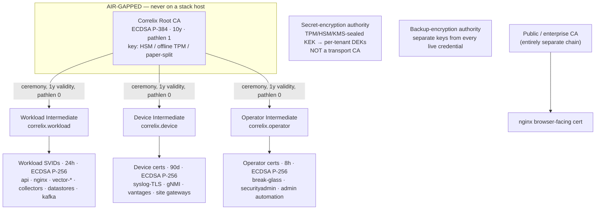
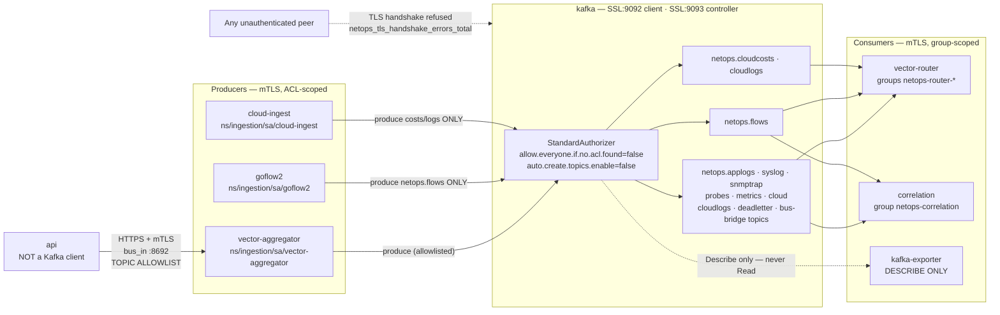

# Correlix Cloud-Native Security — Low-Level Design

**Status: DRAFT for owner review. 2026-08-04. No implementation until the HLD §12
do-not-implement boundary is lifted.**

Binding parent: **`docs/security/CORRELIX_CLOUD_NATIVE_SECURITY_HLD.md`** — its
trust domains (§6.1), SPIFFE identity formats (§6.2), transport-policy sketch
(§6.3), deployment profiles (§6.5), component matrix (§7) and phase order (§9)
are **contract**. Where this LLD found the HLD to be inaccurate it says so
explicitly in **§7 (HLD corrections)** rather than diverging silently.

Predecessors this document **builds on and does not replace**:
`docs/design/tls-architecture.md` (the intra-stack mTLS/SPIFFE design — phases
1–5(1/3) landed in code, dormant in deployment), `docs/runbooks/tls-mtls.md`
(the enable sequence), `docs/design/secret-custody.md` (#17 envelope custody),
`docs/design/transport-encryption-2026-08-04.md` (the Zabbix per-peer policy
model this LLD renders as a concrete schema in §6.2).

## How to read this document

- Every assertion about the current system carries a **`path:line`** citation.
  An uncited claim about current behavior is a bug in this document.
- A path is called **encrypted** only where **both ends** were verified. Where
  only one end was checked, the text says "client side ready, server side
  unverified".
- **`[ASSUMPTION]`** marks a design choice that is defensible but not derived
  from repo evidence. **`[UNKNOWN]`** marks something that must be measured or
  decided before implementation. **`[DECISION-REQUIRED]`** maps to an HLD §11
  owner decision.
- **No new third-party Go dependency is proposed anywhere in this document.**
  Every Go control is stdlib or an already-vendored module (CLAUDE.md §6).
- **Nothing here weakens tenant isolation.** Where a control touches tenancy the
  text states the CLAUDE.md §3a rule it preserves.

## Verification baseline

Branch `feat/observability-platform`, 2026-08-04. The single most important
as-built fact, and the premise of the whole migration:

> The intra-stack PKI is **built and switched off**. The live
> `deployment/docker/.env` contains **no key matching `TLS|SEAL|CERT|SSL|HTTPS`
> at all**; every knob therefore falls to its empty compose default
> (`docker-compose.yml:1448-1450`, `:1455-1472`). `scripts/install.py` never
> writes a `TLS_*` or `SEAL_*` key and never generates a certificate — its only
> seal-related output is two data directories (`install.py:944-945`).

A second as-built fact that changes the scope of everything below:

> The tracked `docker-compose.yml` is **not the whole deployment.** A
> gitignored `deployment/docker/docker-compose.override.yml` is present on the
> lab host and adds (a) the nginx TLS front on `443:8443`
> (`docker-compose.override.yml:4-11`) and (b) a **`cloud-ingest` service that
> is a real Kafka producer holding `INGEST_TOKEN`**
> (`docker-compose.override.yml:27-70`, token at `:37`). Any inventory,
> validator or network policy that reads only the tracked compose will be
> **incomplete**. §6.21 and §6.22 treat this as a first-class problem.

---

# 0. Owner decisions and the v1 scope line

The HLD §11 open decisions were resolved by the owner on 2026-08-04. The steer:

> *"Pick secure methods, don't add too much overhead, not overkill. I want to
> show customers this is a secure environment where all components are
> transported via TLS securely."*

and, on the shape of this document:

> *"We will stick with our design for the most part; I am just giving high-level
> direction where you have to make decisions for me."*

**Therefore: this LLD is complete. Every section is designed at
implementation-ready depth, including the parts that are not v1.** The owner
decisions set the **phase label** and pick the **chosen option** inside each
section — they do not shrink the design. The value of a fully designed Phase 2+
is that when it is wanted, nothing has to be re-derived.

## 0.1 Decisions (binding)

| # | HLD §11 question | Decision | Rationale to state to customers |
|---|---|---|---|
| D1 | Scope of v1 | **Intra-stack + public ingress only.** Every Correlix-owned component speaks TLS: nginx, api, correlation, vector-aggregator, vector-router, Go collectors, Kafka, OpenSearch, ClickHouse, VictoriaMetrics, Postgres, Valkey, Keycloak, Grafana, OSD. **Customer device lanes (syslog, SNMP, gNMI, flows) are Phase 2** — we cannot force customer hardware. | "Every hop inside the Correlix platform is encrypted and mutually authenticated." Device lanes stay honestly labelled (§6.15.4) rather than overclaimed. |
| D2 | Where the CA lives | **v1 = the existing in-process internal CA** (`internalca/ca.go` + `tls_ca.go`), which already mints SPIFFE-SAN leaves and re-issues at TTL/2. No SPIRE, no Vault PKI, no cert-manager, no offline-root ceremony. **One hard requirement: the CA key must be sealed — boot refusal if `TLS_INTERNAL_CA=true` without `SEAL_PROVIDER`** (§6.19.7). | Zero new operational surface; rotation is already automatic. Offline root is documented (§6.3.2) as the Phase 2+ upgrade path. |
| D3 | Trust domains | **v1 = two.** (a) public/enterprise chain for the browser-facing nginx certificate; (b) **one workload trust domain** for everything internal. Device and operator intermediates are **designed (§6.3.2) and deferred** with the device lanes. | A device compromise cannot forge a service identity because devices are not in the mesh at all in v1. |
| D4 | Kafka authn | **mTLS with the same internal CA.** Not SASL/SCRAM. | SASL/SCRAM would add a **second credential store** to create, distribute, rotate and audit. mTLS reuses certificates we already mint and rotate automatically — **lower** operational overhead, and one identity model for the whole stack. |
| D5 | Datastore authz | **TLS + each store's simplest sufficient native auth.** Use mTLS where the client is ours and the CA mints anyway (it costs nothing extra). Do **not** invent elaborate per-client role matrices where one scoped service user is enough. **The existing ClickHouse row policies and Postgres FORCE-RLS are the tenant boundary and are kept exactly as they are.** | Fewer moving parts; the strong control (database-enforced tenancy) is already built and tested and is not touched. |
| D6 | Mesh / PSK | **No service mesh. No PSK infrastructure in v1.** SNMPv3 already carries its own credential scheme; STAMP authenticated mode is Phase 2. | HLD §8 anti-goal: a mesh must never make an insecure datastore *look* secure. |
| D7 | How hard production fails | **Fail-closed validator with clear, actionable error messages.** The lab profile is the escape hatch. | A misconfigured production upgrade must stop, and must tell the operator exactly which policy, which field, and which fix. |
| D8 | Customer-facing deliverable | **A read-only "Transport Security" posture view plus an exportable report** listing every component-to-component path as TLS ✓ with certificate identity and expiry. | This is the point of the programme. §6.23 (metrics) and §6.24 (UI) are written to serve this directly. |

## 0.2 Phase labels used throughout

Every subsection carries one of:

- **`[v1]`** — in scope for the first shipped increment (HLD phases 0–4 + 6).
- **`[Phase 2+]`** — fully designed here, **not built in v1**. Its rationale,
  schema and enforcement points are complete so that starting it later is
  configuration and code, not re-derivation.
- **`[Design-only]`** — Kubernetes (§6.20) and anything gated on a substrate we
  do not have.

## 0.3 What v1 delivers, in one table

| Path | v1 target | Section |
|---|---|---|
| Browser → nginx | TLS 1.2/1.3 + HSTS (already shipped; plaintext `:8000` retired) | §6.13 |
| nginx → api | **mTLS**, URI-SAN allowlist | §6.13.4 |
| api → ClickHouse / OpenSearch / VictoriaMetrics / correlation | **mTLS** via the existing `backend_client.go` transport | §6.8–6.10, §6.14 |
| api → Postgres | TLS `verify-full` + SCRAM | §6.11 |
| api → Valkey | TLS + named ACL user | §6.12 |
| vector-aggregator / vector-router / goflow2 / correlation → Kafka | **mTLS + topic ACLs** | §6.7 |
| vector-router → OpenSearch / ClickHouse | TLS + service identity | §6.8, §6.9 |
| vector-router → api (sealing keys) | **mTLS, dedicated identity** — closes the plaintext key-fetch | §6.13.9 |
| Go collectors / prober → Vector ingest lanes | TLS + per-collector identity (replaces the one shared token) | §6.13.10 |
| syslog-ng → Vector `:6601` | TLS | §6.15.5 |
| gnmic → VictoriaMetrics | TLS via vmauth | §6.10 |
| Keycloak, Grafana, OSD | TLS behind the existing gates + native auth on | §6.8.6, §6.13.7 |
| **Device → Correlix (syslog / SNMP / gNMI / flow)** | **unchanged in v1**, honestly labelled `transport_authenticated=false` | §6.15–6.18 |
| Secrets | `SEAL_PROVIDER` required in production; CA-key boot refusal | §6.19 |
| Posture | read-only Transport Security view + export | §6.23, §6.24 |

## 0.4 What v1 explicitly does not do

Designed here, deferred: device PKI and the `correlix.device` trust domain
(§6.3.2, §6.15.2), the RFC 5425 secure syslog lane (§6.15.1), gNMI certificate
onboarding (§6.17.4), SNMPv3 per-device rollout to `authPriv` as a *hard*
production gate (§6.16.5 — the collector-side defects are still fixed in v1),
STAMP authenticated mode (§6.2.3), PSK infrastructure, the offline root and the
three-intermediate hierarchy (§6.3.2), the operator intermediate, SPIRE / Vault
PKI / cert-manager (§6.3.9), backup-encryption authority (§6.19.11), and
Kubernetes (§6.20).

One v1 exception inside a deferred area: **the SNMP trap fail-open
(`collectors/snmptrap.go:671-681`) is closed in v1** (§6.16.6). It is a
Correlix-side code defect, not a customer-hardware dependency, and it is the
sharpest single finding in the inventory.

---

# 6.1 Configuration hierarchy

## 6.1.1 Where security configuration lives today (verified)

Security-relevant configuration is currently scattered across six unrelated
shapes with no common owner:

| Shape | Example | Evidence |
|---|---|---|
| compose environment | `TLS_*`, `SEAL_*`, `DISABLE_SECURITY_PLUGIN` | `docker-compose.yml:1455-1472`, `:538` |
| mounted service config | nginx CSP, syslog-ng listeners, gnmic `skip-verify` | `nginx/default.conf:63`, `syslog-ng/syslog-ng.conf:84-85`, `gnmic/gnmic.yaml:13` |
| Vector YAML | ingest Basic auth, Kafka sinks, OpenSearch index templates | `vector/vector.yaml:128-130`, `vector-router/vector.yaml:548` |
| SQL/DDL in Go | ClickHouse row policies | `internal/chschema/policies.go:10`, `internal/chschema/ch_sql.go:47` |
| generated `.env` | every secret | `scripts/install.py:305-324` |
| gitignored override | TLS front + cloud-ingest | `docker-compose.override.yml:4-11,27-70` |

There is **no production profile concept**: `DEPLOY_PROFILE` does not exist
anywhere in the repo. The nearest things are compose profiles
(`install.py:50-52`, written to `.env` at `:669`), a host-sizing profile
(`install.py:251-289`) and a retention profile (`install.py:331`). None of them
gates a security control.

## 6.1.2 Proposed `security/` tree

The tree lives **beside** the compose file — `deployment/docker/security/` —
because (a) every consumer of it is a compose service or the installer, both of
which already resolve paths relative to `deployment/docker/`, and (b) the repo's
existing convention is exactly this: one directory per concern next to
`docker-compose.yml` (`nginx/`, `vector/`, `vector-router/`, `syslog-ng/`,
`gnmic/`, `clickhouse/`, `opensearch/`, `grafana/`, `swtpm-sidecar/`,
`cloud-fixtures/`). Putting it under `src/config/` would split it from the
services that mount it; putting it at repo root would break the "compose sees
the slice of tree it needs" build-context rule (`docker-compose.yml:4-6`).

```
deployment/docker/security/
├── README.md                         # what each subtree is, and who reads it
├── profiles/
│   ├── lab.yaml                      # HLD §6.5 profile: what is allowed to be plaintext
│   ├── development.yaml
│   ├── staging.yaml
│   └── production.yaml               # the fail-closed one
├── policies/
│   ├── transport/                    # one TransportPolicy per channel (§6.2)
│   │   ├── nginx-to-api.yaml
│   │   ├── vector-aggregator-to-kafka.yaml
│   │   ├── vector-router-to-opensearch.yaml
│   │   ├── vector-router-to-clickhouse.yaml
│   │   ├── vector-router-to-api-sealing.yaml
│   │   ├── api-to-{clickhouse,opensearch,victoria,postgres,valkey,correlation}.yaml
│   │   ├── correlation-to-{kafka,clickhouse,postgres}.yaml
│   │   ├── goflow2-to-kafka.yaml
│   │   ├── collectors-to-vector-{traps,probes,metrics,bus}.yaml
│   │   ├── syslogng-to-vector.yaml
│   │   ├── device-syslog-secure.yaml     # lane A, 6514 RFC 5425
│   │   ├── device-syslog-legacy.yaml     # lane B, 514 — carries an exception block
│   │   ├── device-snmp-poll.yaml         # protocol_native, min_level authPriv
│   │   ├── device-snmp-trap.yaml
│   │   ├── device-gnmi.yaml
│   │   └── device-flow.yaml              # unencryptable — exception block mandatory
│   ├── authorization/
│   │   ├── kafka-acl.yaml            # §6.7 matrix, machine-readable
│   │   ├── opensearch-roles.yaml     # §6.8
│   │   ├── clickhouse-grants.yaml    # §6.9 (row policies stay in Go — see §6.9.4)
│   │   ├── postgres-roles.yaml       # §6.11
│   │   ├── valkey-acl.yaml           # §6.12
│   │   └── vmauth.yaml               # §6.10
│   └── exceptions/
│       └── register.yaml             # every live exception: owner, reason, expiry, ticket
├── pki/
│   ├── trust-domains.yaml            # the five domains of HLD §6.1
│   ├── issuance.yaml                 # TTLs, renewal windows, SAN rules (§6.3)
│   ├── identities.yaml               # the §6.4 workload-identity table, machine-readable
│   └── ceremonies/
│       ├── root-ceremony.md          # offline root: witnessed, scripted, auditable
│       └── emergency-rotation.md     # the break-glass CA rotation runbook
└── validation/
    ├── rules/                        # one file per §4.4-class rule, id + severity + fix
    ├── schema/                       # JSON Schema for policy/profile/identity files
    └── baselines/                    # ratchet baselines (see §6.26.5)
```

**Nothing in this tree is a secret.** Keys and certificates never live here —
they live under the runtime `data/` volume (§6.5), which is gitignored. The tree
is declarative input; the validator (§6.1.4) is the thing that reads it.

## 6.1.3 Precedence

Most-specific wins, and a missing record means **inherit**, never **allow** —
the rule already stated in `docs/design/transport-encryption-2026-08-04.md:176-180`:

```
1. per-peer TransportPolicy      (policies/transport/<name>.yaml, or a stored
                                  per-device record for device-plane peers)
2. tenant default                (stored, per-tenant — device lanes only)
3. profile default               (profiles/<profile>.yaml)
4. platform default              — accept: [] ⇒ REFUSE. There is no implicit allow.
```

The platform default differs from the draft on purpose. The draft proposed
shipping `accept: {unencrypted}` so the first admin view shows every peer as an
unreviewed risk. That is right for the **device plane** (a device that stops
being collected is a customer-visible outage). It is wrong for the
**intra-stack plane**, where we control both ends and a default-open would
re-create today's posture in a new file. So:

- **Intra-stack channels**: platform default is `accept: []` → refuse. There is
  no such thing as an undeclared internal channel.
- **Device channels**: platform default is `accept: [unencrypted]` **with a
  synthetic exception** whose `reason` is `"platform default — not yet
  reviewed"` and whose `expires` is install-date + the profile's
  `default_exception_days`. It ages and it is visible from day one.

## 6.1.4 Where the tree is consumed

The repo already has the right hooks; none of them checks a security property
today (`scripts/preflight-configs.sh` validates Vector/nginx/VM/syslog-ng
*syntax* only: `:55-100`, `:103-115`, `:121-140`, `:143-157`;
`scripts/preflight-install.py` validates compose↔installer integrity only:
`:122`, `:136`, `:171`, `:201`, `:222`).

| Consumer | New behavior | Enforcement |
|---|---|---|
| `scripts/preflight-security.sh` (new, invoked from `scripts/preflight.sh:23-28`) | loads `profiles/` + `policies/` + the **tracked compose AND any override file present**, evaluates `validation/rules/` | warn in lab/dev; **exit non-zero** in staging/production |
| API boot (`main.go`, beside the existing fail-closed calls at `:270`, `:284`, `:1332`, `:1339`) | `validateSecurityProfile()` | `log.Fatalf` in production profile (§6.21.9) |
| CI (`.github/workflows/`) | runs the validator against `production.yaml` | blocking (CLAUDE.md §12) |
| Admin UI (§6.24) | renders the resolved policy + observed transport | read-only in phase 1 |

`scripts/preflight-security.sh` is a shell script and therefore falls under
CLAUDE.md §16 / `scripts/CLAUDE.md` — it must never swallow an error, must
declare its own `PATH`, and must be safe to run from cron.

---

# 6.2 Transport policy schema

## 6.2.1 Object

Versioned, Kubernetes-shaped on purpose: the same file must survive the
Compose→k8s move (§6.20) without a rewrite, and the shape is already familiar to
every operator who will read it.

```yaml
apiVersion: security.correlix.io/v1alpha1
kind: TransportPolicy
metadata:
  name: vector-aggregator-to-kafka        # unique, stable, kebab-case
  channel: bus                            # enum, §6.2.3
  scope: platform                         # platform | tenant
  tenant: ""                              # required iff scope=tenant; "" is not a wildcard
  labels:
    phase: "3"                            # HLD §9 phase that owns it
    priority: P0
spec:
  environment: production                 # lab | development | staging | production
  peer:
    kind: service                         # service | device | exporter | probe | broker | gateway
    ref: kafka                            # service name / device id / CIDR / vantage id
  outbound:                               # exactly ONE mode — never a list (no downgrade ladder)
    mode: mtls                            # plaintext | tls | mtls | psk | protocol_native
    server_name: kafka                    # REQUIRED unless mode ∈ {plaintext, protocol_native}
    trust_domain: correlix.workload
    client_identity: spiffe://correlix.workload/ns/ingestion/sa/vector-aggregator
  inbound:
    accept: [mtls]                        # SET — the migration lever
    allowed_identities:                   # exact strings; no wildcards, no regex
      - spiffe://correlix.workload/ns/streaming/sa/kafka
    allowed_sources: []                   # CIDRs; ONLY meaningful for unauthenticable protocols
  tls:
    minimum_version: TLS1.2               # TLS1.2 | TLS1.3
    hostname_verification: required       # required | not_applicable
    plaintext_fallback: prohibited        # prohibited | allowed  (allowed ⇒ exception required)
    cipher_policy: ecdhe-aead             # the tlsconfig/policy.go floor; not free-form
  protocol_native:                        # present iff outbound.mode == protocol_native
    protocol: snmpv3                      # snmpv3 | ssh | tacacs
    min_level: authPriv                   # snmpv3: noAuthNoPriv | authNoPriv | authPriv
    auth_algorithms: [SHA256, SHA384, SHA512]
    priv_algorithms: [AES128]
  authorization:                          # AUTHZ, not authn. Never inferred from the certificate.
    kafka:
      produce: [netops.syslog, netops.applogs]
      consume: []
      consumer_groups: []
      describe: [netops.syslog, netops.applogs]
    opensearch: { roles: [] }
    clickhouse: { user: "", roles: [] }
    postgres: { role: "" }
    valkey: { user: "" }
    http: { paths: [] }                   # e.g. the sealing-key fetch scope
  rotation:
    leaf_ttl: 24h
    renew_before: 12h                     # MUST be >= leaf_ttl/2 — see §6.2.5 rule V-07
    overlapping_trust_window: 7d
    credential_rotation: 90d              # non-cert credentials (PSK, DB password, ACL user)
  enforcement:
    fail_on_missing_certificate: true
    fail_on_expired_certificate: true
    fail_on_plaintext: true
    fail_on_unknown_peer: true
    on_violation: refuse                  # refuse | mark   ("mark" is lab/dev only)
  telemetry:
    stamp_transport_authenticated: true   # writes transport_authenticated into the event (§6.15.4)
    metrics_label: vector_aggregator_kafka # BOUNDED cardinality — see §6.23.1
  exception: null                         # REQUIRED and non-null iff plaintext is reachable
status:                                   # written by the platform, never hand-edited
  observed_mode: plaintext
  observed_at: "2026-08-04T00:00:00Z"
  drift: true
  last_handshake_error: ""
audit:
  created_by: ""
  created_at: ""
  updated_by: ""
  updated_at: ""
  config_version: 1                       # monotonic; every change increments
  change_reason: ""                       # free text, required on narrow/widen
```

## 6.2.2 The `exception` block

Required and structurally non-empty whenever `plaintext` ∈ `spec.inbound.accept`
**or** `spec.outbound.mode == plaintext` **or**
`spec.tls.plaintext_fallback == allowed` **or** an unauthenticable protocol is in
play. All four fields are mandatory; none may be empty; none may be a
placeholder.

```yaml
exception:
  reason: "Cisco IOS 15.x on this site cannot do RFC 5425; migration blocked on IOS-XE upgrade CX-4412"
  owner: "network-ops@customer.example"   # a REACHABLE identity, not a team alias with no owner
  accepted_by: "rao@correlix.io"          # who authorized it (platform side)
  accepted_at: "2026-08-04"
  expires: "2026-11-02"                   # REQUIRED. Bounded by profile.max_exception_days.
  ticket: "SEC-014"
  compensating_controls:                  # at least one, free text
    - "dedicated telemetry VLAN 3021, no route to the app subnet"
    - "source allowlist on the syslog-ng listener"
  review_interval: 30d
```

An exception that has **expired** does not silently keep working. Behavior by
profile: lab/dev → warn; staging → validator fails on *new* violations and the
UI shows the row red; production → the validator fails at install and at API
boot (§6.21.9). This is the "no permanent bypass" constraint made mechanical.

## 6.2.3 Field vocabulary

- `channel` ∈ `{ingress, api, bus, store, ingest, sealing, syslog, snmp,
  snmptrap, flow, gnmi, stamp, ssh, operator, backup}` — chosen to match the
  actual enforcement points that exist in this repo (see
  `docs/design/transport-encryption-2026-08-04.md:193-205`).
- `outbound.mode` is **one** value. Zabbix's fail-closed connect rule is adopted
  verbatim: if the configured mode fails, no other mode is tried.
- `inbound.accept` is a **set**, and it is the only migration lever.
  `[plaintext, mtls]` → verify → `[mtls]`.
- `protocol_native` exists so that SNMPv3, SSH and TACACS+ can carry a real,
  enforceable security level without the dishonest claim that "TLS" secures
  them. **Generic TLS does not secure SNMPv3** (§6.16.1).

## 6.2.4 Defaults

| Field | Default | Note |
|---|---|---|
| `spec.tls.minimum_version` | `TLS1.2` | matches `tlsconfig/policy.go:23` (`MinVersion = tls.VersionTLS12`) |
| `spec.tls.hostname_verification` | `required` | `tlsconfig` cannot express anything else — `ClientConfig` requires `ServerName` + explicit roots (`tlsconfig/config.go:70-72`) |
| `spec.tls.cipher_policy` | `ecdhe-aead` | `tlsconfig/policy.go:30,42,48-54` (ECDHE+AEAD, `RenegotiateNever`) |
| `spec.tls.plaintext_fallback` | `prohibited` | |
| `spec.rotation.leaf_ttl` | `24h` | matches `TLS_SVID_TTL` default (`docker-compose.yml:1464`) |
| `spec.rotation.renew_before` | `12h` | the existing re-issue loop runs at TTL/2 (`tls_ca.go:161`) |
| `spec.enforcement.*` | `true` | |
| `spec.enforcement.on_violation` | `refuse` | `mark` is rejected by the production profile |
| `spec.inbound.accept` | `[]` for intra-stack; `[plaintext]`+synthetic exception for device | §6.1.3 |

## 6.2.5 Validation rules

Every rule has an id, is implemented in `validation/rules/`, and is unit-tested
(§6.26.1). Severity `E` = error (fails the validator), `W` = warning.

| Id | Rule | Sev |
|---|---|---|
| V-01 | `metadata.name` unique across the tree; matches `^[a-z0-9][a-z0-9-]{2,62}$` | E |
| V-02 | `scope: tenant` ⇒ `tenant` non-empty and resolvable; `scope: platform` ⇒ `tenant` empty | E |
| V-03 | `outbound.mode ∈ {tls,mtls}` ⇒ `server_name` non-empty | E |
| V-04 | `outbound.mode == mtls` ⇒ `client_identity` present, well-formed SPIFFE, and listed in `pki/identities.yaml` | E |
| V-05 | `inbound.accept` non-empty **unless** the channel is outbound-only | E |
| V-06 | `allowed_identities` contains no `*`, no regex metacharacter, no empty string | E |
| V-07 | `renew_before >= leaf_ttl / 2` and `renew_before < leaf_ttl` | E |
| V-08 | `overlapping_trust_window >= 2 × leaf_ttl` | W |
| V-09 | plaintext reachable ⇒ `exception` present with all mandatory fields non-empty | E |
| V-10 | `exception.expires` parses as a date, is in the future, and is ≤ today + `profile.max_exception_days` | E |
| V-11 | `exception.reason` length ≥ 24 chars and not in the banned list (`lab`, `test`, `tbd`, `temp`, `n/a`, `later`) | E |
| V-12 | `exception.owner` and `accepted_by` are distinct non-empty identities | E |
| V-13 | `protocol_native` present iff `outbound.mode == protocol_native` | E |
| V-14 | `protocol_native.protocol == snmpv3` ⇒ `min_level` set; production ⇒ `min_level == authPriv` | E |
| V-15 | `protocol_native.priv_algorithms ⊆` what the collector actually implements (§6.16.3) | E |
| V-16 | `authorization` grants only topics/indices/tables/roles that exist in the corresponding `policies/authorization/*` file | E |
| V-17 | Every service in `pki/identities.yaml` is reachable by ≥1 policy; every policy peer exists in the compose inventory (**including override files**) | E |
| V-18 | `telemetry.metrics_label` matches `^[a-z][a-z0-9_]{2,40}$` and is not derived from a tenant, device, IP or hostname (§6.23.1) | E |
| V-19 | `audit.config_version` strictly increases on every write | E |
| V-20 | No two policies claim the same `(peer.kind, peer.ref, channel)` triple | E |

## 6.2.6 Forbidden combinations (hard-fail, no override)

| Id | Forbidden | Why |
|---|---|---|
| F-01 | `environment: production` **AND** plaintext reachable (`plaintext ∈ accept`, `outbound.mode == plaintext`, or `plaintext_fallback: allowed`) | HLD §6.5: production prohibits plaintext. The **only** relief is an exception that the production profile explicitly permits for a named unauthenticable channel (`flow`, `syslog` legacy lane, `snmp` v2c) — and even then `plaintext_fallback` stays `prohibited`, because "fallback" is a downgrade, not a declared lane |
| F-02 | `environment: production` **AND** `hostname_verification: not_applicable` on a TLS channel | HLD non-negotiable invariant: no hostname-verification disablement |
| F-03 | `environment: production` **AND** `enforcement.on_violation: mark` | fail-closed is the production contract |
| F-04 | `outbound.mode: mtls` **AND** `inbound.allowed_identities: []` | encryption without authorization is HLD §10's rejected option |
| F-05 | Any `allowed_identities` entry containing `*` or a shared identity used by >1 service | HLD invariant: no wildcard or shared service identities |
| F-06 | `exception` present **AND** `expires` absent/empty/in the past | constraint 18 |
| F-07 | `exception.expires - accepted_at > profile.max_exception_days` | prevents a 10-year "temporary" bypass |
| F-08 | `spec.authorization` empty on a `bus` or `store` channel | an authenticated peer still needs ACLs |
| F-09 | `protocol_native.protocol: snmpv3` **AND** `min_level: noAuthNoPriv` **AND** `environment: production` | HLD §7 SNMP row |
| F-10 | Two policies with the same `client_identity` and different `authorization` | one identity, one privilege set |
| F-11 | `trust_domain: correlix.device` on a `service`-kind peer, or `correlix.workload` on a `device`-kind peer | ADR-SEC-002 domain separation |
| F-12 | `telemetry.stamp_transport_authenticated: true` on a channel whose `outbound.mode` is `plaintext` and whose accept-set has no authenticated member | never claim authenticity we do not have |

## 6.2.7 Migration / legacy-exception fields

`inbound.accept` widening (adding `plaintext`) is a **privileged, audited,
step-up-authenticated** operation that:

1. requires an `exception` block in the same write (V-09 rejects the write
   otherwise — you cannot widen first and justify later);
2. increments `audit.config_version` and records `change_reason`;
3. emits `netops_transport_policy_changed_total{action="widen"}` (§6.23);
4. is refused outright in the production profile unless the channel is on the
   profile's `unauthenticable_channels` list.

Narrowing (removing `plaintext`) requires only that `status.observed_mode`
already equals the target mode for ≥ `profile.narrow_soak` (default 24h) — the
observation-before-enforcement rule from
`docs/design/transport-encryption-2026-08-04.md:221-227`.

## 6.2.8 Versioning behavior

- `apiVersion` is `v1alpha1` until Phase 8 completes, then `v1`.
- A reader that encounters an **unknown `apiVersion`** refuses the file. It does
  not "best-effort parse" — a policy engine that silently ignores fields it does
  not understand is a bypass.
- A reader that encounters an **unknown field** within a known `apiVersion`
  refuses the file (strict decoding). This is the same fail-closed posture as
  `tlsconfig`'s refusal to expose an `InsecureSkipVerify` knob
  (`tlsconfig/policy.go:12`).
- `audit.config_version` is monotonic per object and is the concurrency token:
  a write carrying a stale version is rejected.
- Schema evolution: additive fields ship in a new `apiVersion` with a
  documented, mechanical up-converter under `validation/schema/`.

---

# 6.3 PKI hierarchy

## 6.3.1 What exists today

`src/backend/internalca/ca.go` is a complete, stdlib CA:

- ECDSA **P-256** for both the root (`internalca/ca.go:45`) and every leaf
  (`:157`).
- Root is **constrained**: `IsCA: true`, `KeyUsage: CertSign|CRLSign|DigitalSignature`,
  `MaxPathLen: 0`, `MaxPathLenZero: true` (`internalca/ca.go:59-63`) — it can
  sign leaves but **not** an intermediate. That is a real constraint the
  three-intermediate design in HLD §6.1 must change.
- Root lifetime **10 years** (`tls_ca.go:33` — `caValidity = 10 * 365 * 24 * time.Hour`).
- Leaves carry a **URI SAN** (`internalca/ca.go:181`), `ExtKeyUsage` set per
  `Client`/`Server` request flags (`:165-170`), `KeyUsage:
  DigitalSignature|KeyEncipherment` (`:178`), `NotAfter = now + req.TTL` (`:177`).

`src/backend/tls_ca.go` is the custody + bootstrap layer:

- The CA private key is sealed under the **platform DEK** with AAD field-id
  `tls.ca.key` (`tls_ca.go:32`); the CA certificate is stored plaintext as a
  public trust anchor (`tls_ca.go:16-17`).
- **The verified defect:** `tls_ca.go:23-24` states plainly — *"When the Vault is
  also dormant the CA key is stored plaintext (passthrough) — turning on
  `SEAL_PROVIDER=swtpm` seals it."* `bootstrapInternalCA` (`tls_ca.go:118-133`)
  does **not** check that the Vault is active. §6.19.7 designs the boot refusal.
- Bootstrap mints **exactly two** SVIDs — `api` and `nginx`
  (`tls_ca.go:138-156`) — plus the trust bundle. **No other service has any
  certificate path today.**
- Re-issue loop at **TTL/2** (`tls_ca.go:159-181`), started only when the TLS
  server is actually up (`main.go:1361`).

## 6.3.2 Target hierarchy `[Phase 2+ — designed, not v1]`

**v1 uses the flat structure that already exists**: one self-signed root
(`internalca.Generate`, `ca.go:41-63`), one trust domain
(`TLS_TRUST_DOMAIN`, default `netops` → target value `correlix.workload`),
leaves issued directly off it. Per owner decision **D2/D3**, no intermediate is
introduced in v1 and no ceremony is required. The one v1 change to this layer is
**mandatory sealing of the CA key** (§6.19.7) and extending issuance beyond
`api`+`nginx` to every workload identity (§6.4).

The hierarchy below is the **Phase 2+** target, designed now so the migration is
mechanical later. It is reachable from the v1 state without re-issuing any
identity string: the SPIFFE IDs do not change, only the chain under them.



Separation rationale (HLD §6.1 / ADR-SEC-002, restated as an implementation
constraint): a device intermediate must be **incapable** of minting a workload
identity. That is enforced two ways, both required:

1. **Chain**: distinct intermediates, `MaxPathLen: 0` on each, so no
   intermediate can sign another CA.
2. **Verifier**: `tlsconfig.FederationTrust` already binds a peer's SPIFFE trust
   domain to the CA root that anchored its chain
   (`tlsconfig/federation.go:179`, `tls-architecture.md:139-161`). Registering
   `correlix.workload` → workload-intermediate root and `correlix.device` →
   device-intermediate root makes a device certificate presenting a
   `spiffe://correlix.workload/...` ID a **rejected** connection, not a trusted
   one. This is existing, tested code being pointed at a new problem — no new
   Go dependency.

## 6.3.3 TTLs and windows

Rows marked `[v1]` are what v1 actually runs; the rest are Phase 2+.

| Layer | Algorithm | Validity | Renew before | Notes |
|---|---|---|---|---|
| **`[v1]` Workload root (self-signed, in-process)** | ECDSA P-256 | **10y** (`tls_ca.go:34`) | n/a | unchanged; key sealed (§6.19.7) |
| **`[v1]` Workload SVID** | ECDSA P-256 (`ca.go:157`) | **24h** (`docker-compose.yml:1464`) | **12h** — TTL/2, already implemented (`tls_ca.go:163`) | hot-reloaded, no restart |
| **`[v1]` nginx public cert** | per issuer | per issuer | 30d | ACME or manual; separate chain (§6.13.1) |
| `[Phase 2+]` Offline root | ECDSA P-384 | 10y | 2y (overlap) | ceremony only. P-384 for the root only — the leaf floor stays P-256 to match `ca.go:157` |
| `[Phase 2+]` Intermediate (each) | ECDSA P-256 | 1y | 90d | online, sealed at rest (§6.19) |
| `[Phase 2+]` Device cert | ECDSA P-256 | **90d** | 21d | renewal is a customer-visible operation; short TTLs are hostile on field gear `[ASSUMPTION]` |
| `[Phase 2+]` Operator cert | ECDSA P-256 | **8h** | n/a — reissue | time-boxed like the existing break-glass |

`[UNKNOWN]` The 24h workload TTL has never been exercised under load in this
stack. HLD §11 standing risk (handshake cost) applies: measure handshake rate
and connection reuse on the high-fan-out lanes (`vector-aggregator` → Kafka,
collectors → Vector) before Phase 3 cutover.

## 6.3.4 Certificate lifecycle

```mermaid
stateDiagram-v2
  [*] --> Requested: service starts / renew timer fires
  Requested --> Issued: intermediate signs (SPIFFE URI SAN + DNS SANs)
  Issued --> Distributed: writeFileAtomic cert 0644 / key 0600 (tls_ca.go:104-107)
  Distributed --> Active: CertReloader modtime poll picks it up (tlsconfig/reload.go:106)
  Active --> Renewing: age >= renew_before (TTL/2 loop, tls_ca.go:159-181)
  Renewing --> Issued: re-issue succeeds
  Renewing --> Degraded: re-issue fails
  Degraded --> Issued: retry succeeds (old cert still served — reload.go keeps last good)
  Degraded --> Expired: TTL elapses with no successful re-issue
  Expired --> [*]: handshakes fail closed; netops_tls_cert_expiry_seconds <= 0 alerts
  Active --> Revoked: emergency rotation (§6.3.7)
  Revoked --> [*]: identity removed from allowlists + trust bundle rolled
```



The `Degraded` state is real behavior, not aspiration: `tlsconfig/reload.go`
keeps the last good certificate on a reload error and the failure is logged
(`tls-architecture.md:108-111`), while `/admin/readyz` asserts cert validity with
a 5-minute margin (`tls-architecture.md:120`). §6.23 adds the metric that makes
`Degraded` visible before it becomes `Expired`.

## 6.3.5 Renewal and rotation windows

- **Leaf**: renew at TTL/2. Already implemented. Hot-reload means zero
  connection loss for the Go API; §6.6 enumerates which other services can do
  the same and which cannot.
- **Intermediate**: publish the new intermediate into every trust bundle
  **before** any leaf is issued under it. Overlap ≥ 2× the longest leaf TTL
  (48h for workload, 180d for device).
- **Root**: dual-root, §6.3.6.

## 6.3.6 Dual-root rotation `[v1 — same sequence, one root]`

The sequence below is written for the Phase 2+ offline root, but **v1 runs the
identical choreography with the in-process root**: `tlsconfig.TrustBundle`
already carries multiple roots (`tlsconfig/trust.go:16-64`), and `LoadTrustBundle`
accepts a list of paths (`trust.go:26`). So a v1 CA rotation is: generate the new
CA, publish a two-root bundle, wait for `netops_tls_trust_bundle_version` to
converge, let the TTL/2 loop re-mint every leaf under the new root, then publish
the single-root bundle. No ceremony, no downtime, no new code — this is the
rotation story we show customers, and it is exercised in staging as an HLD §9
Phase 6 completion criterion.

```mermaid
sequenceDiagram
  participant OPS as Operator (ceremony)
  participant ROOT as Offline root store
  participant INT as Online intermediate
  participant BUNDLE as Trust bundle (data/api/tls/ca.pem)
  participant SVC as Every service

  Note over ROOT: T0 — generate ROOT-B offline
  OPS->>ROOT: ceremony: create ROOT-B (witnessed, logged)
  OPS->>BUNDLE: publish bundle = [ROOT-A, ROOT-B]
  BUNDLE->>SVC: distribute (§6.5); each end RELOADS trust
  Note over SVC: T0+soak — every service trusts BOTH roots.<br/>Nothing is issued under ROOT-B yet.
  SVC-->>OPS: netops_tls_trust_bundle_version == N+1 on 100% of services
  OPS->>ROOT: ceremony: sign INT-B under ROOT-B
  ROOT->>INT: INT-B installed, INT-A still live
  Note over INT: T1 — switch issuance to INT-B
  INT->>SVC: next TTL/2 re-issue mints ROOT-B leaves
  Note over SVC: T1 + 2×leaf_ttl — every leaf chains to ROOT-B
  SVC-->>OPS: zero leaves anchored to ROOT-A
  OPS->>BUNDLE: publish bundle = [ROOT-B]
  BUNDLE->>SVC: distribute; reload
  Note over ROOT: T2 — ROOT-A retired, key destroyed per ceremony doc
```

The gating condition between each step is a **metric**, not a stopwatch:
proceed only when `netops_tls_trust_bundle_version` has converged across every
service (§6.23). `tlsconfig.TrustBundle` already carries multiple roots and
reloads (`tlsconfig/trust.go:16-64`), which is why this sequence needs no new
Go machinery — only the distribution and the convergence signal.

## 6.3.7 Revocation and emergency rotation

**Revocation is by short TTL.** No CRL, no OCSP — the position already taken in
`tls-architecture.md:27` and `:104`, and the right one at this scale. Concretely:

1. Remove the identity from every `inbound.allowed_identities` (this is
   immediate — it is an allowlist check in `tlsconfig/verify.go:49`, not a
   revocation list lookup).
2. Stop re-issuing that identity.
3. Within one leaf TTL (24h workload / 90d device), the certificate is dead.

That gap is unacceptable for a **device** cert (90d). So the device plane gets a
second, immediate control: the cert→device→tenant binding is a **database
lookup** at connection time (§6.15.2). Marking the device record revoked kills
the binding in seconds, regardless of certificate validity. **The certificate
authenticates; the registry authorizes.**

**Emergency CA rotation** (suspected intermediate or root compromise) collapses
§6.3.6 into a break-glass runbook (`security/pki/ceremonies/emergency-rotation.md`):
issue the new root, push a bundle containing **only** the new root, accept that
every service must re-obtain a leaf, and accept a bounded outage. Rehearsed in
staging as a Phase 6 completion criterion (HLD §9 Phase 6).

## 6.3.8 Trust-bundle distribution and versioning

Today the bundle is one file written by the API at `TLS_CLIENT_CA_FILE`
(`tls_ca.go:139-143`) via `writeFileAtomic` (`tls_ca.go:185-196`). Target:

- The bundle is a **PEM concatenation of active roots**, plus a sidecar
  `ca.version` file containing a monotonic integer and a SHA-256 of the bundle.
- Every consumer exports `netops_tls_trust_bundle_version` and
  `netops_tls_trust_bundle_age_seconds`. Divergence is the drift alert (HLD T19).
- Distribution on Compose is the **shared `data/api/tls` volume** already used by
  the runbook (`docs/runbooks/tls-mtls.md:42`). Services that cannot read a Go
  file watcher (nginx, Kafka, OpenSearch, ClickHouse, Postgres, Valkey) get the
  bundle mounted read-only and a reload driven by §6.6.
- `TLS_FEDERATED_BUNDLES` is implemented in Go
  (`backend_client.go:42`, `tlsconfig/federation.go:90`) but **absent from
  `docker-compose.yml`** — verified: the compose TLS block is
  `docker-compose.yml:1455-1472` and contains no such key. Phase 2 adds it.

## 6.3.9 Key custody

| Key | Today | **v1** | Phase 2+ |
|---|---|---|---|
| Internal CA private key | in-process, sealed under the platform DEK when a provider is set (`tls_ca.go:16-17,33`); **plaintext when not** (`tls_ca.go:23-24`) | **unchanged location, but boot refusal when unsealed** (§6.19.7) | intermediate-only; root offline |
| Root key | single self-signed root (`internalca/ca.go:41-63`) | same | **offline** — HSM, offline TPM, or split-knowledge backup |
| Leaf keys | 0600 on disk (`tls_ca.go:107`) | unchanged; §6.5 adds ownership + read-only-mount rules | same |
| KEK | swtpm sidecar, opt-in profile (`docker-compose.yml:1686-1699`) | **`SEAL_PROVIDER` required in the production profile** | real TPM/HSM/KMS behind the same `SealingProvider` (`secret-custody.md:58-62`) |

**Resolved (D2).** Moving the root offline would change the appliance install
from "zero-touch" to "import an intermediate", and the owner's steer is
explicitly against that overhead in v1. The **Phase 2+** path, when wanted, is a
profile split rather than a rewrite: lab/dev keep today's self-bootstrap
(`TLS_INTERNAL_CA=true`); staging/production require an imported intermediate and
refuse to self-generate. Nothing in v1 forecloses it — `loadOrCreateCA`
(`tls_ca.go:118-133`) already separates "load" from "create", so "load an
imported intermediate, never create" is a flag, not a redesign.

The **only** custody change v1 makes is the one that closes a real hole: the CA
key must be sealed. That is §6.19.7, and it is a v1 blocker.

---

# 6.4 Workload identities

## 6.4.1 The identity string, and the one code change it needs

`tls_ca.go:91-93` emits:

```go
func (m *caManager) spiffeID(svc string) string {
	return "spiffe://" + m.trustDomain + "/ns/default/sa/" + svc
}
```

The **shape** matches the HLD §6.2 format, but the namespace is the hardcoded
literal `default`. The HLD's per-namespace format
(`spiffe://correlix.workload/ns/<ns>/sa/<svc>`) therefore **requires a code
change**, not just configuration. This is a **v1** change and it is small:
`spiffeID` takes a namespace, and the issuance table below supplies it. See §7
for the HLD correction.

Rules (HLD §6.2, restated as validator rules — V-04, V-06, F-05, F-11):

- **No wildcards.** `tlsconfig/verify.go:78` compares URI SANs by exact,
  case-sensitive string equality — there is no glob to abuse, and none will be
  added.
- **One identity per service role.** `vector-aggregator` and `vector-router` are
  two identities, not one "vector".
- **SAN carries both** the URI SAN (identity) and the DNS names actually
  dialled. `issueService` already takes a `dns []string` (`tls_ca.go:97`); today
  it is called with `{"api","localhost"}` and `{"nginx"}` (`tls_ca.go:146,152`).
- **Hostname verification is mandatory** — structurally, not by policy:
  `tlsconfig/config.go:80` requires a non-empty `ServerName`.

## 6.4.2 The v1 least-privilege gap that must close with it

`tlsconfig/verify.go:62-64`: **an empty `PeerPolicy` allowlist returns `nil`** —
chain verification alone suffices. So with `TLS_CLIENT_ALLOWED_URIS` unset, *any*
holder of *any* mesh certificate is accepted. mTLS without an allowlist is
authentication without authorization, which is HLD §10's explicitly rejected
option. **v1 rule: every mTLS server in the stack sets a non-empty
`allowed_identities`; the production validator rejects an empty one (F-04).**

## 6.4.3 Identity table — every service in `docker-compose.yml`

Namespaces are the HLD §6.2 set: `ingress`, `app`, `ingestion`, `streaming`,
`storage`, `identity`, `ops`.

Columns: **Compose service** (exact `docker-compose.yml` key) · **Profile** ·
**Logical SPIFFE ID** · **Compose certificate identity / files** · **Future k8s
ServiceAccount** · **v1?**

| Compose service | Profile | SPIFFE ID | Compose cert files (under the shared TLS dir, §6.5) | k8s ServiceAccount | v1 |
|---|---|---|---|---|---|
| `nginx` (`:1712`) | — | `spiffe://correlix.workload/ns/ingress/sa/nginx` | `nginx/nginx.{crt,key}` — **already minted** (`tls_ca.go:150-155`) | `ingress/nginx` | ✅ |
| `frontend` (`:1701`) | — | *(none)* — static asset server, never dialled over TLS by another service; reached only via nginx on the compose network | — | `ingress/frontend` | n/a |
| `api` (`:1054`) | — | `spiffe://correlix.workload/ns/app/sa/api` | `api.{crt,key}` — **already minted** (`tls_ca.go:145-148`) | `app/api` | ✅ |
| `correlation` (`:958`) | — | `spiffe://correlix.workload/ns/app/sa/correlation` | `correlation/correlation.{crt,key}` | `app/correlation` | ✅ |
| `prober` (`:1534`) | `prober` | `spiffe://correlix.workload/ns/ingestion/sa/prober` | `prober/prober.{crt,key}` | `ingestion/prober` | ✅ |
| `vector-aggregator` (`:412`) | — | `spiffe://correlix.workload/ns/ingestion/sa/vector-aggregator` | `vector-aggregator/{tls.crt,tls.key}` | `ingestion/vector-aggregator` | ✅ |
| `vector-router` (`:462`) | — | `spiffe://correlix.workload/ns/ingestion/sa/vector-router` | `vector-router/{tls.crt,tls.key}` | `ingestion/vector-router` | ✅ |
| `syslog-ng` (`:272`) | — | `spiffe://correlix.workload/ns/ingestion/sa/syslog-ng` | `syslog-ng/{tls.crt,tls.key}` | `ingestion/syslog-ng` | ✅ (client cert to Vector `:6601`, §6.15.5) |
| `goflow2` (`:358`) | — | `spiffe://correlix.workload/ns/ingestion/sa/goflow2` | `goflow2/{tls.crt,tls.key}` | `ingestion/goflow2` | ✅ (Kafka client only — its UDP ingress is unauthenticable, §6.18) |
| `gnmic` (`:330`) | — | `spiffe://correlix.workload/ns/ingestion/sa/gnmic` | `gnmic/{tls.crt,tls.key}` | `ingestion/gnmic` | ✅ (northbound to vmauth; its southbound device leg is §6.17) |
| `telegraf` (`:313`) | `legacy` | `spiffe://correlix.workload/ns/ingestion/sa/telegraf` | *not issued* — the service must not run (§6.21.4) | `ingestion/telegraf` | ❌ |
| `cloud-ingest` (**override only**, `docker-compose.override.yml:27`) | — | `spiffe://correlix.workload/ns/ingestion/sa/cloud-ingest` | `cloud-ingest/{tls.crt,tls.key}` | `ingestion/cloud-ingest` | ✅ — **must be tracked in compose first** (§6.21.2) |
| `kafka` (`:190`) | `embedded-bus` | `spiffe://correlix.workload/ns/streaming/sa/kafka` | `kafka/{server.crt,server.key}` + `kafka/{controller.crt,controller.key}` (§6.7.2) | `streaming/kafka` | ✅ |
| `kafka-init` (`:247`) | `embedded-bus` | `spiffe://correlix.workload/ns/streaming/sa/kafka-admin` | `kafka-admin/{tls.crt,tls.key}` | `streaming/kafka-admin` | ✅ |
| `kafka-exporter` (`:732`) | `self-monitoring` | `spiffe://correlix.workload/ns/ops/sa/kafka-exporter` | `kafka-exporter/{tls.crt,tls.key}` | `ops/kafka-exporter` | ✅ |
| `opensearch` (`:519`) | — | `spiffe://correlix.workload/ns/storage/sa/opensearch` | `opensearch/{node.crt,node.key}` + `opensearch/{admin.crt,admin.key}` (§6.8.4) | `storage/opensearch` | ✅ |
| `opensearch-init` (`:567`) | — | `spiffe://correlix.workload/ns/ops/sa/opensearch-init` | `opensearch-init/{tls.crt,tls.key}` | `ops/opensearch-init` | ✅ |
| `opensearch-dashboards` (`:590`) | `osd` | `spiffe://correlix.workload/ns/ops/sa/opensearch-dashboards` | `osd/{tls.crt,tls.key}` | `ops/opensearch-dashboards` | ✅ |
| `clickhouse` (`:901`) | — | `spiffe://correlix.workload/ns/storage/sa/clickhouse` | `clickhouse/{server.crt,server.key}` | `storage/clickhouse` | ✅ |
| `victoria` (`:612`) | — | `spiffe://correlix.workload/ns/storage/sa/victoria` | `victoria/{tls.crt,tls.key}` | `storage/victoria` | ✅ |
| `vmalert` (`:683`) | — | `spiffe://correlix.workload/ns/ops/sa/vmalert` | `vmalert/{tls.crt,tls.key}` | `ops/vmalert` | ✅ |
| `postgres` (`:55`) | — | `spiffe://correlix.workload/ns/storage/sa/postgres` | `postgres/{server.crt,server.key}` | `storage/postgres` | ✅ |
| `redis` — **Valkey** (`:87`) | — | `spiffe://correlix.workload/ns/storage/sa/valkey` | `valkey/{server.crt,server.key}` | `storage/valkey` | ✅ (service key stays `redis` — `REDIS_HOST` consumers are untouched, `docker-compose.yml:92-94`) |
| `keycloak` (`:143`) | `sso` | `spiffe://correlix.workload/ns/identity/sa/keycloak` | `keycloak/{tls.crt,tls.key}` | `identity/keycloak` | ✅ |
| `grafana` (`:834`) | `self-monitoring` | `spiffe://correlix.workload/ns/ops/sa/grafana` | `grafana/{tls.crt,tls.key}` | `ops/grafana` | ✅ |
| `cadvisor` (`:750`) | `self-monitoring` | `spiffe://correlix.workload/ns/ops/sa/cadvisor` | `cadvisor/{tls.crt,tls.key}` | `ops/cadvisor` | ✅ (scrape target only) |
| `node-exporter` (`:820`) | `self-monitoring` | `spiffe://correlix.workload/ns/ops/sa/node-exporter` | `node-exporter/{tls.crt,tls.key}` | `ops/node-exporter` | ✅ (scrape target only) |
| `secrets-seal` (`:1686`) | `seal` | **no network identity — by design** | none. Its only channel is a Unix socket (`secrets_swtpm.go:23-24`), gated by filesystem permissions | `ops/secrets-seal` | ✅ (unchanged) |
| `gotenberg` (`:1667`) | `pdf` | `spiffe://correlix.workload/ns/ops/sa/gotenberg` | `gotenberg/{tls.crt,tls.key}` | `ops/gotenberg` | ⚠ TLS optional — renders untrusted HTML; §6.22 confines it by network policy instead |
| `netbox` (`:1772`) | `netbox` | `spiffe://correlix.workload/ns/app/sa/netbox` | `netbox/{tls.crt,tls.key}` | `app/netbox` | ✅ |
| `netbox-postgres` (`:1755`) | `netbox` | `spiffe://correlix.workload/ns/storage/sa/netbox-postgres` | `netbox-postgres/{server.crt,server.key}` | `storage/netbox-postgres` | ✅ |
| `mock-servicenow` (`:1615`) | `mock-snow` | **no identity** | none | none | ❌ — test fixture; §6.21.9 refuses the profile in production |
| `mock-nms` (`:1645`) | `mock-nms` | **no identity** | none | none | ❌ — same |

**32 tracked compose services + 1 override-only service.** Every row is
enumerated from the file; none is guessed.

## 6.4.4 Identities that are *not* workloads

| Identity | Trust domain | Phase | Notes |
|---|---|---|---|
| Browser-facing nginx certificate | **public / enterprise CA** | v1 | Separate chain. A public-CA mis-issuance must never be able to speak inside the mesh (`tls-architecture.md:53-58`) |
| Device certificates | `correlix.device` | Phase 2+ | `spiffe://correlix.device/tenant/<tenant_id>/kind/<device\|vantage\|gateway>/id/<device_id>` (HLD §6.2). §6.15.2 |
| Operator / break-glass certificates | `correlix.operator` | Phase 2+ | 8h TTL; `securityadmin` (§6.8.4) is the first consumer |
| Remote vantage | `correlix.device` | Phase 2+ | Today a shared `infrastructure:write` API key with the vantage id taken **from the request body** (`probe_paths_ingest.go:28,41,50`) — any holder can publish as any vantage. §6.13.11 |

## 6.4.5 Issuance change required in `tls_ca.go` `[v1]`

`provisionFromEnv` (`tls_ca.go:138-156`) mints **exactly two** SVIDs. v1 replaces
the two hardcoded blocks with a table-driven loop fed by
`security/pki/identities.yaml`:

```
for each identity in identities.yaml:
    issueService(<dir>/<name>.crt, <dir>/<name>.key,
                 namespace, name, ttl, dnsNames, client, server)
```

Constraints this must preserve, all already true today:
- `writeFileAtomic` for both files (`tls_ca.go:104,107`) — never a partial cert.
- cert `0644`, key `0600` (`tls_ca.go:104,107`).
- Re-entrant: `provisionFromEnv` is called both at boot and from the TTL/2 loop
  (`tls_ca.go:174`), so it must stay idempotent.
- Fail-closed: any issuance error aborts boot (`main.go:1331-1334`).

`[UNKNOWN]` Certificate **distribution** on Compose. `tls_ca.go` writes into the
API's own `/data` volume (`docker-compose.yml:1504`). Other services need those
files. Two candidate mechanisms, both dependency-free — the choice must be made
before Phase 2 build: (a) one shared named volume mounted read-only into every
service at a per-service subpath, or (b) a tiny init container per service that
copies its pair from the shared volume. (a) is fewer moving parts and is the
`[ASSUMPTION]` this document proceeds on; §6.5 specifies the layout for it.

---

# 6.5 Certificate file layout

## 6.5.1 Never in Git — verified

- `.gitignore:41-42` ignores `deployment/docker/nginx/certs/` (the whole
  directory), with the comment "TLS certs/keys for the nginx front".
- `git ls-files | grep -Ei '\.(key|pem|crt|p12|jks)$'` returns **nothing** — no
  key or certificate material is tracked anywhere in the repo.
- Runtime material lives under `data/`, which is gitignored per CLAUDE.md.
- `scripts/gen-dev-cert.sh:12,26,32` writes the lab self-signed pair into that
  ignored directory and `chmod 600`s the key.

**Rule (validator + CI):** a pre-commit/CI check greps the index for
`BEGIN (EC |RSA |)PRIVATE KEY` and for the extensions above, and fails. This is
cheap insurance against the one mistake that is unrecoverable.

## 6.5.2 Directory layout

```
data/api/tls/                          # the shared TLS volume (host: ../../data/api/tls)
├── ca.pem                             # trust bundle — 0644, world-readable ON PURPOSE
├── ca.version                         # monotonic int + sha256 of ca.pem  (§6.3.8)
├── api/        api.crt (0644)   api.key (0600)
├── nginx/      nginx.crt        nginx.key
├── correlation/ correlation.crt correlation.key
├── vector-aggregator/ tls.crt   tls.key
├── vector-router/     tls.crt   tls.key
├── syslog-ng/         tls.crt   tls.key
├── goflow2/           tls.crt   tls.key
├── gnmic/             tls.crt   tls.key
├── prober/            tls.crt   tls.key
├── cloud-ingest/      tls.crt   tls.key
├── kafka/      server.crt server.key  controller.crt controller.key
├── kafka-admin/       tls.crt   tls.key
├── kafka-exporter/    tls.crt   tls.key
├── opensearch/ node.crt node.key      admin.crt admin.key      # admin: 0600, mounted ONLY into the bootstrap job
├── opensearch-init/   tls.crt   tls.key
├── osd/               tls.crt   tls.key
├── clickhouse/ server.crt server.key
├── victoria/          tls.crt   tls.key
├── vmalert/           tls.crt   tls.key
├── postgres/   server.crt server.key
├── valkey/     server.crt server.key
├── keycloak/          tls.crt   tls.key
├── grafana/           tls.crt   tls.key
├── netbox/            tls.crt   tls.key
└── netbox-postgres/   server.crt server.key

deployment/docker/nginx/certs/         # BROWSER-facing chain only — separate on purpose
├── fullchain.pem                      # public/enterprise issuer
└── privkey.pem  (0600)
```

The browser chain stays in its own directory because it is a **different trust
domain** (§6.4.4) with a different lifecycle (ACME/manual vs 24h automatic). One
directory for both would invite the exact cross-domain mistake the design forbids.

## 6.5.3 Ownership and modes

Container users, verified:

| Service | Runs as | Evidence |
|---|---|---|
| `api` | `${CORRELIX_UID:-65532}:${CORRELIX_GID:-65532}` | `docker-compose.yml:1062`; image default `nonroot` (`Dockerfile.backend:36`) |
| `nginx` | uid **101** | `Dockerfile.nginx:15` (`USER 101`), compose comment `:1713-1714` |
| `frontend` | uid **101** | `Dockerfile.frontend:49` |
| `correlation` | `appuser` | `Dockerfile.correlation:27`, compose `:959` |
| `grafana` | `${CORRELIX_UID:-472}:${CORRELIX_GID:-472}` | `docker-compose.yml:839` |
| `opensearch` | uid **1000** | `opensearch/Dockerfile:50` |
| `prober` | `0:0` + `cap_drop: ALL` + `cap_add: NET_RAW` | `docker-compose.yml:1549-1559` |
| `cloud-ingest` | `poller` | `docker-compose.override.yml:32` |
| `postgres` / `clickhouse` / `kafka` / `victoria` / `valkey` | image defaults (not pinned in compose) | — |

Rules:

| Artifact | Mode | Owner | Mount |
|---|---|---|---|
| `ca.pem`, `ca.version` | `0644` | writer (api uid) | **read-only** into every service |
| `<svc>/*.crt` | `0644` | writer | **read-only** into that service only |
| `<svc>/*.key` | `0600` | **the consuming service's uid** | **read-only** into that service only |
| `opensearch/admin.key` | `0600` | init-job uid | mounted **only** into `opensearch-init`, never into a long-lived service (§6.8.4) |
| `nginx/certs/privkey.pem` | `0600` | uid 101 | read-only |

The heterogeneous-uid problem is real and already bit this project once: the API
image's default uid could not write a customer-created `data/api`, which is why
`CORRELIX_UID` exists at all (`docker-compose.yml:1057-1061`). Keys written by
the API (uid 65532) and read by nginx (uid 101), OpenSearch (1000) or Grafana
(472) will not be readable at `0600`.

**Resolution (v1):** a per-service key is written `0640` with **group** =
`CORRELIX_GID`, and every service that must read a key is run with
`CORRELIX_GID` as a supplementary group via compose `user: "<uid>:${CORRELIX_GID}"`.
`install.py` already computes and writes `CORRELIX_UID`/`CORRELIX_GID`, so this
is configuration, not new machinery. `[ASSUMPTION]` — `0640`+shared group is a
deliberate, documented relaxation from `0600`; the alternative (per-service
`chown` from a privileged init container) reintroduces a root container, which
is worse. The validator asserts the mode is exactly `0640` and the group is not
`root`/`0`.

## 6.5.4 Read-only mounts

Every certificate mount is `:ro`. This is already the repo's habit for config
(`docker-compose.yml:283`, `:321`, `:350`, `:440`, `:489`, `:585`, `:892`,
`:925-941`, `:1503`, `:1507`, `:1724-1725`). A service that could rewrite its own
certificate could mint itself a new identity from a stolen key without the CA
noticing.

**Exception:** the writer (`api`) mounts the TLS dir read-write — it is the
issuer. §6.22 constrains that with the network matrix; §6.20 does it properly
with a k8s CSI volume.

## 6.5.5 Atomic replace

Already implemented and correct — `tls_ca.go:185-196`:

```go
tmp := path + ".tmp"
os.WriteFile(tmp, data, perm)   // :192 — written with the FINAL perm, not 0644-then-chmod
os.Rename(tmp, path)            // :195 — atomic within a filesystem
```

Consumers therefore never observe a half-written key. Two v1 refinements:

1. **`fsync` before rename** — `writeFileAtomic` does not sync (`tls_ca.go:192`).
   On an unclean shutdown the rename can land with empty contents. The reissue
   loop is deliberately tracked rather than a bare goroutine for exactly this
   reason (`main.go:1350-1352`); adding the sync closes the remaining window.
2. **Write key before cert.** A consumer polling on the *cert*'s modtime
   (`tlsconfig/reload.go:121`) must not pick up a new cert paired with an old
   key. `issueService` already writes cert then key (`tls_ca.go:104-107`) — this
   is the wrong order for a modtime-triggered reloader and must be swapped.
   `[UNKNOWN]` whether this has ever produced a real mismatch; the reloader parses
   the pair and keeps the last good one on error (`tlsconfig/reload.go:41`), so
   the failure is self-correcting on the next poll — but it is still a
   transient, avoidable error.

## 6.5.6 Chain and bundle formats

| Artifact | Format | Note |
|---|---|---|
| Trust bundle `ca.pem` | PEM concatenation of active roots | `tlsconfig.LoadTrustBundle` accepts multiple files and multiple certs per file (`tlsconfig/trust.go:26`) |
| Leaf cert | PEM, **leaf first**, then intermediates (Phase 2+), root omitted | `FederationTrust.bindChainToDomain` documents leaf-first/root-last (`tlsconfig/federation.go:178`) |
| Leaf key | PEM `EC PRIVATE KEY` (SEC1) | `internalca/ca.go:28` |
| OpenSearch | PEM; the security plugin wants separate `pemcert`/`pemkey`/`pemtrustedcas` | §6.8.2 |
| Kafka | **JKS or PKCS#12** — Kafka's `ssl.keystore.type` does not read raw PEM in all paths | §6.7.2. `[UNKNOWN]` whether `apache/kafka:4.1.1` supports `ssl.keystore.type=PEM` end-to-end; must be verified before Phase 3, and if not, a conversion step (`openssl pkcs12 -export`) runs in the cert-init job |
| Postgres | PEM `server.crt`/`server.key`, key mode ≤ `0600` or Postgres refuses to start | §6.11.1 |
| ClickHouse | PEM in `config.d/tls.xml` | §6.9.1 |
| Valkey | PEM | §6.12.1 |

---

# 6.6 Certificate reload design

The question this section answers, per service: **can it pick up a rotated
certificate without dropping a connection?** A 24h leaf TTL means this happens
twice a day, every day. Anything that requires a restart is a twice-daily
telemetry gap unless it is handled.

| Service | Hot reload? | Mechanism | Restart needed? | Draining | Telemetry-loss risk | v1 approach |
|---|---|---|---|---|---|---|
| **`api`** | **Yes** | `tlsconfig.CertReloader` — modtime poll, `GetCertificate`/`GetClientCertificate` (`tlsconfig/reload.go:33,77,83,106`); watcher started at `main.go:1353-1357`; interval `TLS_RELOAD_INTERVAL` default 30s (`tls_server.go:123`) | **No** | n/a — new handshakes get the new cert, in-flight connections keep the old | **None** | unchanged — this is the reference implementation |
| **`nginx`** | **Yes, with a signal** | `SIGHUP` re-reads `ssl_certificate`, `proxy_ssl_certificate` and `proxy_ssl_trusted_certificate`. Old workers finish their connections (graceful) | No | **Yes — nginx's own graceful worker shutdown** | None | a tiny sidecar or the api's reissue loop `docker kill -s HUP netops-nginx-1`. `[ASSUMPTION]` — reaching the Docker socket from the API is undesirable; preferred is a **1-line reload sidecar** watching `ca.version` + the cert modtime. `[UNKNOWN]` exact mechanism — decide before Phase 1 |
| **`kafka`** | **Yes** | Kafka reloads keystore/truststore when `ssl.keystore.location` file changes **and** the store is re-pointed via a dynamic broker config update (`kafka-configs.sh --alter --entity-type brokers`). File-only rewrite is **not** picked up reliably | No, if driven by the admin API | Existing connections unaffected | **High if mishandled** — the bus is the spine | v1: cert-init job rewrites the keystore, then issues the dynamic-config update using the `kafka-admin` identity. `[UNKNOWN]` verify on `apache/kafka:4.1.1` in staging before Phase 3 |
| **`opensearch`** | **Partial** | The security plugin hot-reloads **transport and http certificates** when `plugins.security.ssl.certificates_hot_reload.enabled: true`; **the truststore/CA is not hot-reloaded in 2.x** | Restart required for a **CA** change | Single-node (`discovery.type: single-node`, `docker-compose.yml:535`) → a restart **is** an outage | Indexing pauses; Vector's sink retries with backoff | v1: enable hot reload for leaves; schedule CA rotation as a maintenance action. Multi-node rolling restart is a Phase 2+ concern |
| **`clickhouse`** | **Yes** | ClickHouse watches `config.d/` and reloads certificates on change (no restart) | No | n/a | Low — the Vector sink retries | v1: rewrite `config.d/tls.xml` paths never change; only the PEM files do |
| **`postgres`** | **Yes, with a signal** | `SIGHUP` / `pg_reload_conf()` re-reads `ssl_cert_file`, `ssl_key_file`, `ssl_ca_file`. Existing sessions keep the old cert | No | Existing sessions unaffected | None | v1: reload sidecar sends `SIGHUP` (same mechanism as nginx) |
| **`valkey`** | **Yes, with a command** | `CONFIG SET tls-cert-file` / `tls-key-file` / `tls-ca-cert-file`, or Valkey 8's automatic reload on file change `[UNKNOWN]` — verify on `valkey/valkey:8-alpine` | No | n/a | Low — Valkey holds TTL'd collector caches (`docker-compose.yml:93-94`) | v1: reload sidecar issues `CONFIG SET` over the ACL user |
| **`victoria` / `vmalert` / `vmauth`** | **Yes** | VictoriaMetrics components reload TLS certificates from disk automatically (`-tls*` flags re-read on change) `[UNKNOWN]` — verify on `v1.101.0` | No | n/a | Low | v1: file rewrite only |
| **`vector-aggregator` / `vector-router`** | **No — restart** | Vector reads `tls.crt_file`/`key_file` at topology build. `--watch-config` (`docker-compose.yml:476`) reloads on **config file** change, not cert change | **Yes** | Vector drains sources on reload and validates the new topology, keeping the old one on error (`docker-compose.yml:473-475`) | **Real** — the aggregator is the funnel for four ingest lanes and syslog | v1: the cert-init job **touches the config file** after rewriting certs, turning a cert rotation into a config reload the router already handles safely. Aggregator has no `--watch-config` today → add it, or accept a rolling restart with the F-04 disk buffer (`docker-compose.yml:441-444`) absorbing the gap |
| **`syslog-ng`** | **Yes, with a signal** | `SIGHUP` reloads the configuration including `tls()` blocks | No | Reload is graceful; the F-48 disk buffer (`docker-compose.yml:286-288`) covers the window | Low — buffered | v1: reload sidecar |
| **`goflow2`** | **No — restart** | No documented cert-reload path | Yes | UDP ingress is connectionless; a restart drops in-flight datagrams | **Low but non-zero** — flows are lossy by protocol anyway | v1: restart on rotation, scheduled off-peak |
| **`gnmic`** | **No — restart** | Config read at start | Yes | gNMI subscriptions re-establish | Gap = reconnect time | v1: restart on rotation |
| **`correlation`** | **No — restart** `[UNKNOWN]` | Python/httpx client built once (`main.py:1830`); a Kafka/CH client rebuild would be new code | Yes, unless code is added | Consumer group rebalance; offsets are committed, so **no loss**, only latency | Low — at-least-once with idempotent consumers | v1: restart on rotation. The DLQ (`docker-compose.yml:968-971`) is the safety net |
| **`keycloak` / `grafana` / `osd` / `netbox`** | Varies | Keycloak: restart. Grafana: restart. OSD: restart | Yes | Human-facing; brief 502 | None (no telemetry) | v1: restart on rotation |
| **`prober` / `cloud-ingest` / `kafka-exporter` / `cadvisor` / `node-exporter`** | No | — | Yes | — | None / low | v1: restart on rotation |

## 6.6.1 The reload sidecar `[v1]`

Four services need a **signal** (`nginx`, `postgres`, `syslog-ng`) or a
**command** (`valkey`, `kafka`) rather than a file watch. Rather than five
bespoke mechanisms, v1 ships one small, auditable component:

- Watches `data/api/tls/ca.version` and each service's cert modtime.
- On change, performs that service's declared reload action, read from
  `security/pki/identities.yaml` (`reload: {kind: sighup|command|restart|none, ...}`).
- Emits `netops_tls_reload_total{service,outcome}` (§6.23).
- Written in Go against the stdlib, or as a shell script under `scripts/` — in
  which case CLAUDE.md §16 / `scripts/CLAUDE.md` applies in full (never swallow
  an error, hostile-cron environment, explicit `PATH`).
- **It must not hold the Docker socket** if avoidable. Signals to processes in
  other containers require either the socket or a shared PID namespace; the
  preferred design is **one reloader per service** in the same PID namespace
  (`pid: "service:<name>"`), which needs no socket at all. `[ASSUMPTION]`

## 6.6.2 Reload failure is not a silent event

Existing behavior to preserve: a reload error keeps the **last good**
certificate and logs (`tlsconfig/reload.go:41`, `tls-architecture.md:108-111`) —
serving a still-valid cert beats dropping the listener. v1 adds:

- `netops_tls_reload_total{service,outcome="error"}` increments,
- an alert at `outcome="error"` for > 2 consecutive intervals,
- and the posture view (§6.24) shows the service as **Degraded**, not **OK**,
  which is the customer-visible half of decision D8.

---

# 6.7 Kafka LLD `[v1]`

## 6.7.1 Current state

```yaml
KAFKA_LISTENERS: "PLAINTEXT://0.0.0.0:9092,CONTROLLER://0.0.0.0:9093"     # :207
KAFKA_ADVERTISED_LISTENERS: "PLAINTEXT://kafka:9092"                       # :208
KAFKA_LISTENER_SECURITY_PROTOCOL_MAP: "PLAINTEXT:PLAINTEXT,CONTROLLER:PLAINTEXT"  # :210
KAFKA_AUTO_CREATE_TOPICS_ENABLE: "true"                                    # :217
```

No TLS, no SASL, **no ACLs, no authentication of any kind**. Single-node KRaft;
broker and controller are the same process (`docker-compose.yml:202`). Nothing
is published to the host (`:204-206`) — the *only* current control is compose
network reachability. Health check is a bare TCP accept (`:232`).

## 6.7.2 Listeners

Three named listeners, replacing the two:

```yaml
KAFKA_LISTENERS: "CLIENT://0.0.0.0:9092,CONTROLLER://0.0.0.0:9093,MIGRATION://0.0.0.0:9094"
KAFKA_ADVERTISED_LISTENERS: "CLIENT://kafka:9092,MIGRATION://kafka:9094"
KAFKA_LISTENER_SECURITY_PROTOCOL_MAP: "CLIENT:SSL,CONTROLLER:SSL,MIGRATION:PLAINTEXT"
KAFKA_CONTROLLER_LISTENER_NAMES: "CONTROLLER"
KAFKA_INTER_BROKER_LISTENER_NAME: "CLIENT"        # single node; explicit anyway
```

| Listener | Port | Protocol | Purpose | Lifetime |
|---|---|---|---|---|
| `CLIENT` | 9092 | **SSL (mTLS)** | every producer and consumer | permanent |
| `CONTROLLER` | 9093 | **SSL (mTLS)** | KRaft quorum. Single-node today, but leaving it plaintext would make a future multi-node cluster insecure by default | permanent |
| `MIGRATION` | 9094 | PLAINTEXT | **temporary**, §6.7.10 | **expires** |

Broker TLS settings:

```
ssl.keystore.location=/etc/kafka/tls/kafka.server.keystore.p12
ssl.keystore.type=PKCS12                 # or PEM — see §6.5.6 [UNKNOWN]
ssl.truststore.location=/etc/kafka/tls/kafka.truststore.p12
ssl.client.auth=required                 # mTLS, not optional — this is the authn
ssl.endpoint.identification.algorithm=HTTPS   # hostname verification ON (HLD invariant)
ssl.enabled.protocols=TLSv1.3,TLSv1.2
ssl.cipher.suites=<the tlsconfig/policy.go:31-39 ECDHE+AEAD set>
```

`ssl.endpoint.identification.algorithm` **must not** be blank. Blank is Kafka's
documented way to disable hostname verification and is forbidden by the HLD
non-negotiable invariants and by validator rule F-02.

## 6.7.3 Why mTLS, not SASL_SSL `[decision D4]`

SASL/SCRAM would introduce a **second credential store** — SCRAM credentials
live in the cluster metadata, are created with `kafka-configs.sh`, and have
their own creation, distribution, rotation and audit story. That is a whole
parallel lifecycle to build and operate.

mTLS reuses certificates the platform **already mints and already rotates
automatically** (`tls_ca.go:159-181`). One identity model, one rotation
mechanism, one place to revoke. The cost — every client must handle certificates
— is real for goflow2 and the Python correlation service, and §6.7.9 addresses
each. It is still less operational surface than a second credential store.

## 6.7.4 Principal mapping

Kafka derives a principal from the client certificate's **subject DN** by
default: `User:CN=...,OU=...`. Our leaves set
`Subject: pkix.Name{CommonName: req.SPIFFEID}` (`internalca/ca.go:175`), so the
DN is literally `CN=spiffe://correlix.workload/ns/ingestion/sa/vector-aggregator`.

```
ssl.principal.mapping.rules=RULE:^CN=spiffe://[^/]+/ns/([^/]+)/sa/([^,/]+).*$/$1.$2/,DEFAULT
```

This maps the certificate to the principal `User:ingestion.vector-aggregator` —
short, stable, and readable in ACL output and audit logs.

Two properties that matter:

1. **The mapping is derived from the CN, which the CA controls.** A client
   cannot choose its own principal.
2. **`DEFAULT` is retained deliberately**, so a certificate that does *not* match
   the SPIFFE shape maps to its raw DN and therefore matches **no ACL** —
   fail-closed, and visible in the denial log as an obviously-wrong principal.

`[UNKNOWN]` Kafka also supports mapping from the **URI SAN**
(`ssl.principal.mapping.rules` operates on the DN only in current releases).
Since `internalca` puts the SPIFFE ID in *both* the CN (`ca.go:175`) and the URI
SAN (`ca.go:181`), DN-based mapping is sufficient and needs no change to
issuance. Verify on `apache/kafka:4.1.1`.

## 6.7.5 Topic ownership

Enumerated from the actual configs — every topic, its producer, its consumers,
and the citation for each.

| Topic | Pre-created | Producer(s) | Consumer(s) |
|---|---|---|---|
| `netops.applogs` | `:255` | vector-aggregator (`vector/vector.yaml:1013`) | vector-router (`vector-router/vector.yaml:107`) |
| `netops.syslog` | `:255` | vector-aggregator (`:1021`) | vector-router (`:114`), correlation (`main.py:137`) |
| `netops.flows` | `:255` | **goflow2** (`docker-compose.yml:395`) | vector-router (`:121`), correlation (`main.py:137`) |
| `netops.snmptrap` | `:255` | vector-aggregator (`:1070`) | vector-router (`:128`), correlation (`main.py:137`) |
| `netops.probes` | `:256` | vector-aggregator (`:1105`) | correlation (`main.py:137`) |
| `netops.metrics` | `:256` | vector-aggregator (`:1148`) | correlation (`main.py:137`) |
| `netops.cloud` | `:256` | vector-aggregator (`:994`) | correlation (`main.py:137`) |
| `netops.cloudlogs` | `:258` | vector-aggregator (`:1005`), cloud-ingest | vector-router (`:139`) |
| `netops.cloudcosts` | `:258` | cloud-ingest | vector-router (`:162`) |
| `netops.deadletter` | `:258` | vector-aggregator (`:1035`) | vector-router (`:151`) |
| `netops.app.identities.v1` | `:256` | api **via the bus bridge** (`fusion_worker.go:86` → `vector/vector.yaml:1188`) | correlation (`main.py:137`) |
| `netops.controller_events` | `:257` | api via bus bridge (`nms/topics.go:11`) | correlation (`main.py:137`) |
| `netops.app.edge` | `:257` | *(no producer found)* | correlation (`main.py:137`) |
| `netops.verification` | `:257` | api via bus bridge (`verify_service.go:25`) | correlation (`main.py:137`) |
| `netops.events` | **not pre-created** | api via bus bridge (`nms/topics.go:14`) | — |
| `netops.wireless_sessions` | **not pre-created** | *(bus bridge)* | correlation (`main.py:141`) |
| `netops.wireless_events` | **not pre-created** | *(bus bridge)* | correlation (`main.py:141`) |
| `netops.port.{inventory,metrics,lanes,optical,events,health}.v1` | **not pre-created** | Port Intelligence collectors (`portintel/topics.go:13-18`) | router (planned) |

**Finding:** four to ten topics exist only by broker auto-creation
(`docker-compose.yml:217`). With ACLs on and `auto.create.topics.enable=false`
(§6.7.8), those lanes **break**. The `kafka-init` list at `:255-258` must be
extended to the full set above **before** Phase 3, or those consumers fail
closed at exactly the wrong moment. This is a v1 blocker and is cheap.

## 6.7.6 The bus bridge is the sharpest ACL problem

The Go API has **no Kafka client** — the backend is stdlib-only
(`bus_producer.go:17-23`). It produces by POSTing envelopes to the Vector
aggregator's `bus_in` HTTP source at `:8692` (`bus_producer.go:29-40`,
`docker-compose.yml:1097`), and Vector's `kafka_bus` sink writes to a
**templated topic** taken from the envelope: `topic: "{{ __topic }}"`
(`vector/vector.yaml:1188`).

The only guard is a prefix check in VRL:

```
t = to_string(.topic) ?? ""                              # vector/vector.yaml:772
if !starts_with(t, "netops.") { abort }                  # vector/vector.yaml:773
```

The file says so itself (`vector/vector.yaml:96-99`, `:162-163`): *"the netops.*
prefix check in bus_bridge is a routing guard, never an identity guard."* And
`collectors/ingest_auth.go:17-24` records the consequence: a foothold with the
shared token could "inject events onto any netops.* topic carrying a FORGED
tenant_id, which vector-router then routes into that tenant's OpenSearch index."

**Consequence for the ACL matrix:** `vector-aggregator` holds the union of every
bus-bridge topic's produce right. Kafka ACLs cannot subdivide it, because Kafka
sees one principal. So the subdivision must happen **before** Kafka:

1. **v1 (required):** replace the prefix check with an **allowlist** of the exact
   topics the bus bridge may target, in the same VRL transform. A topic not on
   the list aborts and increments a counter. This turns "any `netops.*`" into
   "these 7".
2. **v1 (required):** the `bus_in` lane gets its **own** Vector `http_server`
   source with its **own** client identity (§6.13.10), so a compromised
   *collector* credential cannot reach the bus bridge at all.
3. `[Phase 2+]` If per-caller topic scoping is ever needed, the API becomes a
   real Kafka client — which needs a Kafka library and therefore a CLAUDE.md §6
   allowlist amendment. **Not proposed here.**

## 6.7.7 ACL matrix

Principals are the §6.7.4 mapped names. `P` = Write (produce), `C` = Read
(consume), `D` = Describe. Cluster-level rights are called out separately.

| Principal | Topic | P | C | D |
|---|---|---|---|---|
| `ingestion.vector-aggregator` | `netops.applogs` | ✅ | | ✅ |
| | `netops.syslog` | ✅ | | ✅ |
| | `netops.snmptrap` | ✅ | | ✅ |
| | `netops.probes` | ✅ | | ✅ |
| | `netops.metrics` | ✅ | | ✅ |
| | `netops.cloud` | ✅ | | ✅ |
| | `netops.cloudlogs` | ✅ | | ✅ |
| | `netops.deadletter` | ✅ | | ✅ |
| | `netops.app.identities.v1` | ✅ | | ✅ | *(bus bridge)* |
| | `netops.controller_events` | ✅ | | ✅ | *(bus bridge)* |
| | `netops.verification` | ✅ | | ✅ | *(bus bridge)* |
| | `netops.events` | ✅ | | ✅ | *(bus bridge)* |
| | `netops.wireless_sessions`, `netops.wireless_events` | ✅ | | ✅ | *(bus bridge)* |
| | **anything else** | ❌ | ❌ | ❌ | |
| `ingestion.vector-router` | `netops.applogs`, `netops.syslog`, `netops.flows`, `netops.snmptrap`, `netops.cloudlogs`, `netops.cloudcosts`, `netops.deadletter` | | ✅ | ✅ |
| | **produce: nothing** | ❌ | | | the router is read-only on the bus |
| `ingestion.goflow2` | `netops.flows` | ✅ | | ✅ |
| | **anything else** | ❌ | ❌ | ❌ |
| `ingestion.cloud-ingest` | `netops.cloudcosts`, `netops.cloudlogs` | ✅ | | ✅ |
| | **anything else** | ❌ | ❌ | ❌ |
| `app.correlation` | `netops.syslog`, `netops.flows`, `netops.metrics`, `netops.probes`, `netops.snmptrap`, `netops.cloud`, `netops.app.identities.v1`, `netops.controller_events`, `netops.app.edge`, `netops.verification`, `netops.wireless_sessions`, `netops.wireless_events` (`main.py:137-141`) | | ✅ | ✅ |
| | **produce: nothing** | ❌ | | | correlation writes to ClickHouse/PG, never back to the bus |
| `app.api` | — | ❌ | ❌ | ❌ | **not a Kafka principal** (`bus_producer.go:17-23`). Its `BROKER_URLS` use is a **TCP reachability probe only** (`docker-compose.yml:1093-1096`) — which under mTLS becomes a TLS dial without a client cert and will be *rejected*; §6.7.11 |
| `streaming.kafka-admin` (`kafka-init`) | `netops.*` | | | ✅ | + cluster `Create`, `DescribeConfigs`, `AlterConfigs` |
| `ops.kafka-exporter` | `^netops\..*` (`docker-compose.yml:740`) | | | ✅ | Describe only. **Never Read** — the exporter must not be able to consume tenant telemetry |

**Consumer groups** (exact names, verified):

| Principal | Group | Right |
|---|---|---|
| `ingestion.vector-router` | `netops-router-applogs` (`vector-router/vector.yaml:108`), `netops-router-syslog` (`:115`), `netops-router-flows` (`:122`), `netops-router-snmptrap` (`:129`), `netops-router-cloudlogs` (`:140`), `netops-router-deadletter` (`:152`), `netops-router-cloudcosts` (`:163`) | Read |
| `app.correlation` | `netops-correlation` (`main.py:2233`) | Read |
| `ops.kafka-exporter` | `^netops-.*` (`docker-compose.yml:741`) | **Describe only** |

Group ACLs are **exact-name**, not prefixed — a prefixed `netops-router-*` grant
would let a compromised router hijack the correlation group and steal its
offsets. The exporter's `--group.filter` regex needs Describe on the group
resource, which is a separate right from Read on it.

**Cluster-level:**

| Principal | Cluster operation | Note |
|---|---|---|
| `streaming.kafka-admin` | `Create`, `Describe`, `DescribeConfigs`, `AlterConfigs` | topic pre-creation + the dynamic keystore reload (§6.6) |
| `ops.kafka-exporter` | `Describe` | |
| everyone else | **none** | no `IdempotentWrite` unless a producer needs it `[UNKNOWN]` — Vector's `rdkafka` sink may require `IdempotentWrite` on the cluster; verify in staging and grant narrowly if so |

## 6.7.8 Broker authorization settings

```
authorizer.class.name=org.apache.kafka.metadata.authorizer.StandardAuthorizer   # KRaft
allow.everyone.if.no.acl.found=false
super.users=User:streaming.kafka-admin
auto.create.topics.enable=false
```

- **`allow.everyone.if.no.acl.found=false`** is the whole point. With it `true`,
  a topic with no ACL is world-writable — which is today's posture with extra
  steps.
- **`auto.create.topics.enable=false`** (currently `true`,
  `docker-compose.yml:217`). Auto-creation lets a client conjure a topic that no
  ACL covers, and the compose comment at `:243-246` already identifies the
  race it causes on fresh installs. Turning it off **requires** §6.7.5's
  completed `kafka-init` list.
- `super.users` is exactly one principal, used only by the init/admin job.

## 6.7.9 Per-client migration notes

| Client | Cert support | Note |
|---|---|---|
| `vector-aggregator` / `vector-router` | ✅ | Vector's Kafka sink/source expose `tls.enabled`, `tls.ca_file`, `tls.crt_file`, `tls.key_file`. Certs are read at topology build → §6.6 restart/config-touch story |
| `goflow2` | `[UNKNOWN]` | goflow2 v2.2.1 configures Kafka via `-transport.kafka.*` flags (`docker-compose.yml:385-397`). **Whether it exposes TLS/keypair flags must be verified before Phase 3.** If it does not, the fallback is to keep goflow2 on the `MIGRATION` listener behind a network policy (§6.22) with a declared, expiring exception — or replace its Kafka transport with a Vector hop. Decide before Phase 3 |
| `correlation` (aiokafka) | ✅ | `aiokafka` accepts an `ssl_context` built from `ssl.create_default_context(cafile=...)` + `load_cert_chain(...)`. Stdlib Python, no new dependency |
| `kafka-exporter` | ✅ | `danielqsj/kafka-exporter` supports `--tls.enabled`, `--tls.ca-file`, `--tls.cert-file`, `--tls.key-file` |
| `kafka-init` | ✅ | `kafka-topics.sh --command-config` with a client properties file |
| `cloud-ingest` | `[UNKNOWN]` | its `broker_client.py` must be read before Phase 3 |

## 6.7.10 Migration listener and deadline

The `MIGRATION` plaintext listener on `:9094` exists so clients can be cut over
one at a time without a bus outage — the accept-set idea applied at the listener
level.

Rules, enforced by the validator:

- It is declared by an explicit `TransportPolicy` with an `exception` block
  (V-09) whose `expires` is set at creation.
- It is **only** present when `KAFKA_MIGRATION_LISTENER=true` is explicitly set.
  The default compose value is absent.
- While it exists, `netops_kafka_plaintext_connections_total` is exported and
  alerts on any non-zero value after the cutover milestone (§6.23).
- It is bound to the compose network only and never published to the host.
- **The Phase 3 completion criterion is its removal**, matching HLD §9 Phase 3
  ("Done when: plaintext listener removed and
  `allow.everyone.if.no.acl.found=false`").

Cutover order (lowest blast radius first, telemetry-continuity-checked between
each): `kafka-exporter` → `kafka-init` → `vector-router` → `correlation` →
`vector-aggregator` → `goflow2` → `cloud-ingest`.

## 6.7.11 Health checks over TLS

Today: `nc -z 127.0.0.1 9092` (`docker-compose.yml:232`) — a TCP accept. Under
mTLS a TCP accept still succeeds while every real client is being rejected, so
the health check would report a healthy broker during a total authentication
outage. That is precisely the "a fix whose own failure mode is invisible" shape
this codebase already calls out (`collectors/ingest_auth.go:88-91`).

**v1 health check:** `kafka-broker-api-versions.sh --bootstrap-server kafka:9092
--command-config /etc/kafka/tls/healthcheck.properties`, using the
`kafka-admin` identity. It proves TLS, the client certificate, and the API
surface. Cost is a JVM per probe, which is why the interval moves from 10s to
30s and `start_period` stays generous.

The API's separate stack-health TCP probe (`docker-compose.yml:1093-1096`) has
the same blindness. **v1: it must be updated to attempt a TLS handshake**, or it
will report the bus healthy when the bus is refusing everyone. `[UNKNOWN]`
whether `stack_health.go` can do that without a Kafka client — a bare
`tls.Dial` with the API's own SVID against `kafka:9092` proves handshake +
client-cert acceptance without speaking the Kafka protocol, and needs only
stdlib.

## 6.7.12 Secured flow



---

# 6.8 OpenSearch LLD `[v1]`

## 6.8.1 Current state, and the one piece of good news

```yaml
DISABLE_SECURITY_PLUGIN: "true"    # dev default; flip for prod and add certs   :538
```

OpenSearch runs with **no authentication at all** over every tenant's logs, and
OSD likewise (`DISABLE_SECURITY_DASHBOARDS_PLUGIN: "true"`,
`docker-compose.yml:601`). `vector-router` writes to
`http://opensearch:9200` with **no `auth:` block** at all
(`vector-router/vector.yaml:541,559,571,583,595,607`); the API reads it over
plain HTTP (`docker-compose.yml:1119`).

The good news, verified: **the security plugin is deliberately retained** in the
slim image —

> `opensearch/Dockerfile:11-13`: *"opensearch-security (45 MB): disabled by env
> in compose, but the documented prod-hardening path is 'flip
> DISABLE_SECURITY_PLUGIN and add certs' — removing the plugin would silently
> break that promise."*

So this is configuration, not a rebuild.

## 6.8.2 Enabling the plugin

Remove `DISABLE_SECURITY_PLUGIN` (do not set it to `"false"` — the entrypoint
keys on presence in some versions `[UNKNOWN]`; removing is unambiguous), and mount
`config/opensearch-security/` plus:

```yaml
plugins.security.ssl.transport.pemcert_filepath: node.crt
plugins.security.ssl.transport.pemkey_filepath: node.key
plugins.security.ssl.transport.pemtrustedcas_filepath: ca.pem
plugins.security.ssl.transport.enforce_hostname_verification: true
plugins.security.ssl.http.enabled: true
plugins.security.ssl.http.pemcert_filepath: node.crt
plugins.security.ssl.http.pemkey_filepath: node.key
plugins.security.ssl.http.pemtrustedcas_filepath: ca.pem
plugins.security.ssl.http.clientauth_mode: OPTIONAL      # see §6.8.5
plugins.security.allow_default_init_securityindex: false
plugins.security.audit.type: internal_opensearch
plugins.security.certificates_hot_reload.enabled: true   # §6.6
plugins.security.restapi.roles_enabled: ["all_access"]
```

**Node transport TLS** (port 9300) is mandatory even single-node: it is the
channel a future second node joins on, and leaving it plaintext means the
cluster is insecure by default the moment it grows.

**REST HTTPS** on 9200 means every client URL changes from `http://` to
`https://`: `vector-router/vector.yaml:541,559,571,583,595,607`,
`docker-compose.yml:1119` (api), `:973` (correlation), `:571`
(opensearch-init), `:600` (OSD), `vector/vector.yaml:203,225` (the aggregator's
two `http_client` stats sources — easy to miss, and they will start failing
loudly rather than silently, which is correct).

## 6.8.3 Node DN restrictions

```yaml
plugins.security.nodes_dn:
  - "CN=spiffe://correlix.workload/ns/storage/sa/opensearch"
plugins.security.authcz.admin_dn:
  - "CN=spiffe://correlix.workload/ns/ops/sa/opensearch-admin"
```

`nodes_dn` is what stops a *client* certificate — any client certificate from our
own CA — from joining the cluster as a node. Without it, mTLS from the mesh CA
would be enough to become a data node. This is the OpenSearch-specific instance
of the general rule that authentication is not authorization.

## 6.8.4 Admin certificate isolation

The admin certificate bypasses **all** authorization, including index-level
restrictions. Rules:

- It is a **separate identity**
  (`spiffe://correlix.workload/ns/ops/sa/opensearch-admin`), never the node
  identity and never a service identity.
- Its key is `0600` and is mounted **only** into the `opensearch-init` job
  (`docker-compose.yml:567-588`), which is a one-shot that exits (`restart: "no"`,
  `:569`). No long-lived service ever mounts it.
- `[Phase 2+]` it moves to the `correlix.operator` intermediate with an 8h TTL.
- Every use is audited (§6.8.7) and alerted on (§6.23) — `securityadmin` running
  outside a declared maintenance window is an incident.

## 6.8.5 Identities and role mappings

Per decision **D5**: the simplest sufficient auth. Each of our services gets one
certificate identity mapped to one role with exactly the index privileges it
needs — not a per-tenant role matrix (tenancy is enforced by index naming plus
the API's own filters, and is **not** being moved into OpenSearch roles).

`clientauth_mode: OPTIONAL` rather than `REQUIRE` because OSD's browser-facing
side terminates through nginx and cannot present a client certificate; internal
service clients present one and are authenticated by it.

| Identity | Role | Index privileges | Cluster privileges |
|---|---|---|---|
| `ns/ingestion/sa/vector-router` | `correlix_writer` | `netops-*`: `crud`, `create_index`, `indices:admin/mapping/put` | `indices:data/write/bulk` |
| `ns/app/sa/api` | `correlix_reader` | `netops-*`: `read`, `indices:admin/mappings/get`, `indices:monitor/*` | `cluster:monitor/*`, `indices:admin/aliases/get` |
| `ns/ingestion/sa/vector-aggregator` | `correlix_stats` | none | `cluster:monitor/*` only — it reads `_cluster/health` and indexing stats (`vector/vector.yaml:203,225`) |
| `ns/ops/sa/opensearch-init` | `correlix_ism` | `netops-*`: `indices:admin/settings/update` | `cluster:admin/opendistro/ism/*`, `cluster:admin/repository/*`, `cluster:admin/snapshot/*` |
| `ns/ops/sa/opensearch-dashboards` | `correlix_osd` | `netops-*`: `read`; `.kibana*`: `crud` | `cluster:monitor/*` |
| `ns/app/sa/correlation` | *(none)* | — | — | correlation does **not** talk to OpenSearch despite `OPENSEARCH_URL` being set (`docker-compose.yml:973`) — `[UNKNOWN]`, verify; if truly unused, **remove the variable** rather than grant a role |
| Snapshot | reuses `correlix_ism` | | `cluster:admin/snapshot/*`, `cluster:admin/repository/*` | the F-59 repo at `path.repo` (`docker-compose.yml:545,554`) |

**Role mapping** is by certificate DN (`backend_roles` via
`plugins.security.ssl.http.clientauth_mode` + the `clientcert` authc domain),
not by username/password — no shared secrets to distribute or rotate.

## 6.8.6 Index naming — the existing tenant model, preserved

The per-tenant index pattern is **already** in place and must not change:

- `netops-{{ log_index_base }}-{{ tenant_seg }}-%Y.%m.%d` — `vector-router/vector.yaml:548`
- `netops-syslog-{{ tenant_seg }}-%Y.%m.%d` — `:574`
- `netops-snmptrap-{{ tenant_seg }}-%Y.%m.%d` — `:586`
- `netops-cloudlogs-{{ tenant_seg }}-%Y.%m.%d` — `:598`
- `netops-flows-{{ tenant_seg }}-%Y.%m.%d` — `:610`
- `netops-deadletter-%Y.%m.%d` — `:562` — **no tenant segment**, deliberately

`tenant_seg` derivation (`vector-router/vector.yaml:183-185`, duplicated for the
flows lane at `:376`):

```
seg = downcase(to_string(.tenant_id) ?? "")
if seg == "" { seg = "untagged" } else { seg = replace(seg, r'[^a-z0-9_-]', "-") }
.tenant_seg = seg
```

The Go side mirrors it: `internal/oslog/oslog.go:18` (`IndexBase`), `:46`
(`IndexTenantSeg`), `:70` (`TenantIndexPattern`), with the restricted-tenant
filter at `logs.go:341-360` failing **closed** (empty list) on a parse error.

**Design law preserved (CLAUDE.md §3a):** OpenSearch roles are **not** the tenant
boundary and are not being made into one. The tenant boundary stays where it is —
per-tenant indices plus `TenantIndexPattern` plus the doc-level filter
(`logs.go:72`, `ai_datasource_ops.go:77`). What the roles add is that an
*anonymous* reader no longer exists at all. That is the gap being closed.

`[Phase 2+]` If per-tenant OpenSearch roles are ever wanted (defence in depth
inside the store), the index naming already supports it exactly:
`index_patterns: ["netops-*-<tenant_seg>-*"]`. Designed; not v1, because it
would multiply role count by tenant count for a boundary that is already
enforced twice.

## 6.8.7 Audit logging

```yaml
plugins.security.audit.type: internal_opensearch
plugins.security.audit.config.disabled_rest_categories: [AUTHENTICATED, GRANTED_PRIVILEGES]
plugins.security.audit.config.disabled_transport_categories: [AUTHENTICATED, GRANTED_PRIVILEGES]
plugins.security.audit.config.resolve_bulk_requests: false
plugins.security.audit.config.exclude_sensitive_headers: true
```

Log **failures and privileged operations**, not successes — success logging on a
telemetry store means auditing every bulk index, which is a volume problem, not a
security control. `resolve_bulk_requests: false` and
`exclude_sensitive_headers: true` are non-negotiable: the former would write
**tenant document bodies** into the audit index, the latter would write
`Authorization` headers. Both would be a worse leak than the thing being audited.

The audit index is itself `netops-`-adjacent and inherits the ISM retention
policy (`docker-compose.yml:564-566`).

## 6.8.8 `securityadmin` bootstrap

The security configuration lives in a **system index**, not in files — it must be
loaded once with `securityadmin.sh`:

```
securityadmin.sh -cd config/opensearch-security -icl -nhnv=false \
  -cacert ca.pem -cert admin.crt -key admin.key -h opensearch -p 9200
```

- `-nhnv=false` keeps hostname verification **on**. `-nhnv` (its enabled form) is
  the OpenSearch spelling of "skip verify" and is forbidden (F-02).
- Runs from the existing `opensearch-init` one-shot
  (`docker-compose.yml:567-588`), extending `apply-ism.sh`.
- `plugins.security.allow_default_init_securityindex: false` means the cluster
  does **not** silently self-initialize with the demo configuration if the job
  fails — it stays unconfigured and unreachable, which is the fail-closed
  behavior we want.
- Idempotent by construction (`-icl` reloads from the same directory), matching
  the repo's converge-on-boot habit (`clickhouse_policies.go:11-14`).

## 6.8.9 Zero-downtime migration

OpenSearch is `discovery.type: single-node` (`docker-compose.yml:535`), so
"zero-downtime" is not literally achievable — enabling the security plugin
requires a restart. What *is* achievable is **zero data loss**:

1. **Pre-flight**: register/verify the snapshot repository and take a snapshot.
   The repo is already wired (`docker-compose.yml:545,554,581`) and F-59 records
   that before it existed there was *no backup of any search index, ever*.
2. **Freeze the writer**: stop `vector-router` only. Its Kafka consumer groups
   (`netops-router-*`) hold committed offsets, so the bus buffers and nothing is
   lost — bounded by `KAFKA_LOG_RETENTION_MS` (default 3 days,
   `docker-compose.yml:221`), which is ample.
3. **Restart OpenSearch** with the plugin on; run `securityadmin`.
4. **Verify**: `curl --cert --key https://opensearch:9200/_cluster/health` as
   each identity; assert that an **anonymous** request now fails.
5. **Point clients at `https://`** and restart them: `vector-router`, `api`,
   `opensearch-init`, OSD, and the aggregator's two stats sources.
6. **Unfreeze**; watch consumer lag return to zero.
7. **Re-prove tenant isolation** — HLD §9 Phase 4 requires this explicitly. Run
   the existing isolation suite (`logs`-touching tests plus
   `route_isolation_test.go` / `route_isolation_coverage_test.go`) against the
   secured cluster before declaring done.

Rollback at any step: re-set `DISABLE_SECURITY_PLUGIN: "true"`, restart, revert
client URLs. The snapshot from step 1 is the floor.

<!--LLD-APPEND-POINT-->
