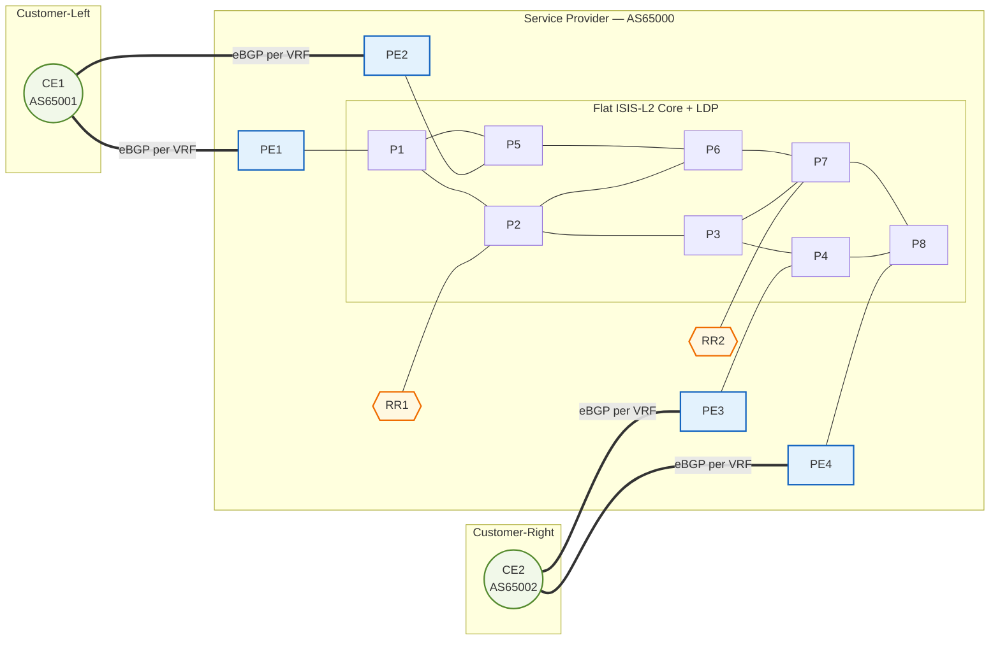

# Network Topology



## VRF service overview

| VRF   | RD         | RT (import/export) | CE1 loopback   | CE2 loopback   |
|-------|------------|--------------------|----------------|----------------|
| VRF-A | 65000:100  | target:65000:100   | 172.16.1.1/32  | 172.17.1.1/32  |
| VRF-B | 65000:200  | target:65000:200   | 172.16.2.1/32  | 172.17.2.1/32  |
| VRF-C | 65000:300  | target:65000:300   | 172.16.3.1/32  | 172.17.3.1/32  |

End-to-end reachability test from CE1 inside VRF-A:

```
A:CE1# ping router 100 172.17.1.1 source 172.16.1.1
```
